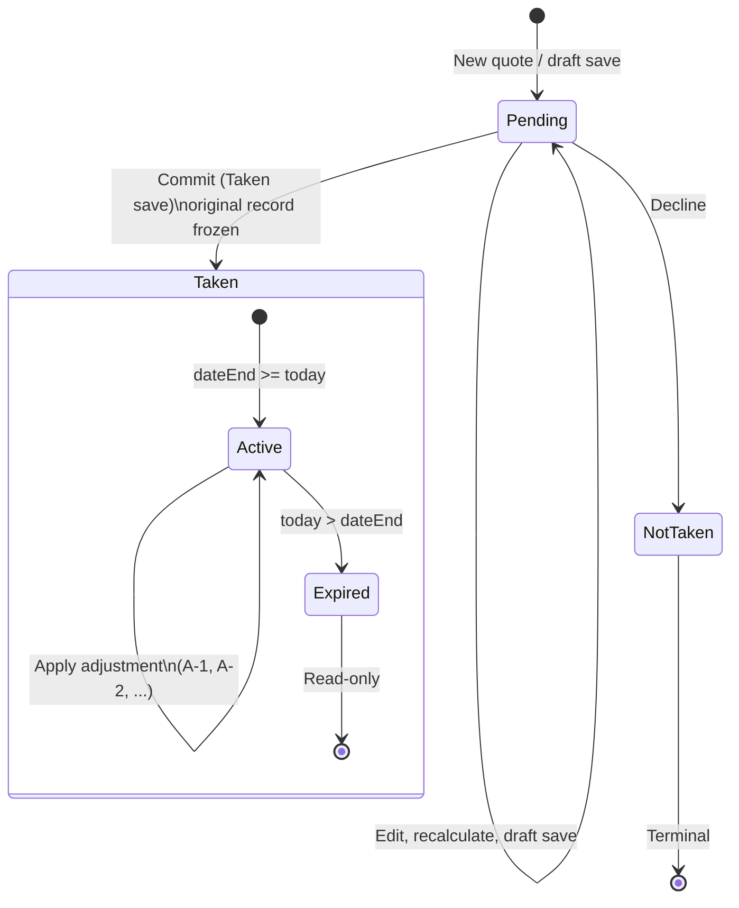
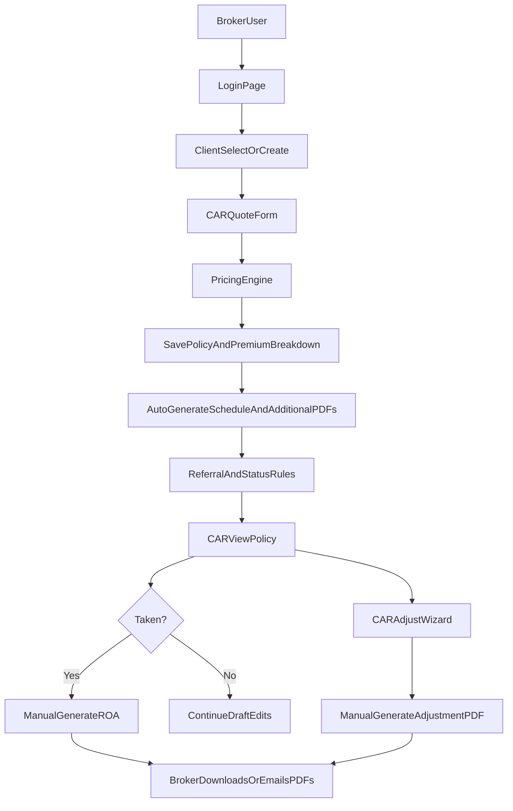

# CAR Insurance App Specification and Legacy Application Overview

## Product Specification (Rebuild)

### 1) Purpose and Scope

This document defines the target-state specification for rebuilding the broker-facing insurance app for Construction All Risk (CAR), aligned with **Phase 1 Scope of Works IRECON** (contract dated 15/06/2026).

**End goal:** generate and manage insurance policies end-to-end — from draft quote through committed (Taken) policy, adjustments, operational reporting, and broker-facing PDF document packs.

- The app is broker-only.
- End clients do not have accounts, login, or direct UI access.
- Phase 1 modules: **Client**, **CAR Policy**, **Settings** (AR broker management + **document template & fixed PDF configuration**) only.
- No payment collection workflow is included.
- **UX / screen flows:** [CAR_INSURANCE_UI_FLOW.md](./CAR_INSURANCE_UI_FLOW.md) — use for wireframes and user experience design.

### 1.1 Phase 1 Scope of Works (IRECON contract)

**Deliverables:**

| Area | In scope |
|------|----------|
| System development | Greenfield web app; UAT + Production environments |
| Data migration | Clients with policies incepted within last **15 months**; IRECON flags which records to migrate |
| UAT | Vendor unit testing; IRECON user acceptance |

**Functional tasks (like-for-like with modernised UI):**

| Task | Summary |
|------|---------|
| Add client | Renamed Entity Name → **Name**; AR Name typeahead with company/practice shown; search AR by first/last name only |
| Client page | Client details; extended AR display; CAR policy counts (Pending / Taken / Not taken) linking to policy lists |
| Edit client | Add-client fields only; **no delete client** |
| Client report | Per-client true base premium + broker fee summary for date range |
| Search policy | From client menu and main menu; **removed:** status, policy type, sub agent, generic policies |
| Search client | Name, Trading Name, Account Manager, AR Company (filters AR Name), AR Name |
| Apply CAR policy | Full CAR wizard; **new** annual-only "Type of cover" (Transfer / Contract Commencing) drives insured contracts text |
| View / edit CAR policy | Inception and expiry at top; editable until Taken or Not taken |
| Adjustment | End-of-term adjustment wizard (unchanged from legacy behaviour) |
| CAR Policy Report | Summary by status + detail drill-down |
| CAR Renewal Report | Renewal due list |
| AR Broker Management | Search, view, edit, **delete** AR (Wholesale Broker in legacy EBS) |

**Rebuild enhancements (beyond legacy manual upload):**

| Enhancement | Summary |
|-------------|---------|
| Document templates in Settings | CAR merge templates (Schedule, ROA, Adjustment) managed in-app — not manual Word file upload to server |
| Fixed PDF attachments in Settings | Additional static PDFs (`CARADDIT`) uploaded, assigned, and removable via Settings |
| Template versioning | In-app template editor with preview and version history; policy PDF generation uses the **active published** version |
| PDF engine | **[pdfme](https://pdfme.com/)** — Designer UI in Settings, `@pdfme/generator` for preview and production PDFs |

Seed content for initial migration lives in [`car-pdf-templates/`](./car-pdf-templates/) (legacy Word `.doc` files and sample fixed PDFs).

**Explicit exclusions (Phase 1 contract):**

- Any module not listed above (e.g. other insurance products, price file admin, user admin beyond AR)
- **Cancel Policies** admin workflow
- Payment processing
- Client deletion

**Timeline:** 4–6 weeks working days (contract estimate).

### 1.2 Product Context (rebuild)

The rebuilt app replaces a legacy ASP.NET Web Forms system and must preserve core business outcomes:

- maintain client records,
- create new CAR quotes,
- calculate premium from configured price files/rates,
- save quote/policy records,
- generate quote PDF output for broker distribution.

### 2) Users and Roles

- **Broker User**: logs in, searches clients, manages client records, creates/edits CAR policies, runs client report and policy search.
- **Client (Insured)**: data entity only; no system login.
- **Admin User**: AR broker management and **document template / fixed PDF configuration** in-app; operational reports. Price files and other rating reference data remain DB-only (no admin UI at this stage).

### 3) Business Constraints

- **BC-01**: Only CAR policy type is supported in Phase 1 (`PolicyType.Code='CAR'`).
- **BC-02**: No direct-to-consumer workflow.
- **BC-03**: No payment initiation or gateway integration (premium funding / card payments out of scope per contract).
- **BC-04**: Premium calculation must be reproducible from saved rating inputs and versioned price files.
- **BC-05**: PDF document packs are mandatory at each lifecycle stage that requires broker distribution (draft quote, Taken commit, applied adjustment).
- **BC-06**: Every material policy action must be attributable to a user in the audit trail.
- **BC-07**: Clients cannot be deleted in Phase 1.
- **BC-08**: Data migration limited to IRECON-flagged clients from the 15-month inception window.

### 4) End-to-End User Journey

1. Broker logs in.
2. Broker selects existing client or creates a new client.
3. Broker starts a new CAR quote.
4. Broker completes quote form fields (risk, coverage, location, limits, claims, and CAR-specific details).
5. System calculates premium and component breakdown.
6. Broker reviews result and updates status (Pending/Taken/Not taken).
7. System saves quote/policy and generated calculation snapshot.
8. System generates the **required PDF pack** for the current lifecycle stage (see §6.7).
9. If status is **Taken**, the policy becomes **immutable** — the original record is never modified again; a new document pack is generated on commit.
10. While the policy is **Taken** and **not expired**, broker may create end-of-term **adjustments** (draft or applied) stored as separate records.
11. When an adjustment is **Applied**, system generates a new adjustment document pack; effective premium for documents uses **original policy + latest applied adjustment**.
12. Broker views/downloads documents from the policy document list; optional email with `EmailLog` entry.
13. Broker and admin users run operational reports (UI table first, export second) and view client premium/fee dashboards.

### 5) Functional Requirements

#### 6.1 Authentication and Access

- **FR-AUTH-01**: System authenticates broker users before access to client or policy workflows.
- **FR-AUTH-02**: All quote operations are restricted to authenticated broker users.
- **FR-AUTH-03**: Client users cannot authenticate to this system.

#### 6.2 Client Management (Phase 1)

##### 6.2.1 Add client

- **FR-CLIENT-01**: Form label **Name** (legacy "Entity Name").
- **FR-CLIENT-02**: Fields in scope match Phase 1 add-client screen only; other legacy client fields are **not migrated** and not shown.
- **FR-CLIENT-03**: **AR Name** typeahead — typing shows selectable list; each option displays **contact name + company/practice name**; search matches **first and last name only** (not company name).
- **FR-CLIENT-04**: Creation audit metadata (`CreatedWhen`, `CreatedBy`).

##### 6.2.2 Client detail page

- **FR-CLIENT-05**: Shows all information for the selected client plus extended **AR block**: AR Company Name, AR Contact Name, AR Number, AR Email.
- **FR-CLIENT-06**: **CAR policy summary** with counts and links:
  - `PENDING — #` → policy list filtered to Pending
  - `Taken — #` → policy list filtered to Taken
  - `Not taken — #` → policy list filtered to Not taken
- **FR-CLIENT-07**: Each policy list row links to policy view.

##### 6.2.3 Edit client

- **FR-CLIENT-08**: Edit form includes **only** the same fields as Add client.
- **FR-CLIENT-09**: **Delete client is not available** in Phase 1.

##### 6.2.4 Search client

- **FR-CLIENT-10**: Search fields: Name, Trading Name, Account Manager, AR Company, AR Name.
- **FR-CLIENT-11**: AR Company selection **filters** the AR Name list; if AR Company empty, all ARs are available.
- **FR-CLIENT-12**: On first load, **Name** field receives focus.

##### 6.2.5 Data model

- **FR-CLIENT-13**: Client records persist in `Client` with references to `EntityType`, `AR`, and `AccountManager` per `db.txt`.

#### 6.3 Quote / Policy Creation

- **FR-POL-01**: Broker can start a new policy transaction under a client (`PolicyPeriod` + `Policy`).
- **FR-POL-02**: Policy number generation uses `PolicyNumber` ranges and format.
- **FR-POL-03**: Policy captures base data: action (`PolicyAction`), type (`PolicyType`), risk postcode/state, effective date, and policy number.
- **FR-POL-04**: CAR-specific quote data persists in `PolicyCAR`.
- **FR-POL-05**: App supports CAR status values: **Pending** (draft), **Taken**, and **Not taken** (see §6.9 Policy State and Lifecycle).
- **FR-POL-06**: App stores policy notes via `PolicyNote` and `PolicyNoteType` for system/referral/message events.
- **FR-POL-07**: When status transitions to **Taken**, the policy is **committed and immutable** — core policy and `PolicyCAR` premium fields must not be updated in the database thereafter.
- **FR-POL-08**: **Pending** policies may be edited, recalculated, and saved until committed as Taken or closed as Not taken.
- **FR-POL-09**: **Not taken** policies are terminal and cannot be edited or adjusted.

##### 6.3.1 Search policy (Phase 1)

- **FR-POL-10**: Policy search is available from **client context menu** and **main top menu**; both use the same search UI.
- **FR-POL-11**: Search is **CAR-only**; remove legacy filters: status, policy type, sub agent, and generic (non-CAR) policies.
- **FR-POL-12**: Results link to policy view.

##### 6.3.2 View / edit CAR policy (Phase 1 layout)

- **FR-POL-13**: **Inception date** and **expiry date** are displayed at the **top** of the policy view.
- **FR-POL-14**: Inception and expiry are **editable while status is Pending**; **read-only** once status is Taken or Not taken.

#### 6.4 CAR Form and Coverage Data

- **FR-CAR-01**: Broker can enter CAR fields including cover type, insured/site details, turnover, activities, contracts, claim history, and declarations.
- **FR-CAR-02**: Broker can capture section values and all calculation output fields required for traceability in `PolicyCAR`.
- **FR-CAR-03**: Broker can capture excess options in `PolicyCARExcess` referencing `CARExcess`.
- **FR-CAR-04**: Broker can capture sub-limits in `PolicyCARSubLimit`.
- **FR-CAR-05**: Broker can store policy wording snapshot in `PolicyCARWording`.
- **FR-CAR-06** (Phase 1): When cover type is **Annual**, show **Type of cover** with values **Transfer** and **Contract Commencing**; selection updates the **Insured contracts** text (wording TBC from business — Lesley).

#### 6.5 Pricing and Rating

- **FR-PRICE-01**: Premium calculation is triggered from quote form input and rerunnable on demand.
- **FR-PRICE-02**: Pricing uses active/versioned source tables by policy type and effective date:
  - `PriceFile` + `PriceFileCAR`
  - `PriceFileESL` + `PriceFileESLRate`
  - `PriceFileStampDuty` + `PriceFileStampDutyRate`
  - `PriceFilePlant`
  - `PriceFileTerror` + `PriceFileTerrorRate` + `PriceFileTerrorPostCode`
  - `Fee` + `FeeName`
- **FR-PRICE-03**: Pricing logic computes and stores section-level components (base premium, ESL, GST, stamp duty, terrorism, plant, totals).
- **FR-PRICE-04**: System stores selected pricing source IDs/rates in `PolicyCAR` (e.g., `PriceFileId`, `PriceFileESLId`, `PriceFileStampDutyId`, rates/minimums).
- **FR-PRICE-05**: Combined fees are persisted in `PolicyFee` with GST components.
- **FR-PRICE-06**: Invoice premium (premium + fees) is maintained in `Policy.TotalInvoicePremium`.

#### 6.6 Adjustment Support

End-of-term adjustments apply only to **Taken** policies that have **not expired**. Adjustments are stored as **separate records** linked to the original policy; the original policy row is never modified.

- **FR-ADJ-01**: Broker can create an adjustment record for a Taken, non-expired policy. Each adjustment is a child record (e.g. policy `A`, adjustments `A-1`, `A-2`) linked to the immutable original policy.
- **FR-ADJ-02**: Each adjustment record has its own lifecycle state: **Draft** or **Applied** (committed). Draft adjustments may be edited or discarded; applied adjustments are immutable.
- **FR-ADJ-03**: An adjustment record captures adjusted turnover, stamp duty exempt flag, section-level premium recalculations, delta totals, and audit metadata (`CreatedWhen`, `CreatedBy`, `AppliedWhen`, `AppliedBy`).
- **FR-ADJ-04**: When an adjustment is **Applied**, the system does not overwrite the original policy. The **effective policy premium** for display, documents, and broker UI is: **original Taken policy premium + latest Applied adjustment delta**.
- **FR-ADJ-05**: Multiple adjustments may be created and applied before the policy expires. There is no limit on the number of applied adjustments prior to expiry.
- **FR-ADJ-06**: **Not taken** policies cannot be adjusted.
- **FR-ADJ-07**: **Expired** policies cannot receive new adjustments or have draft adjustments applied. A policy is **expired** when today's date is **after** the policy end date (`PolicyPeriod` / `dateEnd`).
- **FR-ADJ-08**: Documents (e.g. adjustment ROA, schedule) and broker-facing policy views must be generated from the **composite view**: original immutable policy **plus** the **latest Applied** adjustment (if any).
- **FR-ADJ-09**: Adjustment finish validation includes business rules from legacy (e.g. 75% minimum retained premium, 25% base refund cap per section) — see [CAR_PRICING_FORMULAS.md](./CAR_PRICING_FORMULAS.md) and [CAR_SAVE_VALIDATION.md](./CAR_SAVE_VALIDATION.md).

#### 6.9 Policy State and Lifecycle

##### 6.9.1 Status values

| Status ID | Name | Alias / meaning |
|-----------|------|-----------------|
| 1 | Pending | **Draft** — quote in progress; editable |
| 2 | Taken | **Committed** — policy bound; original record immutable |
| 3 | Not taken | **Declined / lapsed** — terminal; no further changes |

**Pending ≡ draft.** While Pending, the broker may save drafts, recalculate premium, and edit all quote fields.

##### 6.9.2 Taken — immutable original policy

When a broker sets status to **Taken** and saves:

1. The policy passes Taken validation gates (e.g. premium lines for declared existing structures / plant where required).
2. The full policy snapshot (header, period, `PolicyCAR`, fees, excesses, sub-limits, wording, premium breakdown, rating snapshot) is **permanently persisted**.
3. **No subsequent UPDATE** to the original policy's core data or premium fields is permitted in the database.
4. Status remains **Taken** (there is no separate "Adjusted" status — adjustment is modeled via child records).

##### 6.9.3 Not taken — terminal

- Broker may set Pending → Not taken when the quote is declined or not proceeded with.
- Not taken policies cannot be edited, recalculated, taken, or adjusted.

##### 6.9.4 Policy expiry

```
isExpired = today > policyEndDate
```

- `policyEndDate` is the policy period end date (inclusive coverage end; expired from the **day after** end date unless business rules define inclusive boundary — default: **strictly after end date**).
- Only **Taken** policies where `isExpired === false` may have adjustments created, edited (draft), or applied.
- Expired Taken policies remain readable for audit and document retrieval but are frozen for adjustment.

##### 6.9.5 Adjustment record model (target)

Adjustments are **append-only child records**, not in-place mutations on `PolicyCAR`.

**Example:**

| Record | Type | State | Role |
|--------|------|-------|------|
| `A` | Original policy | Taken (immutable) | Source of truth for original premium and rating inputs |
| `A-1` | Adjustment | Applied | First end-of-term adjustment |
| `A-2` | Adjustment | Applied | Second end-of-term adjustment |
| `A-3` | Adjustment | Draft | In-progress adjustment (not yet in effective premium) |

**Effective premium for display and documents:**

```
effectivePremium = policyA.premium + latestAppliedAdjustment.deltaPremium
                 = policyA.premium + adjustmentA2.deltaPremium   // A-2 is latest Applied
```

- Original policy **A** is **always** stored unchanged.
- **A-1** and **A-2** remain as historical applied records.
- **A-3** (draft) does not affect effective premium until Applied.
- After **A-3** is Applied, effective premium uses **A-3** as the latest applied adjustment.

##### 6.9.6 Adjustment eligibility matrix

| Policy status | Expired? | Edit original policy | Create adjustment | Apply adjustment |
|---------------|----------|----------------------|-------------------|------------------|
| Pending (draft) | — | Yes | No | No |
| Taken | No | **No** | Yes | Yes |
| Taken | Yes | **No** | No | No |
| Not taken | — | No | No | No |

##### 6.9.7 Lifecycle diagram (target model)



##### 6.9.8 Data model notes (target)

- **Original policy**: `Policy`, `PolicyCAR`, related child tables — written once at Taken commit; thereafter read-only.
- **Adjustments**: separate table (extend `PolicyCARAdjustment` or equivalent) with:
  - `PolicyId` (FK to original policy)
  - `AdjustmentSequence` or `AdjustmentReference` (e.g. `A-1`, `A-2`)
  - `AdjustmentStatus`: `Draft` | `Applied`
  - Premium delta fields and adjustment inputs (turnover, stamp duty exempt)
  - `AppliedDate` / audit fields
- **Effective view**: application-layer or database view composing original + `MAX(AppliedDate)` adjustment where `AdjustmentStatus = Applied`.
- Legacy `PolicyCAR.Adjusted` bit and in-place adjustment fields on `PolicyCAR` are **superseded** by this model in the rebuild.

##### 6.9.9 Legacy vs target adjustment behavior

| Aspect | Legacy (`CARAdjust.aspx`) | Target (rebuild) |
|--------|---------------------------|------------------|
| Storage | Updates `PolicyCAR` + single `PolicyCARAdjustment` row | Original policy immutable; unlimited adjustment child records |
| Status after adjust | Taken + `Adjusted` flag | Taken unchanged; adjustment has Draft/Applied |
| Effective premium | Overwrites display fields on policy | Original + latest Applied adjustment |
| Multiple adjustments | Effectively one adjustment flow | Unlimited before expiry |
| Expiry check | Not explicit in legacy UI | Required — no adjustment if expired |

#### 6.7 Policy PDF Documents

**Generated policy PDFs** are produced from **in-app document templates** (see §6.13) merged with policy data, rendered to PDF, and stored in **Cloudflare R2**. Metadata for each generated file is stored in **`PolicyDocument`** (Postgres). Generated policy documents are **never deleted** — each generation appends a new R2 object and a new `PolicyDocument` row (audit trail).

**Legacy:** Word templates (`.doc`) were manually uploaded to the server; fixed PDFs were manually uploaded; generation used Word mail-merge (`GetMergeFields()` in `CARPolicy.cs`). **Rebuild:** templates are authored and versioned in Settings; fixed PDFs are uploaded via Settings (see §6.13).

##### 6.7.1 CAR document catalog

| Type code | Document title | Output filename pattern | Template slot | Cover-type variant |
|-----------|----------------|-------------------------|---------------|-------------------|
| `CARSCHED` | CAR Schedule | `CAR_Schedule_{policyNumber}_{amendmentNumber}_{yyyyMMdd HHmmss}.pdf` | `Schedule` | Annual \| Single \| Owner Builder |
| `CARRATING` | CAR Rating / ROA (Record of Advice) | `Car_Premium&ROA_{policyNumber}_{amendmentNumber}_{yyyyMMdd HHmmss}.pdf` | `Rating` | Annual \| Single \| Owner Builder |
| `CARADJUST` | CAR Adjustment | `CAR_Adjustment_{policyNumber}_{amendmentNumber}_{yyyyMMdd HHmmss}.pdf` | `Adjustment` | Single (not cover-type split) |
| `CARADDIT` | Additional attachments | Original configured filename (e.g. `ATC Stamp duty Exemption.pdf`) | Fixed PDF library (§6.13.3) | Per cover type + optional rules |

**Seed templates** (import reference — not runtime Word upload): [`car-pdf-templates/`](./car-pdf-templates/)

| Slot | Cover | Legacy seed file (examples) |
|------|-------|----------------------------|
| Schedule | Annual | `CAR_iAnyware Schedule (Annual) [from 01.26].doc` |
| Schedule | Single | `CAR_iAnyware Schedule (Single) [from 01.26].doc` |
| Schedule | Owner Builder | `CAR_iAnyware Schedule (Owner Builder) [from 06.25] - v2.doc` |
| Rating / ROA | Annual | `CAR_Quotation & Record of Answers (Annual) [from 01.26].doc` |
| Rating / ROA | Single | `CAR_Quotation & Record of Answers (Single) [from 01.26].doc` |
| Rating / ROA | Owner Builder | `CAR_Quotation & Record of Answers (Owner Builder) [from 06.25] - v2.doc` |
| Adjustment | All | `CAR_Adjustment.doc` / `Adjustment.doc` |

**Fixed PDF seed examples:** `POLICY COMPARISON JUNE 2024.pdf`, `IA Annual CAR TPL Wording (eff Jan 2026) - Sample.pdf`

**Attachment rules (retained from legacy):**

- e.g. `ATC Stamp duty Exemption.pdf` attached only when policy state is **NSW** (rule configurable in Settings).
- If no active template version exists for a required slot, generation **fails visibly** (FR-DOC-04) — no silent placeholder PDF.
- Merge field catalogue is derived from the legacy `CARPolicy.GetMergeFields()` contract; exposed as insertable tokens in the template editor (§6.13.2).

##### 6.7.2 Document generation triggers — target (rebuild)

| Event | Required PDFs | Data source for merge |
|-------|---------------|----------------------|
| **First save** (Pending/draft created) | Schedule (`CARSCHED`) + applicable additional docs (`CARADDIT`) | Current draft policy snapshot |
| **Pending/draft save** (subsequent) | Regenerate Schedule + additional docs when premium or material fields change (configurable: always vs on-demand) | Latest draft snapshot |
| **Taken commit** | Full pack: Schedule + Rating/ROA (`CARRATING`) + additional docs | Immutable Taken policy snapshot |
| **Adjustment — Draft saved** | Optional preview: Adjustment doc marked as draft/watermarked (recommended) | Original policy + draft adjustment |
| **Adjustment — Applied** | Adjustment (`CARADJUST`) + updated Schedule + Rating/ROA reflecting **effective** premium | Original policy + latest applied adjustment |

**Target improvements over legacy:**

- Legacy generates Schedule + additional docs on **first save only**; Rating/ROA and Adjustment docs require **manual buttons** on `CARViewPolicy.aspx` (`Generate ROA`, `Generate Schedule`, `Generate Adjustment Doc`).
- Legacy does **not** auto-generate adjustment PDFs when `CARAdjust.aspx` finishes — broker must click Generate Adjustment Doc separately.
- Rebuild must **auto-generate** the correct pack on Taken commit and on adjustment Applied, without manual regeneration buttons for the happy path.
- Each generation creates a **new versioned file** (timestamp in filename); prior versions remain in the document list for audit.

##### 6.7.3 Document delivery requirements

- **FR-DOC-01**: Broker can view and download all policy-linked PDFs from the policy detail screen.
- **FR-DOC-02**: Document content reflects the correct lifecycle snapshot (draft vs Taken vs effective-with-adjustment).
- **FR-DOC-03**: Broker can email selected documents to the client; send is logged in `EmailLog`.
- **FR-DOC-04**: Document generation failures are logged and surfaced to the broker (no silent failure).
- **FR-DOC-05**: `PolicyDocument` records: `PolicyId`, optional `PolicyCARAdjustmentId`, type code, filename, R2 storage key, `GeneratedWhen`, `GeneratedBy`, and optional `DocumentTemplateVersionId` / `FixedPdfId` (which config version produced the file).
- **FR-DOC-06**: Generated policy PDFs and their `PolicyDocument` rows are **append-only** — never deleted from R2 or the database.
- **FR-DOC-07**: PDF generation uses the **active published** template version for each slot at generation time; the version id is stored on `PolicyDocument` for traceability.

#### 6.13 Document template & fixed PDF configuration (Settings)

Admin-managed document configuration replaces legacy manual server upload of Word files and static PDFs. **Brokers do not edit templates** — only admins via **Settings**.

##### 6.13.1 Settings navigation

| Route | Screen | Access |
|-------|--------|--------|
| `/settings` | Settings hub | Admin |
| `/settings/ar-brokers` | AR Broker Management | Admin |
| `/settings/document-templates` | Merge templates (Schedule, ROA, Adjustment) | Admin |
| `/settings/fixed-pdfs` | Fixed PDF attachments (`CARADDIT`) | Admin |

##### 6.13.2 Merge templates (Schedule, ROA, Adjustment)

Legacy Word `.doc` templates are **imported once** (from `car-pdf-templates/`) into structured **in-app templates** — not uploaded as Word files for ongoing generation.

| Requirement | Detail |
|-------------|--------|
| **FR-TPL-01** | Admin can open each template **slot** (type × cover type where applicable): Schedule Annual / Single / Owner Builder, ROA Annual / Single / Owner Builder, Adjustment (single). |
| **FR-TPL-02** | Template editor embeds **pdfme Designer** (`@pdfme/ui`) per slot — drag/drop **text** (merge fields) and **image** (logo) schemas on a `basePdf` background. Not a raw Word file upload for production use. |
| **FR-TPL-03** | Text schema field names match the **CAR merge-field catalogue** (policy number, client name, premiums, dates, sections, etc.). Admin can add/reposition fields; optional sidebar picker for field names. |
| **FR-TPL-04** | **Preview** uses `@pdfme/generator` with **sample policy data** (fixture `inputs` object) — same engine as production. |
| **FR-TPL-05** | **Version control:** each save creates a new **template version**; versions are immutable once published. Admin can view version history, diff (optional v1.1), and **publish** one version as **active** per slot. |
| **FR-TPL-06** | Only the **active published** version is used for new policy PDF generation. Prior published versions remain for audit and for tracing which version generated an existing `PolicyDocument`. |
| **FR-TPL-07** | **Rollback:** admin can publish a previous version to make it active again (creates a new publish event; does not mutate old versions). |
| **FR-TPL-08** | Initial import: convert seed `.doc` files in `car-pdf-templates/` → PDF **`basePdf`** (static background), then place pdfme text/image schemas in Designer for v1 templates. |
| **FR-TPL-09** | Template create/edit/publish actions are **audit-logged** (user, timestamp, slot, version id). |

**Version model (conceptual):**

| Entity | Role |
|--------|------|
| `DocumentTemplate` | Slot identity: `DocumentTypeCode` + `CoverTypeId` (nullable for Adjustment) |
| `DocumentTemplateVersion` | Immutable **pdfme `Template` JSON** (`basePdf` + `schemas`); `VersionNumber`, `PublishedAt`, `PublishedBy`, `IsActive` |
| R2 | `basePdf` assets and org logo; optional archived source `.doc` for reference only |

##### 6.13.3 Fixed PDF attachments (`CARADDIT`)

Static PDFs bundled with generated packs (stamp duty exemption, wording samples, policy comparison sheets, etc.).

| Requirement | Detail |
|-------------|--------|
| **FR-FIX-01** | Admin can **upload** PDF files via Settings (stored in R2). |
| **FR-FIX-02** | Admin can **delete** a fixed PDF from the active library (removes from future packs; does not delete already-generated `PolicyDocument` copies on policies). |
| **FR-FIX-03** | Admin assigns each fixed PDF to one or more **cover types** (Annual / Single / Owner Builder) and optional **rules** (e.g. state = NSW). |
| **FR-FIX-04** | Admin can set **display order** within the additional-docs list per cover type. |
| **FR-FIX-05** | Upload/delete/reorder/assignment changes are **audit-logged**. |
| **FR-FIX-06** | Replacing a file: upload new PDF (new record) and retire/delete the old library entry — already-issued policy packs retain their historical `PolicyDocument` rows. |

**Distinction — two PDF lifecycles:**

| PDF kind | Managed in | Deletable? | Purpose |
|----------|------------|------------|---------|
| **Generated policy PDF** | Policy detail document list | **No** — append-only audit trail | Schedule, ROA, Adjustment outputs per policy event |
| **Fixed PDF (library)** | Settings → Fixed PDFs | **Yes** — admin removes from config | Static attachments merged into future packs |

##### 6.13.4 Functional requirements summary

- **FR-CFG-DOC-01**: All CAR document generation reads **active** merge templates and fixed PDF config from the database — not from filesystem paths or manual server upload.
- **FR-CFG-DOC-02**: Brokers cannot access template or fixed-PDF Settings screens.
- **FR-CFG-DOC-03**: Missing or unpublished template for a required slot blocks generation with a clear admin-facing error message.

##### 6.13.5 Implementation — pdfme

**Decision:** Use [pdfme](https://pdfme.com/) for merge-template **editing**, **preview**, and **PDF generation**. MIT-licensed; TypeScript; works in browser (Designer) and Node/Workers (`generate`).

**Packages:**

| Package | Use |
|---------|-----|
| `@pdfme/ui` | **Designer** embedded in Settings → Document Templates |
| `@pdfme/generator` | Production PDF generation (server / Worker) |
| `@pdfme/schemas` | Built-in schema plugins: `text`, `image` (logo), tables as needed |
| `@pdfme/common` | Shared `Template` type |

**Template shape (stored in `DocumentTemplateVersion.TemplateJson`):**

```json
{
  "basePdf": "<data-uri or R2 URL of static background PDF>",
  "schemas": [[{ "name": "policyNumber", "type": "text", "position": { ... }, ... }]]
}
```

**Schema conventions:**

| Schema type | Purpose |
|-------------|---------|
| `text` | Merge field — `name` matches CAR merge-field key; value supplied in `inputs` at generation |
| `image` | Logo or static image — `name` e.g. `orgLogo`; `inputs` supplies R2 URL or data URI |

**Settings UI (simple):**

1. Slot list → open Designer in a full-width panel.
2. Toolbar: **Preview** (generate with fixture data), **Save draft version**, **Publish**.
3. Optional: upload/replace **logo** (stored in R2; bound to `orgLogo` image schema).
4. Layout changes are infrequent — most edits are repositioning merge fields or updating `basePdf` when wording changes.

**Generation flow (`pdf.service.ts`):**

```ts
import { generate } from '@pdfme/generator';
import { text, image } from '@pdfme/schemas';

const pdfBytes = await generate({
  template: activeVersion.templateJson,
  inputs: [mapPolicyToPdfmeInputs(policy, adjustment)],
  plugins: { text, image },
});
// → upload to R2 → insert PolicyDocument
```

**Legacy import (one-time per slot):**

1. Convert Word seed from `car-pdf-templates/` → PDF (LibreOffice or similar).
2. Upload PDF to R2 as `basePdf`.
3. Open pdfme Designer; place text schemas over dynamic areas; add image schema for logo.
4. Save as v1; publish.

**Fixed PDFs (`CARADDIT`):** Not pdfme templates — separate Settings → Fixed PDFs library (upload/delete). App appends these files to the generated pack when rules match.

**Why pdfme:** Single library for WYSIWYG editor + renderer; JSON templates map directly to versioned DB rows; no custom merge-field editor or HTML→PDF pipeline to maintain.

#### 6.8 Audit Trail and Activity Logging

Legacy relies primarily on `PolicyNote` (informational/referral/message notes) plus `CreatedWhen`/`CreatedBy` on entities. The rebuild requires a **structured audit trail**: who did what, when.

##### 6.8.1 Events to log (target)

| Action | Minimum audit fields |
|--------|---------------------|
| Policy created / draft saved | user, timestamp, policy id, client id |
| Premium recalculated | user, timestamp, policy id, price file ids used |
| Status change (Pending → Taken / Not taken) | user, timestamp, old status, new status |
| Taken commit (immutability lock) | user, timestamp, `TakenAt`/`TakenBy` |
| Adjustment draft created / updated / discarded | user, timestamp, adjustment id, sequence |
| Adjustment applied | user, timestamp, adjustment id, delta totals |
| PDF pack generated | user, timestamp, policy id, document types produced, template version ids |
| Template published / fixed PDF uploaded or deleted | user, timestamp, slot or file id, action |
| Document emailed | user, timestamp, recipients (via `EmailLog`) |
| Report run / export | user, timestamp, report name, parameters |

##### 6.8.2 Functional requirements

- **FR-AUD-01**: Entities that carry creation metadata store `CreatedWhen` and `CreatedBy`.
- **FR-AUD-02**: System preserves full calculation trace by saving pricing inputs and outputs in policy tables.
- **FR-AUD-03**: Status changes, referrals, and broker notes are captured in `PolicyNote` / `PolicyNoteType`.
- **FR-AUD-04**: **New:** append-only **activity log** (or extended `PolicyNote` with typed actions) records user-attributed actions from §6.8.1; visible on policy detail and client detail.
- **FR-AUD-05**: Applied adjustments and Taken commits are immutable; audit log entries are never deleted.

#### 6.10 Client Dashboard (Broker Fee Summary)

Per-client summary table aggregated over a selectable date range. Legacy: `ClientReport.aspx` → stored procedure `ClientBrokerFee_Report`.

##### 6.10.1 Display

Default period: **current calendar month** (legacy defaulted to **previous** month).

| Column | Description |
|--------|-------------|
| Policy Type | Product/class code (e.g. `CAR`, `UNKNOWN` when unmapped) |
| Base Premium (Ex. GST) | Sum of base premium ex-GST for policies in period |
| Broker Fee (Ex. GST) | Sum of broker fees ex-GST for policies in period |

Example row:

| Policy Type | Base Premium (Ex. GST) | Broker Fee (Ex. GST) |
|-------------|------------------------|----------------------|
| UNKNOWN | $8,032.64 | $260.00 |

##### 6.10.2 Requirements

- **FR-CDASH-01**: Client detail view includes a dashboard section with date-from / date-to filters.
- **FR-CDASH-02**: Table shows one row per policy type with summed base premium and broker fee (ex-GST).
- **FR-CDASH-03**: **Export** button downloads CSV/XLSX matching the on-screen table (legacy showed UI only; Excel export was commented out).
- **FR-CDASH-04**: Only policies for the selected client and approved/taken transactions in the date range are included (match `ClientBrokerFee_Report` semantics).

#### 6.11 Reports and Dashboards

Legacy admin/broker reports export directly to Excel (Aspose.Cells) with **no on-screen table** for most reports. **Target:** each report has a **dashboard page** with parameter form, **results table in the UI**, and an **Export** button (CSV/XLSX).

##### 6.11.1 Report inventory

| Report | Phase 1 SOW | Legacy page | Target UI |
|--------|-------------|-------------|-----------|
| Client Report | **Yes** | `Broker/ClientReport.aspx` | Table + export (§6.10) |
| CAR Policy Report | **Yes** | `Admin/CARPolicyReport.aspx` | Table + export |
| CAR Renewal Report | **Yes** | `Admin/CARRenewal.aspx` | Table + export |
| IRECON Reconciliation Report | No (retained) | `Admin/ReconciliationReportIrecon.aspx` | Table + export |
| Expiring OBCAR Report | No (retained) | `Admin/OBCARExpiringReport.aspx` | Table + export |
| ~~Cancel Policies~~ | **Excluded** | `Admin/CancelPolicies.aspx` | Not built |

> **Note:** Legacy menu item **"CAR Renewal Report"** (`CARPolicyRenewal.aspx`) incorrectly runs IRECON reconciliation code. Rebuild implements **one** CAR Renewal Report (`CARRenewal.aspx` behaviour).

##### 6.11.2 IRECON Reconciliation Report

**Purpose:** Financial reconciliation of approved policies for IRECON / Advisernet for a date range. Data: `Report_IRECON_Reconciliation` (per underwriter agent: Calliden, QBE, CSC).

**Parameters:** Date from, date to (legacy defaults: previous calendar month).

**Worksheets (legacy Excel):**

1. **IAA Report** — summary with totals and sub-agent rollups.
2. **Policy Details Report** — line-level detail; OBCAR policies expand MD/PL/option sub-rows (not applicable to CAR-only rows).

**Key columns (IAA Report):** Policy Number, Date Approved, Client Name, Site Address, Base Premium, Base Premium GST, Stamp Duty, Broker Fee, Broker Fee GST, Invoice Total, Credit Card Surcharge, Grand Total, Total Premium (excl. broker fee & GST), IRECON Income & GST, IAA Margin, IA Admin Fee, IA Margin & Cert Fee GST, IA Total, Net to IRECON Less Margin, Sub Agent, Sub Agent Income/GST/Total, Payment Type.

**Target scope:** Include CAR (`ClassCode = CAR`) transactions; full multi-product parity optional for admin role.

##### 6.11.3 Expiring OBCAR Report

**Purpose:** Renewal outreach list for **Owner Builder CAR (OBCAR)** policies expiring within a date range. Data: `Report_OBCAR_Expiring`.

**Parameters:** Date from (legacy default: today), date to (legacy default: ~90 days ahead).

**Columns:** Status, Inception Date, Expiry Date, Policy Number, Invoice Comment, Policy Id, Client Id, Client, Phone, Fax, Mobile, Email, Address 1/2, Suburb, Postcode, State, Alternate Address fields.

**Note:** Read-only report — no policy cancellation or status change from this screen. OBCAR is a separate legacy product; retained for operational parity. CAR-only Phase 1 module scope does not include OBCAR quoting.

##### 6.11.4 Client Report

Same as §6.10 Client Dashboard — per-client premium and broker fee by policy type for a date range. Legacy shows UI table; target adds export.

##### 6.11.5 CAR Policy Report

**Purpose:** CAR quote/policy activity summary and drill-down by status category. Data: `PolicyCAR_Report_Search1` (summary), `PolicyCAR_Report_Search2` (detail).

**Parameters:** Date from, date to (legacy defaults: ~1 year ago to end of previous month).

**Step 1 — Summary by status category (`CARSearchStatus`):**

| CARSearchStatus | Meaning |
|-----------------|---------|
| Taken - New | Taken policies, new business |
| Not taken | Declined quotes |
| Pending | Draft quotes |
| Taken Renewal | Taken renewal policies |
| Not Taken Renewal | Declined renewals |
| Pending Renewal | Draft renewals |

Columns: Status (link), Number of Policies, Total Base Premium Combined.

**Step 2 — Detail for selected status:** Client Name, AR Name, Date Quoted, Base Premium. Legacy: **Download in Excel** on this view.

##### 6.11.6 CAR Renewal Report

**Purpose:** Policies due for renewal relative to a reference date. Data: `PolicyCAR_Report_Renewal`.

**Parameters:** Reference date (legacy default: today), CAR status checkboxes (Taken / Not Taken / Pending), policy action checkboxes (New / Renewal).

**Columns:** Status, Type (policy action), Client Name, Expiry Date, AR, AR Email, Due Next Days.

##### 6.11.7 Report functional requirements

- **FR-RPT-01**: Each report listed in §6.11.1 has a dedicated route with parameter form.
- **FR-RPT-02**: **Run Report** renders results in a sortable/filterable table before export.
- **FR-RPT-03**: **Export** produces CSV or XLSX matching visible columns (and legacy worksheet structure where multi-sheet).
- **FR-RPT-04**: Report execution is audit-logged (user, parameters, row count).
- **FR-RPT-05**: Empty results show explicit "no results" state (legacy pattern).

#### 6.12 AR Broker Management (Settings — Phase 1)

Legacy EBS name: **Wholesale Broker**. Phase 1 admin module per contract.

- **FR-AR-01**: Admin can **search** AR broker records.
- **FR-AR-02**: Admin can **view** AR detail (company, contact, number, email, etc.).
- **FR-AR-03**: Admin can **edit** AR records.
- **FR-AR-04**: Admin can **delete** AR records.
- **FR-AR-05**: AR data powers client **AR Name** typeahead and client detail AR block.

> **See also:** §6.13 Document template & fixed PDF configuration (same Settings area).

#### 6.14 Data Migration (Phase 1)

Per contract migration protocol:

- **FR-MIG-01**: Vendor provides list of clients with policies incepted within the **last 15 months**.
- **FR-MIG-02**: IRECON reviews and **flags** which client records to migrate.
- **FR-MIG-03**: Only flagged clients and their associated CAR policy data are loaded into the new system.
- **FR-MIG-04**: Client edit form fields not in Phase 1 add-client set are not migrated.

### 7) Non-Functional Requirements

- **NFR-01 Performance**: Quote recalculation target under normal load should feel interactive for broker use.
- **NFR-02 Reliability**: Save operations must be transactional across policy core and CAR detail records.
- **NFR-03 Security**: Broker authentication and role boundaries enforced at all quote/policy endpoints.
- **NFR-04 Data Integrity**: Foreign key constraints and reference data validation must be enforced according to the schema.
- **NFR-05 Observability**: Key events (quote created, recalculated, status updated, Taken commit, adjustment applied, PDF generated, report run, email sent) must appear in the audit/activity log and application logs.
- **NFR-06 Compatibility**: Generated quote PDFs should be standard and readable across major PDF viewers.

### 8) Data Model Mapping Summary

- **User and org context**: `User` (app login profile), `AR`, `AccountManager`, `Client`, `EntityType`
- **Policy backbone**: `PolicyPeriod`, `Policy`, `PolicyType`, `PolicyAction`, `PolicyNumber` — `PolicyPeriod.ClientId` links to client; renewal/copy grouping via `Policy.RenewalOfPolicyId` / `CopiedFromPolicyId`
- **CAR domain**: `PolicyCAR`, `CARStatus`, `PolicyCARExcess`, `CARExcess`, `PolicyCARSubLimit`, `PolicyCARWording`, `PolicyCARAdjustment` (one-to-many adjustments per policy; Draft/Applied status)
- **Rating and fees**: `PriceFile*`, `CoverType`, `State`, `Fee`, `FeeName`, `PolicyFee`
- **Documents**: `PolicyDocument` — generated PDF metadata (R2 key, append-only); `DocumentTemplate`, `DocumentTemplateVersion` — merge templates with version control; `FixedPdf` — static attachment library (upload/delete in Settings)
- **Operational records**: `PolicyNote`, `PolicyNoteType`, `EmailLog`, activity/audit log

### 9) Out of Scope (Phase 1)

Per **Phase 1 Scope of Works IRECON** contract exclusions:

- Direct client portal or self-service UI.
- Card/bank payments and premium funding integration.
- Multi-product quoting beyond CAR (including OBCAR apply/quote flows).
- Claims management workflow.
- **Cancel Policies** admin bulk-cancellation (`CancelPolicies.aspx`).
- Client deletion.
- Price file administration UI, fee editors, and generic reference-data CRUD (rating configuration remains DB-only per §10.2).
- Any functionality not explicitly listed in §1.1.

**Retained in specification but not Phase 1 contract modules:** IRECON Reconciliation Report and Expiring OBCAR Report (see §6.11.1).

### 10) Assumptions

#### 10.1 General

- Existing `db.txt` schema is the approved target data contract.
- Legacy pricing behavior is used as functional baseline unless business rules are explicitly revised.
- **Generated** policy PDFs are stored in R2 with append-only `PolicyDocument` metadata. **Merge templates** and **fixed PDF library** are configured in Settings (§6.13), seeded initially from [`car-pdf-templates/`](./car-pdf-templates/).
- Screen layout and navigation follow [CAR_INSURANCE_UI_FLOW.md](./CAR_INSURANCE_UI_FLOW.md).
- Broker workflows follow [CAR_INSURANCE_USER_STORIES.md](./CAR_INSURANCE_USER_STORIES.md).

#### 10.2 Configuration and reference data — **no admin UI at this stage**

The following are **not** maintained through the web app. Values are **manually inserted or updated directly in database tables** (SQL, migration scripts, or DBA/ops process):

| Data | Example tables | App behaviour |
|------|----------------|---------------|
| **Price files** | `PriceFile`, `PriceFileCAR`, `PriceFileESL`, `PriceFileESLRate`, `PriceFileStampDuty`, `PriceFileStampDutyRate`, `PriceFilePlant`, `PriceFileTerror`, `PriceFileTerrorRate`, `PriceFileTerrorPostCode` | App **reads** active price files for rating; no create/edit UI |
| **Fees** | `Fee`, `FeeName`, `PolicyFee` defaults | Read-only at runtime |
| **Reference / lookup data** | `CARStatus`, `CoverType`, `State`, `CARExcess`, `EntityType`, `PolicyType`, `PolicyAction`, `AdjustmentStatus`, `PolicyNoteType`, etc. | Seeded in DB; no in-app admin screens |
| **Policy number ranges** | `PolicyNumber` | DB-managed |
| **AR records** | `AR` | In-app UI: **Settings → AR Broker Management** (§6.12) |
| **Document merge templates** | `DocumentTemplate`, `DocumentTemplateVersion` | In-app UI: **Settings → Document Templates** (§6.13.2) — versioned, with preview |
| **Fixed PDF attachments** | `FixedPdf` (+ cover-type / rule assignments) | In-app UI: **Settings → Fixed PDFs** (§6.13.3) — upload and delete |

**Implications:**

- **ASM-CFG-01**: Premium calculation depends on correct DB seeding before UAT/production use.
- **ASM-CFG-02**: Changing rates, fees, or reference data requires a database change — not a broker or admin screen action.
- **ASM-CFG-03**: No price-file versioning UI, fee editor, or generic reference-data CRUD in this phase.
- **ASM-CFG-04**: Document templates and fixed PDFs **do** have admin Settings UI; legacy `ProductSetting` key/value table is **superseded** by `DocumentTemplate*` and `FixedPdf`.
- **ASM-CFG-05**: Admins must publish an active template version per required slot before brokers can generate complete document packs.

#### 10.3 Migration

- Initial client/policy load follows Phase 1 migration protocol (§6.14); reference and price data are loaded separately via SQL seed, not through the app.

### 11) Glossary

- **CAR**: Construction All Risk insurance policy.
- **Broker**: Intermediary selling insurance to clients on behalf of insurer.
- **Pending (draft)**: Quote in progress; fully editable until committed.
- **Taken**: Committed policy; original database record is immutable.
- **Not taken**: Declined quote; terminal state.
- **Expired policy**: Today's date is after the policy end date; no new adjustments allowed.
- **Adjustment**: Separate child record linked to a Taken policy; stores end-of-term premium delta. May be Draft or Applied.
- **Effective premium**: Original Taken policy premium plus the delta from the latest Applied adjustment.
- **Policy Action**: Transaction type (e.g., New, Renewal).
- **Price File**: Versioned rate configuration used to calculate premium.
- **ESL**: Emergency Services Levy.
- **SD**: Stamp Duty.
- **ROA**: Record of Advice — premium breakdown document (`CARRATING`).
- **PolicyDocument**: Stored PDF metadata for **generated** policy outputs (append-only); links to R2 and optional template version.
- **DocumentTemplate / DocumentTemplateVersion**: Admin-managed merge template slots with version history and active published version.
- **FixedPdf**: Admin-managed static PDF library for `CARADDIT` attachments; upload/delete in Settings.
- **AR (Authorised Representative)**: Wholesale broker entity linked to clients; managed under **Settings** → AR Broker Management.

---

## Legacy Application Overview

### 1) What the Legacy App Does

The legacy app is a broker-facing insurance administration and quoting platform implemented in ASP.NET Web Forms. It supports **multiple products**; this rebuild scopes to **CAR only**, but reports and admin tools below reflect the full legacy surface.

For CAR, the broker flow is:

1. Broker logs in.
2. Broker creates/selects client.
3. Broker completes CAR quote form (`CARNewPolicy.aspx`).
4. System calculates premium using `CARCalculator2` + database-stored rate data.
5. System saves policy and premium fields; on **first save** auto-generates **Schedule** + **additional PDFs**.
6. Broker views policy (`CARViewPolicy.aspx`), may change status to Taken/Not Taken, and manually triggers **ROA** or **Schedule** regeneration.
7. For Taken policies, broker runs end-of-term adjustment (`CARAdjust.aspx`); on finish, adjustment data is saved but adjustment PDF requires a **separate manual** generate step.
8. Broker views/downloads PDFs via `CertDocs` control / `ViewDocument.aspx`.
9. Broker runs client fee report (`ClientReport.aspx`); admin runs CAR, renewal, reconciliation, and expiring reports.

### 2) Legacy Architecture

- **Presentation layer**: ASP.NET Web Forms pages and user controls.
- **Business layer**: BLL policy classes and calculator classes (e.g., CAR calculators, policy lifecycle methods).
- **Data layer**: SQL provider classes and stored procedures for price files, rates, and persistence.
- **Document layer**: server-side template merge and PDF conversion pipeline.

### 3) Legacy CAR Pricing Behavior (High-Level)

- Quote inputs (turnover, cover type, liability limits, state/postcode, section values, options) are captured in form pages.
- Calculator logic fetches relevant rates/minimums/levies from configured tables/procedures.
- Premium components are computed (base, levies, GST, stamp duty, terrorism, plant components as applicable).
- Total premium and component values are written back to policy entities and persisted.
- Referral conditions are evaluated and may affect status/notes.

### 4) Legacy CAR Document Generation (detail)

**Implementation:** `InsuranceDemo.BLL/Products/CAR/CARPolicy.cs`

| Trigger | Documents generated |
|---------|---------------------|
| First policy save (`_isNew`) | `CARSCHED` (Schedule), `CARADDIT` (config-driven additional PDFs by cover type) |
| Manual "Generate ROA" button | `CARRATING` |
| Manual "Generate Schedule" button | `CARSCHED` (new file) |
| Manual "Generate Adjustment Doc" (only if `Adjusted = true`) | `CARADJUST` |
| Adjustment wizard finish (`CARAdjust.aspx`) | **No PDF** — saves adjustment data only |

Templates are resolved from **Settings → Document Templates** (`DocumentTemplate` + active `DocumentTemplateVersion` storing **pdfme JSON**). Generation uses `@pdfme/generator`. Fixed attachments from **Settings → Fixed PDFs** (`FixedPdf`). Legacy used `ProductSetting` keys and Word mail-merge.

**Document storage:** `PolicyDocument` links R2 key and type code to `PolicyId`. Generated files are never deleted. Template config and fixed PDF library are separate from policy document history.

### 5) Legacy Audit Trail

- `PolicyNote` records: status changes, amendments, adjustments, referral reasons, broker messages, emails sent, cancellation notes.
- `CreatedWhen` / `CreatedBy` on client and policy entities.
- No unified activity feed — notes are the primary human-readable history.

### 6) Legacy Reports Summary

| Report | Location | UI table | Excel export | Phase 1 rebuild |
|--------|----------|----------|--------------|-----------------|
| IRECON Reconciliation | `ReconciliationReportIrecon.aspx` | No | Yes (direct download) | Retained |
| Expiring OBCAR | `OBCARExpiringReport.aspx` | No | Yes | Retained |
| Client Report | `ClientReport.aspx` | Yes | No (commented out) | **Yes** + export |
| CAR Policy Report | `CARPolicyReport.aspx` | Yes (3-step) | Yes (detail step) | **Yes** |
| CAR Renewal | `CARRenewal.aspx` | No | Yes | **Yes** |
| Cancel Policies | `CancelPolicies.aspx` | Yes | No | **Excluded** |

Admin navigation (`AdminLeftNav.ascx`) also lists **CAR Renewal Report** (`CARPolicyRenewal.aspx`) — see §6.11.1 note on implementation bug.

### 7) Legacy End-to-End Flow Diagram



### 8) Legacy-to-Rebuild Continuity Decisions

- Preserve broker-first operating model.
- Preserve client-then-quote workflow.
- Preserve rating traceability and saved component fields.
- Preserve CAR document types and template merge semantics (Schedule, ROA, Adjustment, additional docs).
- **Improve:** auto-generate full PDF packs on Taken commit and adjustment Applied (remove manual-only dependency).
- **Improve:** reports render in UI first with export button (legacy is export-first for most admin reports).
- **Improve:** structured audit/activity log beyond unstructured policy notes.
- **Improve:** document templates and fixed PDFs configurable in Settings with version control and preview (replaces manual Word/PDF server upload).
- Add client dashboard with export (legacy client report lacked export).
- Remove payment and direct client portal concerns from scope.
