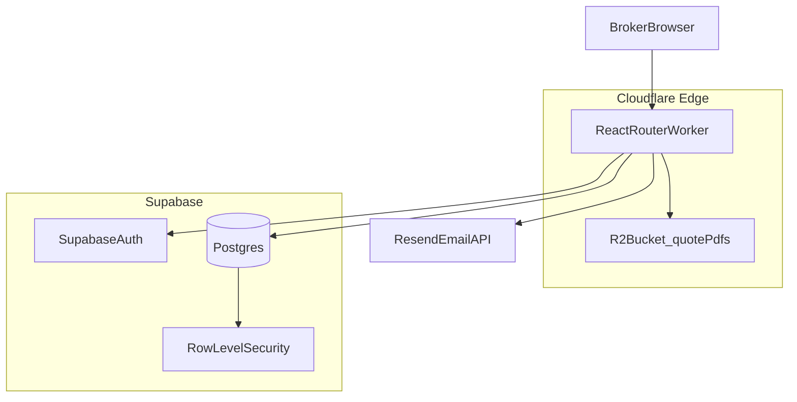
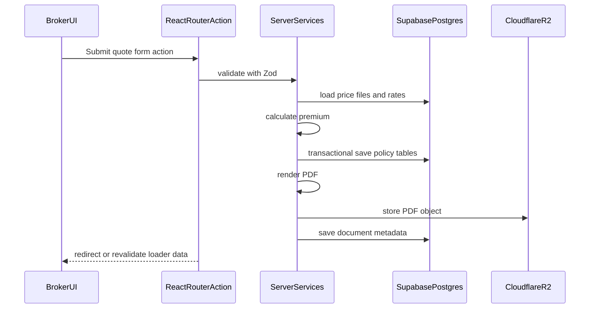

# CAR Insurance App — Technical Specification

Companion to [CAR_INSURANCE_APP_SPEC.md](./CAR_INSURANCE_APP_SPEC.md). Defines the rebuild architecture, stack, infrastructure, and implementation conventions.

---

## 1) Architecture Overview

### 1.1 High-Level Topology



### 1.2 Architectural Principles

| Principle | Decision |
|-----------|----------|
| Server-first data access | Loaders, actions, and server modules own reads/writes. No client-side Supabase calls for business data. |
| Minimize APIs | Prefer React Router loaders/actions over standalone REST endpoints. Add explicit API routes only for webhooks, PDF streaming edge cases, or third-party integrations. |
| Type safety end-to-end | TypeScript everywhere; Zod at boundaries; generated DB types from Supabase schema. |
| Business logic on server | Pricing, referral rules, policy persistence, and PDF generation run server-side only. |
| Broker-only auth | Supabase Auth for brokers; clients are DB records only. |
| Immutable quote artifacts | Generated PDFs stored in R2; metadata in Postgres. |

### 1.3 Request Flow (Server-First)



---

## 2) Technology Stack

### 2.1 Core Framework

| Layer | Choice | Version / Notes |
|-------|--------|-----------------|
| Framework | React Router (Framework mode) | File-based routes, loaders, actions, SSR/streaming |
| UI library | React | v19 |
| Language | TypeScript | Strict mode (`strict: true`) |
| Validation | Zod | Shared schemas for forms, actions, and services |
| Forms | React Hook Form | **Recommended — see §6** |
| Styling | Tailwind CSS | Latest stable |
| Components | [shadcn/ui](https://ui.shadcn.com/) | Source-owned components via CLI |
| Database | Supabase Postgres | Schema from `db.txt` |
| Auth | Supabase Auth | Email/password or SSO for brokers |
| Object storage | Cloudflare R2 | Quote PDFs and templates |
| Email | [Resend](https://resend.com/) | Transactional email (quote delivery, notifications) |
| Hosting | Cloudflare Workers | React Router Cloudflare adapter |

### 2.2 Key Libraries

```txt
react-router
react / react-dom
@supabase/supabase-js
@supabase/ssr
zod
react-hook-form
@hookform/resolvers
tailwindcss
class-variance-authority
clsx / tailwind-merge
sonner (toasts)
lucide-react (icons)
```

Server-only (not bundled to client):

```txt
resend                # outbound email via Resend API
@react-pdf/renderer   # or pdf-lib / puppeteer — evaluate in spike
# Supabase service role client
# R2 S3-compatible SDK or Workers binding
```

---

## 3) Project Structure

```txt
app/
  routes/
    _auth.login.tsx
    _auth.logout.tsx
    _app.tsx                    # authenticated layout
    _app.dashboard.tsx
    _app.clients._index.tsx
    _app.clients.new.tsx
    _app.clients.$clientId.tsx
    _app.quotes.new.tsx
    _app.quotes.$policyId.tsx
    _app.quotes.$policyId.pdf.tsx
    _app.quotes.$policyId.send-email.tsx
    api.health.tsx              # minimal explicit API surface
    api.webhooks.resend.tsx     # optional delivery/bounce events
  components/
    ui/                         # shadcn components
    forms/                      # CAR form sections
    layout/
  lib/
    supabase/
      server.ts                 # service role + cookie client
      browser.ts                # auth-only browser client if needed
    zod/
      client.ts
      policy-car.ts
      pricing.ts
    services/
      client.service.ts
      policy.service.ts
      pricing.service.ts
      pdf.service.ts
      document.service.ts
      email.service.ts
    db/
      types.ts                  # generated from Supabase
  server/                       # server-only modules
    pricing/
      car-calculator.ts         # port of legacy CARCalculator2
      rate-resolver.ts
    pdf/
      quote-template.tsx
    email/
      resend-client.ts
      templates/
        quote-email.tsx
workers/
  app.ts                        # Cloudflare entry (if separate)
wrangler.toml
supabase/
  migrations/
  seed.sql
```

### 3.1 Route Conventions

- **Loaders**: read data for pages (clients, policy, reference tables).
- **Actions**: mutations (create client, save quote, recalculate, generate PDF, update status).
- **No fetch-to-REST from UI** for internal operations; use `<Form>`, `useFetcher`, or `useSubmit` against route actions.

---

## 4) Supabase Design

### 4.1 Schema

- Implement tables from [db.txt](./db.txt) as Supabase migrations.
- Add extension tables for rebuild needs:

```sql
-- Broker profile linked to Supabase auth.users
create table broker_profile (
  id uuid primary key references auth.users(id) on delete cascade,
  ar_id int references ar(ar_id),
  full_name text not null,
  created_at timestamptz default now()
);

-- Policy document metadata (PDF in R2)
create table policy_document (
  policy_document_id serial primary key,
  policy_id int not null references policy(policy_id),
  document_type text not null, -- 'quote', 'schedule', etc.
  r2_key text not null,
  file_name text not null,
  mime_type text default 'application/pdf',
  created_at timestamptz default now(),
  created_by uuid references auth.users(id)
);
```

### 4.2 Auth and Roles

| Role | Access |
|------|--------|
| `broker` | CRUD clients, quotes, PDFs for own AR scope |
| `admin` | Reference data, price files, all brokers (optional v1) |

- Supabase Auth handles sign-in, sessions, password reset.
- `broker_profile` maps `auth.users.id` → business identity (`AR`, display name).
- JWT claims or profile lookup used in server services for authorization.

### 4.3 Row Level Security (RLS)

- Enable RLS on all business tables.
- Policies scoped by `ar_id` (broker sees only their AR's clients/policies).
- Server actions use **service role** only inside trusted server modules; never expose service key to browser.
- Browser receives session cookie; server validates session per request.

### 4.4 Data Access Pattern

```ts
// Server action pattern (pseudocode)
export async function action({ request, context }) {
  const session = await requireBroker(request);
  const input = carQuoteSchema.parse(await request.formData());
  return await policyService.saveQuote({ session, input });
}
```

- **Do not** use Supabase Realtime for v1 (not required).
- **Do not** expose generic CRUD APIs; encapsulate in services.

### 4.5 Migrations and Types

1. SQL migrations in `supabase/migrations/`.
2. Seed reference data from `db.txt` records (PolicyType, State, CARStatus, etc.).
3. Generate types: `supabase gen types typescript --project-id <id> > app/lib/db/types.ts`.

---

## 5) Cloudflare Infrastructure

### 5.1 Deployment Model

| Component | Service |
|-----------|---------|
| App runtime | Cloudflare Workers (React Router Cloudflare preset) |
| Static assets | Workers Assets / built client bundle |
| PDF storage | R2 bucket `car-quote-pdfs` |
| Secrets | Workers secrets (Supabase keys, R2 credentials) |
| DNS / TLS | Cloudflare zone |

### 5.2 Wrangler Bindings

```toml
# wrangler.toml (illustrative)
name = "car-insurance-app"
main = "build/server/index.js"
compatibility_date = "2025-01-01"

[[r2_buckets]]
binding = "QUOTE_PDFS"
bucket_name = "car-quote-pdfs"

[vars]
SUPABASE_URL = "..."
# secrets: SUPABASE_SERVICE_ROLE_KEY, SUPABASE_ANON_KEY, RESEND_API_KEY
```

### 5.3 R2 PDF Storage

**Object key convention:**

```txt
quotes/{policyId}/{documentType}/{timestamp}.pdf
```

**Flow:**

1. Server generates PDF bytes.
2. Upload to R2 via binding or S3-compatible API.
3. Insert `policy_document` row with `r2_key`.
4. Download route streams from R2 after auth check (signed URL or worker proxy).

**Benefits:** cheap storage, edge-adjacent to Workers, no Supabase Storage egress for large PDFs.

### 5.4 Environments

| Env | Purpose |
|-----|---------|
| `dev` | Local Wrangler + Supabase local or dev project |
| `staging` | Pre-prod validation |
| `production` | Live broker use |

---

## 6) Forms Strategy — Is React Hook Form Required?

**Recommendation: Yes, use React Hook Form.**

This is a form-heavy broker app (multi-step CAR quote, client create/edit, excess/sub-limit sections, conditional fields). React Hook Form is the right default.

| Concern | Without RHF | With RHF |
|---------|-------------|----------|
| 50+ fields across wizard steps | Manual state object, verbose | `useForm` + field registration |
| Validation | Custom error mapping | `@hookform/resolvers/zod` |
| Performance | Re-render whole form on each keystroke | Uncontrolled fields, minimal re-renders |
| Dirty / touched tracking | Manual | Built-in `formState` |
| Section-level save | Custom | `trigger(['section1'])` partial validation |
| shadcn integration | Awkward | `Controller` + `Field` components |

### 6.1 Form Architecture

- **One `useForm` per quote wizard** with Zod schema split by step.
- Steps: `ClientContext` → `RiskDetails` → `Section1` → `Section2` → `ExcessSubLimits` → `ReviewPremium`.
- Use `useFetcher` for **recalculate premium** without full navigation.
- Persist draft on step transition via server action (autosave optional v1.1).

### 6.2 Zod + RHF Pattern

```ts
const carQuoteFormSchema = z.object({
  coverTypeId: z.coerce.number(),
  estimatedTurnover: z.coerce.number().positive(),
  postcode: z.string().regex(/^\d{4}$/),
  // ...
});

const form = useForm<CarQuoteFormValues>({
  resolver: zodResolver(carQuoteFormSchema),
  defaultValues: loaderData.draft,
});
```

- **Single source of truth**: Zod schemas in `app/lib/zod/` used by both RHF (client) and actions (server re-parse).

---

## 7) Server-Side Domains

### 7.1 Pricing Service

Port legacy `CARCalculator2` logic to TypeScript:

- Inputs: cover type, turnover, section values, liability, state, postcode, plant, dates.
- Rate resolution from `PriceFile*`, `Fee*`, `CARExcess` tables by effective date.
- Outputs: all `PolicyCAR` premium fields + `PolicyFee` rows.
- Referral evaluation → `PolicyNote` (type Referral).

**Rule:** pricing endpoint is a server action / loader revalidation only — never client-side.

### 7.2 Policy Service

Transactional saves across:

- `PolicyHeader`, `PolicyPeriod`, `Policy`
- `PolicyCAR`, `PolicyCARExcess`, `PolicyCARSubLimit`, `PolicyCARWording`, `PolicyFee`, `PolicyNote`

**Policy state rules** (see [CAR_INSURANCE_APP_SPEC.md §6.9](./CAR_INSURANCE_APP_SPEC.md#69-policy-state-and-lifecycle)):

- **Pending (draft)**: create/update allowed.
- **Taken**: original policy row is **immutable** after commit; no UPDATE to `PolicyCAR` premium fields.
- **Not taken**: terminal; no edits or adjustments.
- **Adjustments**: separate `PolicyCARAdjustment` records (Draft / Applied), one-to-many per policy. Effective premium = original + latest Applied adjustment delta. Adjustments only when Taken and `today <= dateEnd`.

Use Postgres transactions (Supabase RPC or sequential with rollback).

### 7.3 PDF Service

1. Load policy + premium snapshot (original Taken policy **+** latest Applied adjustment if any).
2. Render template (React PDF or HTML→PDF).
3. Upload to R2.
4. Record metadata.

Legacy used Word mail-merge + Aspose; rebuild should use a maintainable server template approach.

### 7.4 Email Service (Resend)

Outbound email is handled server-side via [Resend](https://resend.com/). No client-side email API calls.

**Use cases (v1):**

| Email | Trigger | Attachment |
|-------|---------|------------|
| Quote to client/recipient | Broker action on quote view | Quote PDF from R2 |
| Referral notification | Referral rule triggered on save | Optional |
| Status change notice | CAR status updated (Taken / Not taken) | Optional |

**Flow:**

1. Broker submits send-email form (recipient, subject, optional message) on quote view.
2. Server action validates with Zod and checks broker auth + AR scope.
3. `email.service.ts` fetches PDF bytes from R2 (if attaching).
4. Resend API sends email from verified domain (e.g. `quotes@yourdomain.com.au`).
5. Server inserts `EmailLog` row (`ClientId`, `From`, `To`, `Subject`, `Content`, `DateSent`, audit fields).
6. UI shows success/error toast via `sonner`.

**Implementation:**

```ts
// app/server/email/resend-client.ts
import { Resend } from "resend";

export function createResendClient(apiKey: string) {
  return new Resend(apiKey);
}

// app/lib/services/email.service.ts
export async function sendQuoteEmail({
  to,
  subject,
  html,
  pdfBytes,
  fileName,
  clientId,
  createdBy,
}: SendQuoteEmailInput) {
  const resend = createResendClient(env.RESEND_API_KEY);
  const { data, error } = await resend.emails.send({
    from: env.RESEND_FROM_ADDRESS,
    to,
    subject,
    html,
    attachments: pdfBytes
      ? [{ filename: fileName, content: pdfBytes }]
      : undefined,
  });
  if (error) throw error;

  await insertEmailLog({ clientId, to, subject, content: html, createdBy });
  return data;
}
```

**Templates:**

- React Email components (optional) or simple HTML strings in `app/server/email/templates/`.
- Merge fields: client name, policy number, premium total, broker name, effective dates.

**Resend configuration:**

| Setting | Value |
|---------|-------|
| `RESEND_API_KEY` | Workers secret |
| `RESEND_FROM_ADDRESS` | Verified sender on Resend domain |
| Domain DNS | SPF, DKIM, DMARC via Resend dashboard |
| Webhook (optional) | `POST /api/webhooks/resend` for delivery/bounce events |

**Logging:** all sends map to `EmailLog` per **FR-DOC-04**. Display email history on client detail view (legacy parity with `ClientDetails` email log).

**Rule:** email sending is a server action only — never expose `RESEND_API_KEY` to the browser.

### 7.5 Minimal API Surface

Explicit routes only where needed:

| Route | Purpose |
|-------|---------|
| `GET /quotes/:id/pdf` | Stream/download quote PDF |
| `POST /quotes/:id/send-email` | Send quote email via Resend (server action preferred) |
| `GET /api/health` | Health check |
| `POST /api/webhooks/resend` | Optional Resend delivery/bounce webhook |

Everything else: loaders + actions.

---

## 8) UI and Responsive Design

### 8.1 shadcn/ui Setup

- Initialize with React Router + Tailwind v4 compatible preset.
- Add components via CLI: `sidebar`, `button`, `input`, `select`, `field`, `card`, `tabs`, `table`, `dialog`, `sheet`, `sonner`, `badge`, `separator`, `skeleton`, `toggle-group`.
- Compose dashboards from existing primitives per [shadcn/ui](https://ui.shadcn.com/) patterns.

### 8.2 Layout Responsive Rules

| Breakpoint | Layout |
|------------|--------|
| `< md` (mobile) | Collapsible sidebar (Sheet), single-column forms, sticky step footer |
| `md–lg` (tablet) | Sidebar visible, two-column form grids where appropriate |
| `≥ lg` (desktop) | Full sidebar + content, quote review split pane (form / premium summary) |

### 8.3 Form UX (Responsive)

- Wizard step indicator horizontal on desktop, compact progress on mobile.
- Premium summary panel: sticky right column on `lg+`, collapsible bottom sheet on mobile.
- Tables (client search, policy list): horizontal scroll on small screens; card list alternative on `sm`.
- Touch targets ≥ 44px on mobile actions.

### 8.4 shadcn Conventions (from project skill)

- Use `Field` + `FieldGroup` for form layout.
- Semantic tokens (`bg-background`, `text-muted-foreground`).
- `flex` + `gap-*` instead of `space-y-*`.
- Toast via `sonner`.

---

## 9) Security

| Area | Approach |
|------|----------|
| Authentication | Supabase Auth session cookies via `@supabase/ssr` |
| Authorization | Server checks broker role + AR scope on every action |
| RLS | Defense in depth on Postgres |
| Secrets | Workers secrets only; never in client bundle |
| PDF access | Auth-gated download; no public R2 URLs |
| Email | Resend API key in Workers secrets only; verified sending domain |
| Input validation | Zod on server (authoritative) + client (UX) |
| Audit | `created_by` from `auth.users.id`, timestamps on writes |

---

## 10) Observability and Operations

- Cloudflare Workers logs for request errors and PDF generation failures.
- Structured log events: `quote.created`, `quote.recalculated`, `pdf.generated`, `email.sent`, `email.failed`, `status.changed`.
- Supabase dashboard for DB metrics and slow queries.
- Health endpoint for uptime checks.

---

## 11) Development Workflow

### 11.1 Local Setup

```bash
# App
npm create react-router@latest
npx shadcn@latest init

# Supabase
supabase init
supabase start
supabase db reset

# Cloudflare
wrangler dev
```

### 11.2 Recommended Cursor MCP Servers

| MCP | Use For | Status |
|-----|---------|--------|
| **shadcn** (`plugin-shadcn-shadcn`) | Add/search components, presets, component docs | Available |
| **Cloudflare Docs** (`plugin-cloudflare-cloudflare-docs`) | Workers, R2, bindings documentation | Available |
| **Cloudflare Bindings** (`plugin-cloudflare-cloudflare-bindings`) | R2 bucket setup, Workers config | Available |
| **Cloudflare Observability** | Production log investigation | Available |
| **Supabase MCP** | Migrations, auth, SQL, typegen | **Install separately** — not in current workspace; add from [Supabase MCP docs](https://supabase.com/docs/guides/getting-started/mcp) |

> **Note:** Neon Postgres MCP is available in this workspace but targets Neon, not Supabase. Use it only if you pivot DB provider; otherwise prefer Supabase CLI + Supabase MCP.

### 11.3 Recommended Cursor Skills

| Skill | Path | Use For |
|-------|------|---------|
| **shadcn** | `~/.cursor/plugins/cache/cursor-public/shadcn/.../skills/shadcn/SKILL.md` | Component setup, form patterns, styling rules |
| **wrangler** | `~/.claude/skills/wrangler/SKILL.md` | Deploy, R2 bindings, secrets |
| **cloudflare** | `~/.claude/skills/cloudflare/SKILL.md` | Workers architecture |
| **workers-best-practices** | `~/.claude/skills/workers-best-practices/SKILL.md` | Production Worker patterns |

No dedicated Supabase skill is installed; rely on Supabase MCP + official docs for auth/RLS/migrations.

---

## 12) Implementation Phases

### Phase 1 — Foundation
- React Router + Cloudflare Workers scaffold
- Supabase schema migration from `db.txt`
- Auth (login/logout, broker profile)
- shadcn layout shell (sidebar, responsive nav)

### Phase 2 — Client Management
- Client search/create/view
- Reference data loaders (EntityType, AR, AccountManager)

### Phase 3 — CAR Quote Form
- Multi-step wizard with RHF + Zod
- Draft save action
- Premium recalculation fetcher

### Phase 4 — Pricing Engine
- Port `CARCalculator2` to TypeScript
- Rate resolver from price files
- Referral notes

### Phase 5 — PDF Pipeline
- Template + generation
- R2 upload + download route
- Document metadata

### Phase 6 — Email (Resend)
- Resend domain verification and API key setup
- `email.service.ts` + quote email template
- Send-email action on quote view with PDF attachment
- `EmailLog` persistence and client email history UI

### Phase 7 — Hardening
- RLS policies
- E2E tests for quote flow
- Staging deploy

---

## 13) Technical Requirements Traceability

| Product Req | Technical Implementation |
|-------------|-------------------------|
| FR-AUTH-* | Supabase Auth + `requireBroker()` guard |
| FR-CLIENT-* | `client.service.ts`, routes under `_app.clients.*` |
| FR-POL-* / FR-CAR-* | `policy.service.ts`, quote wizard actions |
| FR-PRICE-* | `pricing/car-calculator.ts`, server action recalc |
| FR-DOC-* | `pdf.service.ts`, R2, `policy_document` table |
| FR-DOC-04 | `email.service.ts`, Resend, `EmailLog` table |
| FR-AUD-* | `created_by` UUID, `PolicyNote`, structured logs |
| NFR-02 | Postgres transactions in policy save |
| NFR-03 | RLS + server-side auth checks |
| BC-03 | No payment modules or routes |

---

## 14) Open Technical Decisions (Spikes)

| Decision | Options | Recommendation |
|----------|---------|----------------|
| PDF engine | `@react-pdf/renderer`, `pdf-lib`, HTML→PDF (Playwright in Worker) | Spike with `@react-pdf/renderer` first (fits React stack) |
| Autosave | Step save only vs debounced autosave | Step save for v1 |
| Admin price file / configuration UI | In-app vs manual DB only | **Manual DB only** at this stage (no configuration UI); AR management UI in-app per Phase 1 |
| Email outbound | Resend, SendGrid, Postmark | **Resend** — simple API, good Worker compatibility |

---

## 15) Glossary (Technical)

| Term | Meaning |
|------|---------|
| Loader | React Router server function that supplies route data |
| Action | React Router server function that handles mutations |
| RLS | Supabase Row Level Security |
| R2 | Cloudflare object storage (S3-compatible) |
| Service role | Supabase admin key for trusted server-only operations |
| Resend | Transactional email API used for quote delivery |
