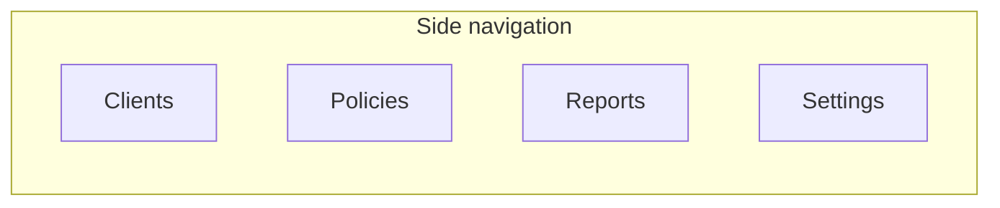
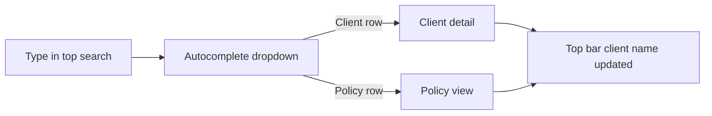
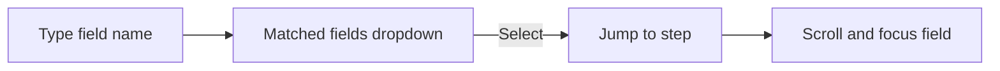
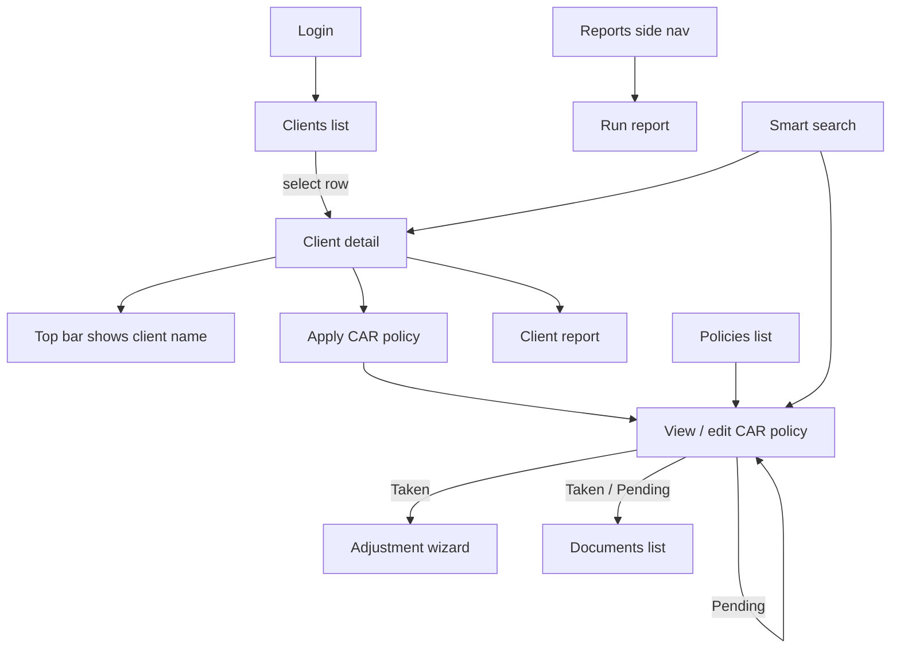
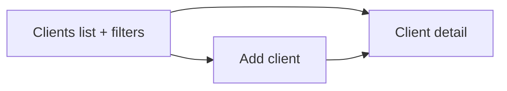
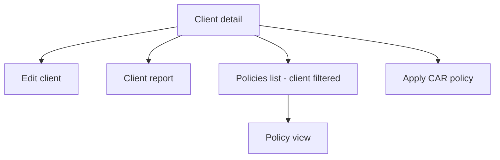
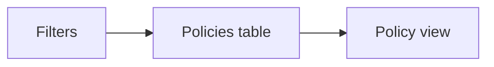
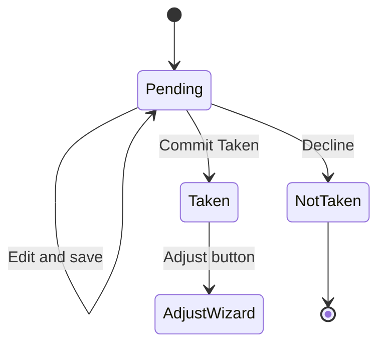
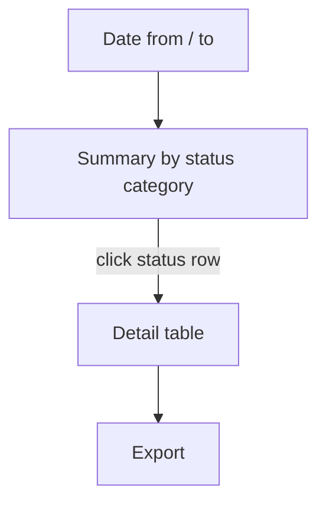
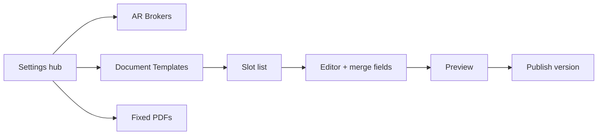

# CAR Insurance App — UI Flow & Screen Map

Companion to [CAR_INSURANCE_APP_SPEC.md](./CAR_INSURANCE_APP_SPEC.md). Use this document to design user experience, navigation, and wireframes for **Phase 1** (per *Phase 1 Scope of Works IRECON*).

**Design principle:** Replicate legacy EBS functionality on a like-for-like basis with a modernised UI. Every screen below maps to a legacy page where one exists.

**User stories (broker workflows):** [CAR_INSURANCE_USER_STORIES.md](./CAR_INSURANCE_USER_STORIES.md)

---

## 1) Application shell

Layout: **side navigation** (primary modules) + **top bar** (global context) + **main content**.

```
┌──────────────────────────────────────────────────────────────────────────────┐
│ [App]  🔍 Search clients and policies…          Acme Construction Pty Ltd  [User] │
├──────────┬───────────────────────────────────────────────────────────────────┤
│ Clients  │                                                                   │
│ Policies │                        Main content                               │
│ Reports  │                                                                   │
│ Settings │                                                                   │
└──────────┴───────────────────────────────────────────────────────────────────┘
```

### 1.1 Side navigation (primary)

Four **peer** items — same level, no nesting under Home or a Reports parent in the side nav:

| Side nav item | Route | Main content |
|---------------|-------|----------------|
| **Clients** | `/clients` | Client **list** with inline filters (not a separate “search” step) |
| **Policies** | `/policies` | Policy **list** with inline filters |
| **Reports** | `/reports` | Report hub; individual reports open in main content |
| **Settings** | `/settings` | Settings hub (AR brokers, document templates, fixed PDFs) |



**Reports** — selecting the side nav item opens the reports area. Secondary links inside main content (or a slim sub-nav under the page title):

- Client Report *(client-scoped; requires selected client — see §1.2)*
- CAR Policy Report
- CAR Renewal Report
- IRECON Reconciliation
- Expiring OBCAR

**Settings** — selecting Settings opens the settings area (admin only):

- AR Broker Management
- Document Templates (Schedule, ROA, Adjustment — versioned editor + preview)
- Fixed PDFs (upload / delete static attachments)

| Module | Phase 1 |
|--------|---------|
| Clients | Yes |
| Policies | Yes |
| Reports | Yes (see list above) |
| Settings | Yes |
| Cancel Policies | **Out of scope** |

### 1.2 Top navigation (header)

Always visible above main content.

| Element | Behaviour |
|---------|-----------|
| App / logo | Returns to default landing (`/clients`) |
| **Smart search** | Global search clients + policies — see §1.3 |
| **Client name** | Shown when a client is **selected** (active context). Links to client detail. Sits beside search (or right of search). |
| Clear client | Optional `×` or “All clients” to clear context and remove name from top bar |
| User menu | Sign out, profile (if applicable) |

**When client name appears:**

- User opens a client from the **Clients** list → client becomes selected → top bar shows e.g. `Acme Construction Pty Ltd`
- User navigates to Policies, Reports, or a policy while context is kept → top bar **still shows** the same client name
- User clears context or picks **Clients** without a selection → top bar shows no client name (or placeholder “No client selected”)
- Selecting a **client** from smart search also sets selected client and updates the name chip

**Client-scoped actions** (legacy client sidebar) live on **client detail** and contextual toolbars — not as duplicate side nav entries:

- Edit client · Client report · Apply CAR policy · View client’s policies (deep-link to `/policies?clientId=…`)

### 1.3 Smart search (top bar)

Single **omnibox** in the top nav: search **clients** and **policies** from anywhere in the app.

**Interaction:**

1. Broker focuses the search field (keyboard shortcut optional e.g. `/` or `⌘K`).
2. Broker types a query (min 2 characters recommended).
3. Dropdown shows **autocomplete matches** grouped by type.
4. Broker selects a row → navigate to **client detail** or **policy view**; client selection also updates top-bar client context.

**Dropdown layout:**

```
┌─ Clients ─────────────────────────────────────┐
│  Acme Construction Pty Ltd     · Sydney      │
│  Acme Builders Ltd             · Melbourne   │
├─ Policies ────────────────────────────────────┤
│  CAR-2024-00123  · Acme Construction · Taken │
│  CAR-2024-00456  · Beta Corp        · Pending│
└───────────────────────────────────────────────┘
```

| Match type | Search against (suggested) | Result action |
|------------|---------------------------|---------------|
| **Client** | Name, trading name | `/clients/:id` + set selected client |
| **Policy** | Policy number, client name, site/invoice comment | `/policies/:id` + set policy’s client as selected |

**Behaviour:**

- Debounced request (e.g. 200–300 ms); show loading spinner in dropdown while fetching.
- **No matches:** “No clients or policies found.”
- **Recent items** (optional): last 5 clients/policies visited when field is focused and empty.
- Search is **global** — not limited to the current client filter.
- Does not replace **Clients** / **Policies** list pages (those keep full filters and tables); smart search is for **fast jump**.



### 1.4 Field finder (CAR policy wizard & edit)

When the broker is in the **CAR policy wizard** (new quote) or **editing a Pending policy** (same multi-step form), a **field search** control helps jump to any field without clicking through every step.

**Placement:** Sticky sub-header below top bar (or top of wizard chrome):

```
┌─────────────────────────────────────────────────────────────┐
│  Find field…  e.g. turnover, stamp duty, excess              │
└─────────────────────────────────────────────────────────────┘
│  Step 2 of 7 · Risk details          [ < Back ]  [ Next > ] │
```

**Interaction:**

1. Broker types a field label or keyword (e.g. `turnover`, `site address`, `section 1`).
2. Autocomplete dropdown lists **only matching fields** across **all wizard steps**.
3. Each result shows: **field label** · **step name** (e.g. “Annual turnover · Premium”).
4. Broker selects a match → wizard **navigates to that step**, scrolls to the field, and **focuses** the input (highlight ring).

**Example dropdown:**

```
┌─ Matching fields ─────────────────────────────┐
│  Annual turnover          · Step 3 · Premium   │
│  Turnover adjustment      · Step 5 · Declarations │
│  Site address             · Step 1 · Insured    │
└────────────────────────────────────────────────┘
```

**Rules:**

- Match against display labels from [CAR_FORM_VALIDATION.md](./CAR_FORM_VALIDATION.md) (and section headings as secondary text).
- Fuzzy / contains match is acceptable (`turn` → turnover).
- **Pending edit only** — field finder available when the form is editable (new quote + Pending policy). Hidden for Taken / Not taken read-only views.
- Does not change step validation: broker may still need to complete required fields on other steps before save.
- Optional: after jump, briefly pulse the target field (accessibility: focus + `aria-describedby`).



**Applies to:**

| Screen | Field finder |
|--------|----------------|
| Apply CAR policy wizard (`/clients/:id/policies/new`) | Yes |
| Edit Pending policy (wizard mode on `/policies/:id`) | Yes |
| View Taken / Not taken policy | No |
| Adjustment wizard | No (only two inputs; field finder not needed) |

### 1.5 Active nav state

- Side nav highlights **Clients**, **Policies**, **Reports**, or **Settings** according to current route.
- Client detail (`/clients/:id`) keeps **Clients** highlighted in the side nav.
- Policy view (`/policies/:id`) keeps **Policies** highlighted.

---

## 2) High-level user journeys



---

## 3) Screen flows (Phase 1)

### 3.1 Clients list

**Route:** `/clients` — side nav → **Clients**  
**Legacy:** client search pages (replaced by list + filter pattern)

**Layout:** Filter panel above a **paginated client table**. No separate “search results” step — filters refine the list in place.

**Filter fields (all optional):**

| Field | Behaviour |
|-------|-----------|
| Name | Primary text filter; **focused on first load** |
| Trading Name | |
| Account Manager | Dropdown / lookup |
| AR Company | Filters AR Name options when set |
| AR Name | Typeahead; **first + last name only** (not company). Filtered by AR Company when set. |

**Table columns (suggested):** Name · Trading Name · AR Name · Account Manager · (actions)

**Row click** → Client detail; sets **selected client** → top bar shows client name.

**Primary action:** **Add client** button (toolbar, top-right of list).



---

### 3.2 Add client

**Route:** `/clients/new`  
**Legacy:** `ClientAdd.aspx` (subset for Phase 1)

| Field | Phase 1 rule |
|-------|----------------|
| Name | Label was "Entity Name" in legacy → **Name** |
| Trading Name | |
| Entity type | |
| Account Manager | |
| AR Name | **Typeahead**: typing shows matches; each option shows **person name + company/practice name**. Search matches first/last name only. |
| Other legacy fields on add form | Only fields listed here are in scope |

**Actions:** Save → Client detail (sets selected client; top bar updates). Cancel → Clients list.

**Not in Phase 1:** Delete client.

---

### 3.3 Client detail

**Route:** `/clients/:clientId`  
**Legacy:** `ClientDetails.aspx` + policy summary

Opening this page sets **selected client**; top bar shows **client name**.

**Sections:**

1. **Client details** — read-only summary of migrated + add-client fields.
2. **AR information** (display on client page per SOW):
   - AR Company Name
   - AR Contact Name
   - AR Number
   - AR Email
3. **Policy summary** — CAR counts with links:

| Badge | Links to |
|-------|----------|
| PENDING — # | `/policies?clientId=…&status=pending` |
| Taken — # | `/policies?clientId=…&status=taken` |
| Not taken — # | `/policies?clientId=…&status=not-taken` |

4. **Actions (page toolbar):** Edit client · Client report · Apply CAR policy · View all policies

5. **Grouped policies table** — tree view for **adjustments and renewals only** (copied policies are flat rows). See [CAR_INSURANCE_USER_STORIES.md](./CAR_INSURANCE_USER_STORIES.md#policy-grouping-cross-cutting-ui):

```
▸ A1          Taken     …
    A1-adjustment-1  Draft
    A1-adjustment-2  Applied
▸ B1          Taken     Renewal family
    B1-2025          Taken
    B1-2026          Pending
C1            Pending   (copy — not grouped under A1)
```

Expand/collapse per root policy. Row opens policy view or draft adjustment wizard.



---

### 3.4 Edit client

**Route:** `/clients/:clientId/edit`  
**Legacy:** edit subset of `ClientAdd`

- **Same fields as Add client** only.
- **No delete client** in Phase 1.
- Save → Client detail.

---

### 3.5 Client report

**Route:** `/clients/:clientId/report`  
**Legacy:** `ClientReport.aspx`

1. Parameters: **Date from**, **Date to** (default: current calendar month).
2. **Run report** → table on page.
3. **Export** → CSV/XLSX.

| Policy Type | Base Premium (Ex. GST) | Broker Fee (Ex. GST) |
|-------------|------------------------|----------------------|
| CAR / UNKNOWN / … | summed | summed |

Summary of **true base premium** and broker fees for all client policies in the date range.

---

### 3.6 Policies list

**Route:** `/policies` — side nav → **Policies**  
**Legacy:** policy search (replaced by list + filter pattern)

**Layout:** Filter panel above a **paginated policy table**. CAR policies only.

**Optional deep-link query params:**

| Param | Set by |
|-------|--------|
| `clientId` | Client detail, policy summary badges, top-bar client context |
| `status` | `pending` \| `taken` \| `not-taken` |

When **top bar has a selected client**, opening Policies from side nav may default `clientId` to that client (user can clear filter to see all policies).

**Filter fields:**

| Field | Behaviour |
|-------|-----------|
| Status | Pending / Taken / Not taken (required for broker workflows — find quotes, bind Taken) |
| Client | Pre-filled when client context active; typeahead by client name |
| Policy number | Text |
| Inception from / to | Date range |
| Expiry from / to | Date range |

**View mode:** Flat table (default) or **Grouped** when `clientId` filter is set (same component as client detail grouped table).

**Table columns (suggested):** Policy number · Client name · Inception · Expiry · Status · Last updated

**Row click** → Policy view (`/policies/:policyId`).



---

### 3.7 Apply CAR policy (new quote wizard)

**Route:** `/clients/:clientId/policies/new`  
**Legacy:** `CARNewPolicy.aspx`

Multi-step wizard (align with existing CAR form sections in [CAR_FORM_VALIDATION.md](./CAR_FORM_VALIDATION.md)).

**Phase 1 change — Annual cover only:**

When cover type = **Annual**, show new question **Type of cover**:

| Value | Effect on "Insured contracts" field |
|-------|-------------------------------------|
| Transfer | Pre-fill / replace with TBC wording from Lesley |
| Contract Commencing | Pre-fill / replace with TBC wording from Lesley |

> Wording strings pending from business — placeholder in UI until supplied.

**Flow:**

```mermaid
stateDiagram-v2
  [*] --> WizardSteps: Start apply CAR
  WizardSteps --> WizardSteps: Save draft / recalculate
  WizardSteps --> PolicyView: First save creates Pending policy
  note right of PolicyView: PDF: Schedule + additional docs
```

**Exit:** Save → **View / edit CAR policy** (Pending).

**Field finder:** §1.4 — use **Find field…** to jump to any form field across steps.

---

### 3.8 View / edit CAR policy

**Route:** `/policies/:policyId`  
**Legacy:** `CARViewPolicy.aspx`

**Layout change (Phase 1):** **Inception date** and **Expiry date** at the **top** of the page.

| Status | Editable fields |
|--------|-----------------|
| Pending | All quote fields including inception/expiry — **multi-step wizard** with field finder (§1.4) |
| Taken | Read-only policy; **Renew** (annual only) · **Copy** · **Adjust** (if not expired) |
| Not taken | Read-only; terminal |

**Toolbar actions (by status):**

| Action | Pending | Taken | Not taken |
|--------|---------|-------|-----------|
| Save | Yes | No | No |
| Email documents | Yes | Yes | Optional (historical) |
| Set Taken | Yes | — | — |
| Set Not taken | Yes | — | — |
| Renew | — | Annual only | — |
| Copy policy | Yes | Yes | Yes |
| Adjust | — | If not expired | — |

**Document area:**

- List generated PDFs (Schedule, ROA, Adjustment, additional)
- Download; optional email

**Taken + not expired:**

- Button: **Adjust** → Adjustment wizard



---

### 3.9 Adjustment wizard

**Route:** `/policies/:policyId/adjust`  
**Legacy:** `CARAdjust.aspx`

**Precondition:** Policy status = Taken, not expired.

Steps (like-for-like legacy):

1. Enter adjusted turnover, stamp duty exempt, recalculate
2. Review premium delta tables
3. Finish → Applied adjustment (target model) + PDF pack

**Exit:** Policy view with updated effective premium and new documents.

---

### 3.10 Reports

**Route:** `/reports` — side nav → **Reports** (peer with Clients and Policies)

Landing: cards or list linking to each report. Same UX pattern for every report:

1. Parameter panel
2. **Run report** → results **table in UI**
3. **Export** button (CSV/XLSX)

#### Client Report

**Route:** `/reports/client` or `/clients/:clientId/report`  
**Requires:** Selected client (from top bar or client detail). If none selected, prompt to select a client or pick from Clients list.

#### CAR Policy Report

**Route:** `/reports/car-policies`  
**Legacy:** `CARPolicyReport.aspx`



Summary columns: Status · Number of policies · Total base premium  
Detail columns: Client name · AR name · Date quoted · Base premium

#### CAR Renewal Report

**Route:** `/reports/car-renewals`  
**Legacy:** `CARRenewal.aspx`

Parameters: Reference date · Status checkboxes · Policy action (New / Renewal)  
Columns: Status · Type · Client · Expiry · AR · AR email · Due next days

#### IRECON Reconciliation Report

**Route:** `/reports/irecon-reconciliation`  
**Legacy:** `ReconciliationReportIrecon.aspx`

Parameters: Date from · Date to  
Two logical result tabs (or sections): **IAA summary** · **Policy details**

#### Expiring OBCAR Report

**Route:** `/reports/obcar-expiring`  
**Legacy:** `OBCARExpiringReport.aspx`

Parameters: Expiry date from · to  
Read-only contact list for renewal outreach.

---

### 3.11 Settings

**Route:** `/settings` — side nav → **Settings** (peer with Clients, Policies, Reports). **Admin only** — brokers do not see this nav item.

**In-app settings (Phase 1):**

| Screen | Route | Summary |
|--------|-------|---------|
| Settings hub | `/settings` | Links to sub-sections below |
| AR Broker Management | `/settings/ar-brokers` | Search, view, edit, delete AR records |
| Document Templates | `/settings/document-templates` | Merge templates per slot; version history; preview |
| Fixed PDFs | `/settings/fixed-pdfs` | Upload/delete static PDFs; assign to cover types + rules |

**Still manual DB only:** price files, fees, generic reference data — see [CAR_INSURANCE_APP_SPEC.md §10.2](./CAR_INSURANCE_APP_SPEC.md#102-configuration-and-reference-data--no-admin-ui-at-this-stage).

#### AR Broker Management

| Action | Phase 1 |
|--------|---------|
| Search | Yes |
| View | Yes |
| Edit | Yes |
| Delete | Yes |

AR records drive client **AR Name** typeahead and client detail AR block.

#### Document Templates

**Route:** `/settings/document-templates`  
**Spec:** [CAR_INSURANCE_APP_SPEC.md §6.13.2](./CAR_INSURANCE_APP_SPEC.md#6132-merge-templates-schedule-roa-adjustment)

List template **slots** (Schedule × cover type, ROA × cover type, Adjustment). Each slot:

1. **Editor** — embedded **pdfme Designer** (`@pdfme/ui`): text schemas = merge fields, image schema = logo; `basePdf` = static background from imported Word/PDF.
2. **Preview** — `@pdfme/generator` with sample policy fixture (same as production).
3. **Version history** — immutable pdfme `Template` JSON per version; one **active published** version per slot.
4. **Publish** / **rollback** to prior version.

Initial content imported from [`car-pdf-templates/`](../car-pdf-templates/) (one-time migration from legacy `.doc` seeds).



#### Fixed PDFs

**Route:** `/settings/fixed-pdfs`  
**Spec:** [CAR_INSURANCE_APP_SPEC.md §6.13.3](./CAR_INSURANCE_APP_SPEC.md#6133-fixed-pdf-attachments-caraddit)

- **Upload** PDF → stored in R2; appears in library.
- **Delete** from library (stops inclusion in **future** packs; does not remove PDFs already on policies).
- Assign to **cover type(s)** and optional **rules** (e.g. NSW only).
- Set **sort order** within additional-docs list per cover type.

**Not the same as policy document list:** generated Schedule/ROA/Adjustment PDFs on a policy are **never deleted** (audit trail).

---

## 4) Screen inventory (wireframe checklist)

| # | Screen | Route | Side nav | Phase 1 |
|---|--------|-------|----------|---------|
| 1 | Login | `/login` | — | Yes |
| 2 | Clients list | `/clients` | Clients | Yes |
| 3 | Add client | `/clients/new` | Clients | Yes |
| 4 | Client detail | `/clients/:id` | Clients | Yes |
| 5 | Edit client | `/clients/:id/edit` | Clients | Yes |
| 6 | Client report | `/clients/:id/report` or `/reports/client` | Reports | Yes |
| 7 | Policies list | `/policies` | Policies | Yes |
| 8 | Apply CAR policy | `/clients/:id/policies/new` | Clients* | Yes |
| 9 | View / edit CAR policy | `/policies/:id` | Policies | Yes |
| 10 | Adjustment wizard | `/policies/:id/adjust` | Policies | Yes |
| 11 | Reports hub | `/reports` | Reports | Yes |
| 12 | CAR Policy Report | `/reports/car-policies` | Reports | Yes |
| 13 | CAR Renewal Report | `/reports/car-renewals` | Reports | Yes |
| 14 | IRECON Reconciliation | `/reports/irecon-reconciliation` | Reports | Retained |
| 15 | Expiring OBCAR | `/reports/obcar-expiring` | Reports | Retained |
| 16 | Settings hub | `/settings` | Settings | Yes (admin) |
| 17 | AR Broker Management | `/settings/ar-brokers` | Settings | Yes (admin) |
| 18 | Document Templates | `/settings/document-templates` | Settings | Yes (admin) |
| 19 | Fixed PDFs | `/settings/fixed-pdfs` | Settings | Yes (admin) |
| — | Cancel Policies | — | — | **Excluded** |

\*Apply CAR is reached from client detail; side nav stays on **Clients** or follows client context.

**Default landing after login:** `/clients`

---

## 5) Policy list filters (from client summary)

From client detail, count badges deep-link to:

`/policies?clientId={id}&status=pending|taken|not-taken`

Same **Policies list** screen (§3.6) with filters pre-applied. Top bar continues to show client name.

---

## 6) Empty & error states (UX)

| Situation | UX |
|-----------|-----|
| No clients match filters | Empty table + adjust filters CTA |
| No policies match filters | Empty table + adjust filters CTA |
| No policies for client | Empty state on policy summary with **Apply CAR** CTA |
| Taken validation failed | Inline errors before commit |
| Expired policy + Adjust clicked | Block with message: policy expired |
| Report no rows | "No results" row (legacy parity) |
| PDF generation failed | Toast + activity log; retry action |
| Smart search no results | Empty dropdown message |
| Field finder no match | “No fields match …” in dropdown |

---

## 7) Related documents

- [CAR_INSURANCE_APP_SPEC.md](./CAR_INSURANCE_APP_SPEC.md) — functional requirements
- [CAR_FORM_VALIDATION.md](./CAR_FORM_VALIDATION.md) — CAR wizard field validation
- [CAR_SAVE_VALIDATION.md](./CAR_SAVE_VALIDATION.md) — save and lifecycle rules
- [Phase 1 Scope of Works IRECON.docx](./Phase%201%20Scope%20of%20Works%20IRECON.docx) — contract scope
