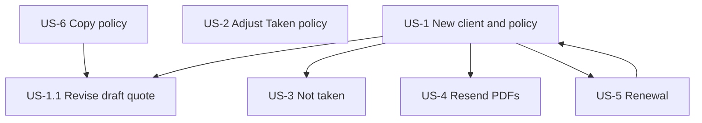

# CAR Insurance App — User Stories

Companion documents:

- [CAR_INSURANCE_UI_FLOW.md](./CAR_INSURANCE_UI_FLOW.md) — navigation and screens
- [CAR_INSURANCE_APP_SPEC.md](./CAR_INSURANCE_APP_SPEC.md) — functional requirements

These stories describe **broker workflows** for UI/UX design. Client confirmation happens **outside the app** (phone, email reply, etc.) unless noted.

---

## Personas

| Persona | Description | In-app access |
|---------|-------------|---------------|
| **Broker** | Insurance broker — creates clients, quotes, binds policies, adjustments, emails documents | Clients, Policies, Reports |
| **Admin** | Same login; **AR broker management** in-app (Phase 1). Price files, fees, templates, and other table configuration are **DB-only — no UI** at this stage | Admin (AR only) |

> **Staging assumption:** Price files and all other configuration tables are manually loaded/updated in the database. The app reads them at runtime; it does not provide screens to edit rates, fees, or reference data. See [CAR_INSURANCE_APP_SPEC.md §10.2](./CAR_INSURANCE_APP_SPEC.md#102-configuration-and-reference-data--no-admin-ui-at-this-stage).

---

## Policy grouping (cross-cutting UI)

Brokers need to see how **adjustments** and **renewals** relate to a bound policy. **Client detail** and **Policies list** (when filtered to one client) use a **grouped / tree table** for those relationships only.

**Copied policies are not grouped** — each copy is a separate top-level row in the policy list (same as any new quote). Traceability is via optional `CopiedFromPolicyId` and a banner on the policy view (“Copied from {policy#}”), not a tree parent/child.

### Example

| Policy # | Status | Inception | Expiry | Notes |
|----------|--------|-----------|--------|-------|
| **▸ A1** | Taken | 01/07/2024 | 30/06/2025 | Original |
| &nbsp;&nbsp;&nbsp;&nbsp;A1-adjustment-1 | Draft | — | — | Adjustment |
| &nbsp;&nbsp;&nbsp;&nbsp;A1-adjustment-2 | Applied | — | — | Adjustment |
| **▸ B1** | Taken | 01/07/2023 | 30/06/2024 | Renewal family |
| &nbsp;&nbsp;&nbsp;&nbsp;B1-2025 | Taken | 01/07/2024 | 30/06/2025 | Renewal |
| &nbsp;&nbsp;&nbsp;&nbsp;B1-2026 | Pending | 01/07/2025 | 30/06/2026 | Renewal (draft quote) |
| **C1** | Pending | 01/08/2025 | 31/07/2026 | Copy of A1 — **standalone row**, not nested |

**Grouping rules (adjustments and renewals only):**

| Child type | Parent | Label pattern | Shown when |
|------------|--------|---------------|------------|
| Adjustment | Taken policy | `{policy#}-adjustment-{n}` | Draft or Applied |
| Renewal | Prior annual policy | Same policy number or `{policy#}-{year}` | `PolicyAction = Renewal`; linked to predecessor |

**Not grouped:** policies created via **Copy policy** — always a flat root row with its own policy number.

- Expand/collapse (`▸` / `▾`) per root policy row that has adjustments or renewals.
- Row click opens **policy view** or **adjustment wizard** (for draft adjustment).
- Badges on grouped children: `Renewal`, `Draft`, `Adjustment`.

---

## Story map

---

## US-1 — New client, new policy (quote → Taken)

**As a** broker  
**I want to** create a client, build a CAR quote, send it to the client, and later bind it as Taken  
**So that** the client receives a formal quote and, once they agree, the policy is committed in the system.

### Flow

| Step | Actor | Action | System |
|------|-------|--------|--------|
| 1 | Broker | Create client with required details | Client saved; client selectable in top bar |
| 2 | Broker | Start **Apply CAR policy**; complete wizard | — |
| 3 | Broker | **Save** (first save) | Status = **Pending** (draft); **PDFs generated** (Schedule + quote pack) |
| 4 | Broker | **Email PDFs** to client | `EmailLog` + audit: docs sent |
| 5 | Client | Confirms quote (**manual**, outside app) | — |
| 6 | Broker | Log in; find client **or** find Pending policy | Clients list / Policies list (filter: Pending) |
| 7 | Broker | Open policy; set status to **Taken**; save | Policy **immutable**; full PDF pack generated |
| 8 | Broker | **Email confirmation** / bound docs to client | `EmailLog` + audit |

### Acceptance criteria

- [ ] **AC-1.1** Add client captures Phase 1 fields (Name, Trading Name, AR Name typeahead, etc.).
- [ ] **AC-1.2** New policy starts in **Pending** after first save.
- [ ] **AC-1.3** On draft save, system auto-generates quote PDFs (no manual “Generate” for happy path).
- [ ] **AC-1.4** Policy view shows **Email documents** action with selectable PDFs.
- [ ] **AC-1.5** Email send writes **audit log** (who, when, which docs, recipient).
- [ ] **AC-1.6** Broker can locate draft via **Clients** → client detail → grouped policies **or** **Policies** list with status = Pending.
- [ ] **AC-1.7** Changing status to **Taken** runs validation gates; on success policy becomes read-only except adjustments.
- [ ] **AC-1.8** Taken commit generates bound-policy PDF pack and allows email to client.
- [ ] **AC-1.9** Taken commit logs `TakenAt` / `TakenBy` in audit trail.

### UI touchpoints

- Clients list → Add client → Client detail → Apply CAR policy
- Policy view: status control (Pending → Taken), documents panel, email modal
- Top bar: client name after step 1

---

## US-1.1 — Client asked for changes on draft quote

**As a** broker  
**I want to** edit a Pending policy and resend updated quote PDFs  
**So that** the client can review changes before I bind the policy.

### Flow

1. Client requests changes (outside app).
2. Broker finds **Pending** policy (client grouped view or Policies filter).
3. Broker edits policy form (all fields still editable while Pending).
4. Broker **saves** → PDFs **regenerated** (new versions in document list).
5. Broker **emails** updated PDFs to client.
6. Client agrees (manual).
7. Broker sets policy to **Taken** (same as US-1 steps 7–8).

### Acceptance criteria

- [ ] **AC-1.1.1** Only **Pending** policies are fully editable.
- [ ] **AC-1.1.2** Each save regenerates quote PDFs; prior versions remain for audit.
- [ ] **AC-1.1.3** Document list shows version history or latest + timestamp.
- [ ] **AC-1.1.4** Resend email is audited.

### UI touchpoints

- Policy view (Pending): editable form, Save, Email documents
- Grouped table: Pending row under client

---

## US-2 — Adjust existing Taken policy (not expired)

**As a** broker  
**I want to** adjust turnover and stamp duty exemption on a bound policy, preview the premium difference, and either save a draft adjustment or apply it  
**So that** the client can agree to an end-of-term change before it takes effect.

### Preconditions

- Policy status = **Taken**
- Policy **not expired** (`today ≤ expiry date`)

### Adjustable inputs only

| Field | Control |
|-------|---------|
| Adjustment turnover | Currency / numeric |
| Stamp duty exempt | Yes / No |

All other policy fields remain frozen on the original Taken record.

### Flow — start adjustment

1. Broker opens **Taken** policy (from grouped view or Policies list).
2. Broker clicks **Adjust** → adjustment wizard.
3. Broker enters **adjustment turnover** and **stamp duty exempt**.
4. System **recalculates** and shows **premium difference** (delta vs original Taken snapshot): section breakdown + total delta.
5. Broker chooses:
   - **Save as draft**, or
   - **Apply adjustment**

### Flow — save as draft

| Step | System |
|------|--------|
| Save draft | Adjustment record `Draft`; appears in grouped table as `{policy#}-adjustment-{n}` draft |
| PDFs | Adjustment **quote** PDFs generated (watermarked or labelled Draft optional) |
| Email | Broker may email draft adjustment PDFs to client |
| Client feedback | Manual — client may accept, reject, or request changes |

**Broker returns later:**

- Find policy → expand group → open **draft adjustment** row **or** policy view → “Draft adjustment” banner with **Continue editing** / **Apply** / **Discard**.

### Flow — apply adjustment

| Step | System |
|------|--------|
| Apply | Adjustment → **Applied** (immutable); effective premium = original + this delta |
| PDFs | Final adjustment pack generated |
| Email | Broker sends PDFs to client; audit logged |

### Acceptance criteria

- [ ] **AC-2.1** Adjust button hidden for Pending, Not taken, and **expired** Taken policies.
- [ ] **AC-2.2** Wizard only exposes turnover + stamp duty exempt inputs.
- [ ] **AC-2.3** UI shows side-by-side or delta table: original vs adjusted vs **difference to apply**.
- [ ] **AC-2.4** Validation: 75% minimum retained premium, 25% base refund cap (per formulas doc).
- [ ] **AC-2.5** Draft adjustment: editable until Applied or Discarded; at most one draft per policy (recommended).
- [ ] **AC-2.6** Draft save generates adjustment quote PDFs; Apply generates final PDFs.
- [ ] **AC-2.7** Applied adjustment cannot be edited; new adjustment requires new child record (if prior Applied exists and not expired).
- [ ] **AC-2.8** Grouped table shows adjustment rows with Draft / Applied badges.
- [ ] **AC-2.9** All adjustment actions audited (create draft, edit draft, apply, discard, email).

### UI touchpoints

- Policy view (Taken): **Adjust** CTA
- Adjustment wizard: 2–3 steps (inputs → delta review → Save draft / Apply)
- Grouped policies table: nested adjustment rows
- Email documents from adjustment context

---

## US-3 — Client declines policy (Not taken)

**As a** broker  
**I want to** mark a quote as Not taken  
**So that** the system records that the client did not proceed.

### Flow

1. Broker finds policy (typically **Pending**; may also apply before Taken).
2. Broker sets status to **Not taken**; confirms.
3. Policy becomes **terminal** — read-only, no adjustments, no Taken.

### Acceptance criteria

- [ ] **AC-3.1** Not taken available from **Pending** (primary case).
- [ ] **AC-3.2** Not taken policy cannot be edited, renewed, or adjusted.
- [ ] **AC-3.3** Status change audited with user and timestamp.
- [ ] **AC-3.4** Grouped table shows Not taken badge; row still visible for history.

### UI touchpoints

- Policy view: status → Not taken (with confirmation dialog)

---

## US-4 — Resend policy PDFs

**As a** broker  
**I want to** resend existing policy documents to the client  
**So that** the client receives copies without regenerating or changing the policy.

### Flow

1. Broker finds policy (any status where documents exist).
2. Broker opens **Documents** panel on policy view.
3. Broker selects PDFs → **Email** (or download).
4. System sends email and writes **audit log** (resend event, not a new generation).

### Acceptance criteria

- [ ] **AC-4.1** All policy-linked PDFs listed with type, date generated, generated by.
- [ ] **AC-4.2** Resend does not change policy data or status.
- [ ] **AC-4.3** Audit distinguishes **document generated** vs **document emailed / resent**.
- [ ] **AC-4.4** Works for Pending quotes, Taken policies, and applied adjustments (adjustment-specific docs).

### UI touchpoints

- Policy view: Documents section, multi-select, Email button
- Activity log on policy detail

---

## US-5 — Renew annual policy

**As a** broker  
**I want to** renew an existing **annual** Taken policy into a new draft quote  
**So that** I can update terms and run the same quote → Taken flow for the next period.

### Preconditions

- Source policy: **Annual** cover type, status **Taken** (or eligible per business rules)
- **Renew** action visible on policy view

### Flow

1. Broker opens eligible **Taken** annual policy.
2. Broker clicks **Renew**.
3. System creates **new Pending policy**:
   - Copies data from source policy
   - `PolicyAction = Renewal`
   - **Inception / expiry shifted +1 year** (or next period from source expiry)
   - Linked to source policy (renewal group)
4. Broker reviews/edits draft (same as US-1).
5. Save → quote PDFs → email → client confirms → **Taken** (same as US-1).

### Grouping

- Renewal appears **under renewal family** in client grouped table (see cross-cutting section).
- Label e.g. `B1-2026` or same policy number with **Renewal** badge.
- Parent row may show original Taken policy; children show renewal terms/years.

### Acceptance criteria

- [ ] **AC-5.1** **Renew** button only on **annual** policies (hidden for Single / Owner Builder unless business says otherwise).
- [ ] **AC-5.2** Renewal creates **new** Pending record; source Taken policy **unchanged**.
- [ ] **AC-5.3** Dates default to +1 year from source period; broker can edit while Pending.
- [ ] **AC-5.4** `RenewalOfPolicyId` (or group id) links renewal chain for grouped UI.
- [ ] **AC-5.5** Grouped table shows renewal cluster with expand/collapse and **Renewal** badge.
- [ ] **AC-5.6** Post-renewal flow matches US-1 (draft PDFs, email, Taken, confirmation email).

### UI touchpoints

- Policy view (Taken, annual): **Renew** button
- Client detail: grouped renewal family
- New Pending policy opens in policy view with banner: “Renewal of {policy#}”

---

## US-6 — Copy existing policy

**As a** broker  
**I want to** copy an existing policy into a new draft  
**So that** I can quote similar cover without re-entering all fields.

### Flow

1. Broker opens any policy (typically Taken or Pending).
2. Broker clicks **Copy policy**.
3. System creates **new Pending policy** with duplicated form data (new policy number).
4. Broker edits as needed → same quote flow as US-1.

### Acceptance criteria

- [ ] **AC-6.1** Copied policy is always **Pending** on creation.
- [ ] **AC-6.2** Copy gets **new** policy number; optional link `CopiedFromPolicyId` for traceability.
- [ ] **AC-6.3** Copy is **not** a renewal (`PolicyAction = New` unless broker changes it).
- [ ] **AC-6.4** Copied policy appears as a **standalone root row** in the policy list — **not** nested under the source policy in the grouped tree.
- [ ] **AC-6.5** Copy action audited.

### UI touchpoints

- Policy view: **Copy policy** action (secondary button)
- Policy view banner: “Copied from {policy#}”

---

## US-7 — Find work in progress (supporting stories)

**As a** broker  
**I want to** quickly find draft quotes, draft adjustments, and policies awaiting action  
**So that** I can continue when the client calls back.

### Acceptance criteria

- [ ] **AC-7.1** **Policies** list filters: Status (Pending / Taken / Not taken), Client, Policy number, dates.
- [ ] **AC-7.2** Client detail grouped table surfaces **Pending** quotes and **Draft** adjustments without extra navigation.
- [ ] **AC-7.3** Policy view shows clear **status banner** (Pending quote, Taken, Not taken, Draft adjustment in progress, Expired).
- [ ] **AC-7.4** Optional: “My open drafts” or client summary counts (Pending / Taken / Not taken) link to filtered Policies list.

### UI touchpoints

- Policies list filter bar
- Client detail: grouped policies + summary badges (existing §3.3 UI flow)

---

## US-8 — Admin: AR broker management only

**As an** admin  
**I want to** search, view, edit, and delete AR (wholesale broker) records in the app  
**So that** brokers can link clients to the correct authorised representative.

### Out of scope at this stage (no UI)

Price files, fees, document templates, product settings, and other reference/configuration tables — **manual DB only** (see spec §10.2). No user stories for configuration screens until a later phase.

### Acceptance criteria

- [ ] **AC-8.1** Admin side nav **Admin** → AR Broker Management restricted to admin role (or admin flag).
- [ ] **AC-8.2** AR create/edit/delete audited (who, what, when).
- [ ] **AC-8.3** Brokers cannot access Admin section.
- [ ] **AC-8.4** No in-app UI for price files or other configuration tables in this phase.

---

## Email & audit (shared)

All stories that send email share:

| Event | Logged fields |
|-------|----------------|
| Quote emailed | user, timestamp, policy id, recipient, document ids, subject |
| Taken confirmation emailed | same |
| Adjustment draft emailed | user, timestamp, policy id, adjustment id, documents |
| Adjustment applied emailed | same |
| Resend documents | user, timestamp, policy id, “resend” flag |

**EmailLog** table + activity feed on policy detail.

---

## Status reference (for UI labels)

| UI label | Meaning | Editable? | PDF on save |
|----------|---------|-----------|-------------|
| Pending | Draft quote | Yes (full form) | Quote pack |
| Taken | Bound | No (original) | Bound pack on commit |
| Not taken | Declined | No | — |
| Adjustment — Draft | End-of-term quote | Turnover + SD exempt only | Draft adjustment pack |
| Adjustment — Applied | Committed change | No | Final adjustment pack |

---

## Related documents

- [CAR_INSURANCE_UI_FLOW.md](./CAR_INSURANCE_UI_FLOW.md)
- [CAR_INSURANCE_APP_SPEC.md](./CAR_INSURANCE_APP_SPEC.md)
- [CAR_SAVE_VALIDATION.md](./CAR_SAVE_VALIDATION.md)
- [CAR_PRICING_FORMULAS.md](./CAR_PRICING_FORMULAS.md) — adjustment delta math
