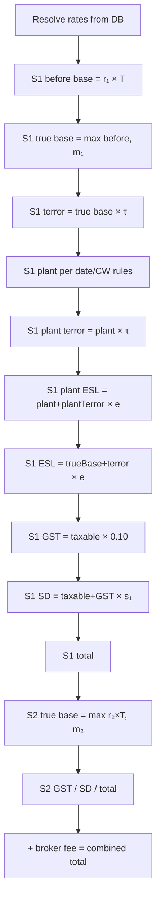

# CAR Policy Pricing Calculation Formulas

Source: legacy wholesale/broker CAR product in `legacy-app/`.

| Area | Primary files |
|------|----------------|
| Server calculator | `InsuranceDemo.BLL/Calculators/CARCalculator2.cs` (class name: `CARCalculator`) |
| Rate lookups | `InsurnanceDemo.SqlDataProvider/CARPolicyData.cs` |
| New quote (server + JS) | `WebSite/CAR/CARNewPolicy.aspx.cs`, `CARNewPolicy.aspx` |
| View/edit policy (JS) | `WebSite/CAR/CARViewPolicy.aspx` |
| End-of-term adjustment | `WebSite/CAR/CARAdjust.aspx.cs`, `CARAdjust.aspx` |
| Policy persistence | `InsuranceDemo.BLL/Products/CAR/CARPolicy.cs` |

> **Scope:** Annual CAR broker product only. Owner Builder / Licenced Builder calculators are separate.

---

## 1. Constants

| Symbol | Value | Notes |
|--------|-------|-------|
| `GSTRate` | `0.10` (10%) | `CARCalculator2.cs` L76; `Policy.cs` L56 |
| `TerrorStartDate` | `2021-01-01` | Terrorism levy applies from this certificate date |
| `Version21StartDate` | `2023-01-01` | Simplified plant formula from this date |
| `PlantCertificateTurnoverLimit` | `2,500,000` | Used in pre-v2.1 plant banding |
| Plant referral threshold | `50,000` | Triggers referral, not a formula cap |
| Adjustment 25% cap | `0.25` | Max base refund per section on adjustment |
| Adjustment 75% floor | `0.75` | Min retained premium on adjustment finish |

Plant min/max dollar thresholds (`PlantMinValue`, `PlantMaxValue`) come from DB (`CAR_PlantRate_Get`), typically ~$25k free band / $50k cap.

---

## 2. Rate Resolution (inputs → rates)

Resolved once per calculation from certificate date, state, postcode, cover type, and turnover.

```
CAR_PriceFile_Get(CoverType, Turnover, Date)
  → CWRate, CWMinPrem
  → TenMilLiability, TenMilMinPrem
  → TwentyMilLiability, TwentyMilMinPrem

CAR_StampDuty_Get(State, Date)     → SDRate
CAR_ESL_Get(State, Date)           → ESLRate (construction), ESLPlantRate (loaded but see §10)
CAR_TerrorismRate_Get(Postcode, State, Date)  [if Date ≥ 2021-01-01]
  → TerrorismRate, TerrorismTier
CAR_PlantRate_Get(Date)            → PlantPremiumRate, PlantMinValue, PlantMaxValue
```

### Section 2 liability rate (`GetLiabilityRate`)

| `Section2Value` | Rate | Min premium |
|-----------------|------|-------------|
| `m10` (1) — $10M | `TenMilLiability` | `TenMilMinPrem` |
| `m20` (2) — $20M | `TwentyMilLiability` | `TwentyMilMinPrem` |
| `NotInsured` (3) | `0` | `0` |

---

## 3. Section 1 — Contract Works (server: `CARCalculator`)

Let:
- `T` = `CertificateTurnover` (estimated turnover)
- `r₁` = `CWRate`
- `m₁` = `CWMinPrem`
- `τ` = `TerrorismRate`
- `e` = `ESLRate`
- `g` = `GSTRate` (= 0.10)
- `s₁` = `SDRate` (section 1 stamp duty rate, decimal)

### 3.1 Base premium

```
Section1BeforeBasePremium = r₁ × T
Section1TrueBasePremium   = max(Section1BeforeBasePremium, m₁)
```

### 3.2 Terrorism (contract works base only)

```
Section1TerrorismPremium = Section1TrueBasePremium × τ
```

### 3.3 Plant & equipment (`GetSection1PlantEquipment`)

Let `P` = plant equipment value, `pr` = `PlantPremiumRate`, `pMin` = `PlantMinValue`, `pMax` = `PlantMaxValue`, `CW` = `Section1ContractWorksValue`.

**If certificate date ≥ 2023-01-01:**
```
Section1PlantEquipment = pr × P
```

**Else if date < 2021-01-01 OR CW ≤ 2,500,000** (banded — first $25k free):
```
if P > pMin:
  if P > pMax:  Section1PlantEquipment = pr × (pMax − pMin)
  else:         Section1PlantEquipment = pr × (P − pMin)
else:
  Section1PlantEquipment = 0
```

**Else** (post-terror, CW > 2.5M):
```
if P ≤ 0:       Section1PlantEquipment = 0
elif P > pMax:  Section1PlantEquipment = pr × pMax
else:           Section1PlantEquipment = pr × P
```

### 3.4 Plant terrorism & ESL

```
Section1PlantTerrorismPremium = (Section1PlantEquipment > 0) ? Section1PlantEquipment × τ : 0
Section1PlantESL              = (Section1PlantEquipment > 0) ? (Section1PlantEquipment + Section1PlantTerrorismPremium) × e : 0
Section1ESL                   = (Section1TrueBasePremium + Section1TerrorismPremium) × e
```

### 3.5 GST

```
Section1GST = (Section1TrueBasePremium
            + Section1TerrorismPremium
            + Section1PlantEquipment
            + Section1PlantTerrorismPremium
            + Section1PlantESL
            + Section1ESL) × g
```

### 3.6 Stamp duty

```
Section1SD = (Section1TrueBasePremium
           + Section1TerrorismPremium
           + Section1PlantEquipment
           + Section1PlantTerrorismPremium
           + Section1PlantESL
           + Section1ESL
           + Section1GST) × s₁
```

### 3.7 Section 1 total

```
Section1TotalPremium = Section1TrueBasePremium
                     + Section1TerrorismPremium
                     + Section1PlantEquipment
                     + Section1PlantTerrorismPremium
                     + Section1PlantESL
                     + Section1ESL
                     + Section1GST
                     + Section1SD
```

**Not calculated server-side:** `Section1DisplayHomes`, `Section1ExistingStructure` — manual premium lines only (client JS).

---

## 4. Section 2 — Legal Liability (server: `CARCalculator`)

Let `r₂` = liability rate, `m₂` = liability min premium, `s₂` = `SDRate`.

```
Section2BeforeBasePremium = r₂ × T
Section2TrueBasePremium   = max(Section2BeforeBasePremium, m₂)
Section2ESL               = 0
Section2GST               = (Section2TrueBasePremium + Section2ESL) × g
Section2SD                = (Section2TrueBasePremium + Section2ESL + Section2GST) × s₂
Section2TotalPremium      = Section2TrueBasePremium + Section2ESL + Section2GST + Section2SD
```

Section 2 has **no terrorism levy** in any code path.

---

## 5. Combined Total (new quote)

```
OriginalCombinedBrokerFee = BrokerFeeTotal + BrokerFeeGstTotal
OriginalTotalPremium      = Section1TotalPremium + Section2TotalPremium + OriginalCombinedBrokerFee
```

(`CARNewPolicy.aspx.cs` `CalculateTotal` adds broker fee to combined display total.)

---

## 6. Client-Side `CalculatePremium` (new quote & view policy)

Used when broker manually edits premium fields on the pricing step. Logic in `CARNewPolicy.aspx` L1094–1354 and `CARViewPolicy.aspx` L1060–1299.

### Additional Section 1 variables

```
ES          = Section1ExistingStructure      (manual premium input)
DH          = Section1DisplayHomes         (manual premium input)
ES_τ        = τ × ES
DH_τ        = τ × DH
```

`Section1Terror` in JS = terrorism on **contract works base only**. The displayed terrorism field combines all three:

```
txtSection1TerrorismPremium = Section1Terror + ES_τ + DH_τ
```

### ESL (recalculated unless `DoNotCalculate` is true)

```
Section1ESL = (Section1Base + Section1Terror + ES_τ + ES + DH + DH_τ) × ESLRate
Section2ESL = 0
```

### GST (always recalculated)

```
Section1GST = (Section1Base + Section1Terror + ES_τ + ES + DH + DH_τ
             + Section1Plant + Section1PlantTerror + Section1ESLPlant + Section1ESL) × GSTRate

Section2GST = (Section2Base + Section2ESL) × GSTRate
```

### Stamp duty (recalculated unless `DoNotCalculate`)

```
Section1SD = (all Section1 taxable components + Section1GST) × SDRateSection1
Section2SD = (Section2Base + Section2ESL + Section2GST) × SDRateSection2
```

### Section totals

```
Section1Total = Section1Base + Section1Terror + ES_τ + ES + DH + DH_τ
              + Section1Plant + Section1PlantTerror + Section1ESLPlant
              + Section1ESL + Section1GST + Section1SD

Section2Total = Section2Base + Section2ESL + Section2GST + Section2SD

CombinedTotal = Section1Total + Section2Total + BrokerFee
```

### Manual override rules

- Editing base on blur: floor to `hidSection1MinPrem` / `hidSection2MinPrem`.
- Editing ESL/SD/GST directly sets `DoNotCalculate = true` permanently for the session — ESL/SD stop auto-recalculating.
- `hidSection1Rate = Section1Base / EstimatedTurnover` back-derived on manual base edit.

---

## 7. End-of-Term Adjustment (`CARAdjust.aspx`)

> **Target rebuild model:** Adjustments are **separate child records** (Draft / Applied) linked to an **immutable Taken** policy. Original policy premium is never overwritten; effective premium = original + latest Applied adjustment delta. See [CAR_INSURANCE_APP_SPEC.md §6.9](./CAR_INSURANCE_APP_SPEC.md#69-policy-state-and-lifecycle). Formulas below describe **legacy** `CARAdjust.aspx` calculation logic (still used for delta math).

**Legacy simplified model** — excludes plant, display homes, existing structures, and broker fees. Uses **frozen rates** stored on the policy from original quote.

Inputs:
- `T_adj` = adjustment turnover
- `T_orig` = original estimated turnover
- `r₁, r₂, m₁, m₂, τ, e, g, s₁, s₂` = stored rates
- `SDExempt` = stamp duty exempt (Yes → Section 2 SD = 0)

### 7.1 Original row (reconstructed)

From stored `Section1TrueBasePremium`, `Section2TrueBasePremium`, `Section1TerrorismPremium`:

```
S1_ESL = (S1_Base + S1_Terror) × e
S2_ESL = 0
S1_GST = (S1_Base + S1_Terror + S1_ESL) × g
S2_GST = (S2_Base + S2_ESL) × g
S1_SD  = (S1_Base + S1_Terror + S1_ESL + S1_GST) × s₁
S2_SD  = SDExempt ? 0 : (S2_Base + S2_ESL + S2_GST) × s₂
S1_Gross = S1_Base + S1_Terror + S1_ESL + S1_GST + S1_SD
S2_Gross = S2_Base + S2_ESL + S2_GST + S2_SD
OriginalCombined = S1_Gross + S2_Gross
```

### 7.2 Adjustment row (from `T_adj`)

```
AdS1_Base   = max(T_adj × r₁, m₁)
AdS2_Base   = max(T_adj × r₂, m₂)
AdS1_Terror = AdS1_Base × τ
AdS2_Terror = 0
AdS1_ESL    = (AdS1_Base + AdS1_Terror) × e
AdS2_ESL    = 0
AdS1_GST    = (AdS1_Base + AdS1_Terror + AdS1_ESL) × g
AdS2_GST    = (AdS2_Base + AdS2_Terror + AdS2_ESL) × g
AdS1_SD     = (AdS1_Base + AdS1_Terror + AdS1_ESL + AdS1_GST) × s₁
AdS2_SD     = SDExempt ? 0 : (AdS2_Base + AdS2_Terror + AdS2_ESL + AdS2_GST) × s₂
AdCombined  = AdS1_Gross + AdS2_Gross
```

### 7.3 Total adjustment premium (delta) — with 25% base refund cap

Per section, base delta:

```
if Ad_Base < Orig_Base AND (Orig_Base − Ad_Base) / Orig_Base > 0.25:
  Δ_Base = Orig_Base × 0.25 × (−1)     // max 25% refund of original base
else:
  Δ_Base = Ad_Base − Orig_Base
```

Then taxes recalculated on the capped delta:

```
Δ_Terror = Δ_Base × τ          (Section 1 only; Section 2 terror = 0)
Δ_ESL    = (Δ_Base + Δ_Terror) × e    (Section 1 only; Section 2 ESL = 0)
Δ_GST    = (Δ_Base + Δ_Terror + Δ_ESL) × g
Δ_SD     = (Δ_Base + Δ_Terror + Δ_ESL + Δ_GST) × s     (S2 SD = 0 if SDExempt)
Δ_Gross  = Δ_Base + Δ_Terror + Δ_ESL + Δ_GST + Δ_SD
TotalAdjustmentPremium = ΔS1_Gross + ΔS2_Gross
```

### 7.4 Finish validation — 75% minimum retained premium

```
if TotalAdjustmentPremium < 0
   AND |TotalAdjustmentPremium| > OriginalCombined × 0.75:
  REJECT — "The return premium is more than 75% of the original premium"
```

Policy must retain at least **25%** of original section gross premium.

On success (legacy): `Adjusted = true`, `AdjustedDate = now`, status remains **Taken**.

**Target rebuild:** adjustment is saved as a new **Applied** child record; original `PolicyCAR` unchanged; effective premium composes original + this adjustment's delta.

---

## 8. Calculation Order (full new quote)



---

## 9. Stored Rate Back-Calculation (on save)

When a policy is saved, effective rates are derived from final premium amounts and stored for future adjustments:

```
Section1Rate  = TrueBase₁ / Turnover
Section2Rate  = TrueBase₂ / Turnover
TerrorismRate = Section1TerrorismPremium / Section1TrueBasePremium
PlantRate     = Section1PlantEquipment / PlantValue
ESLRate       = Section1ESL / (TrueBase₁ + TerrorismPremium)
ESLPlantRate  = Section1PlantESL / (Plant + PlantTerrorism)
SDRateSection1 = Section1SD / (all S1 taxable + GST)
SDRateSection2 = Section2SD / (S2Base + ESL + GST)
```

---

## 10. Three Calculation Paths Compared

| Component | New quote (server) | View/edit (JS) | Adjustment |
|-----------|-------------------|----------------|------------|
| Rate source | DB lookup | Hidden fields from policy | Frozen stored rates |
| Plant & equipment | Yes | Yes (JS) | **No** |
| Display homes / existing structure | No (JS only) | Yes (JS) | **No** |
| Terrorism on S2 | No | No | No |
| S2 ESL | Always 0 | Always 0 | Always 0 |
| Broker fee in total | Yes | Yes | **No** |
| 75% return rule | UI text only | UI text only | **Enforced** |
| 25% base refund cap | N/A | N/A | **Enforced** |
| S2 stamp duty exempt | N/A | N/A | Optional (`StampDutyExempt = Yes`) |

---

## 11. Referral Triggers (`CARCalculator.GetReferralReasons`)

- Plant equipment > $50,000
- `CWRate` missing or zero
- Liability selected but rate = 0
- Stamp duty rate not found (`CAR_StampDutyId == 0`)
- ESL rate not found (`CAR_ESLId == 0`)
- Terrorism rate not found when `DateCertificate ≥ 2021-01-01`

---

## 12. Implementation Notes

1. **`ESLPlantRate`** is loaded from DB but plant ESL uses **`ESLRate`** (construction rate) in `CARCalculator2.cs` L291.
2. **`PlantMaxValue` assignment bug** at L341: `PlantMinValue` is assigned twice from `PlantMaxValue` column — may affect plant banding.
3. **Terrorism field semantics:** server stores terror on CW base only; JS merges ES/DH terror into the displayed terrorism field, so stored `TerrorismRate` can diverge after manual edits.
4. **Adjustment original row** may not equal the policy's true original premium when plant / ES / DH premiums exist on the certificate.
5. **75% minimum premium** text appears on new quote and view screens but is **not enforced** outside the adjustment wizard.

---

## 13. Variable Glossary

| Variable | Meaning |
|----------|---------|
| `T` / `Turnover` | Estimated annual turnover |
| `r₁` / `CWRate` | Contract works rate (per dollar of turnover) |
| `m₁` / `CWMinPrem` | Contract works minimum premium |
| `r₂` | Section 2 liability rate |
| `m₂` | Section 2 minimum premium |
| `τ` / `TerrorismRate` | Terrorism levy rate |
| `e` / `ESLRate` | Emergency Services Levy (construction) rate |
| `g` / `GSTRate` | GST rate (0.10) |
| `s₁`, `s₂` | Stamp duty rates (section 1 and 2) |
| `P` | Plant & equipment declared value |
| `ES`, `DH` | Existing structure / display homes manual premium lines |
