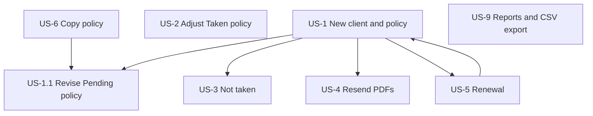

# CAR Insurance App — User Stories

Companion documents:

- [CAR_INSURANCE_UI_FLOW.md](./CAR_INSURANCE_UI_FLOW.md) — navigation and screens
- [CAR_INSURANCE_APP_SPEC.md](./CAR_INSURANCE_APP_SPEC.md) — functional requirements

These stories describe **broker workflows** for UI/UX design. Client confirmation happens **outside the app** (phone, email reply, etc.) unless noted.

---

## Personas

| Persona    | Description                                                                                                                                                                                                                                  | In-app access                                |
| ---------- | -------------------------------------------------------------------------------------------------------------------------------------------------------------------------------------------------------------------------------------------- | -------------------------------------------- |
| **Broker** | Insurance broker — creates clients, creates and binds policies, adjustments, emails documents, **runs reports and exports CSV**                                                                                                                  | Clients, Policies, Reports                   |
| **Admin**  | Same login; **Settings** nav: Authorised Representative broker management, **document templates** (versioned editor + preview), **library documents** (upload/delete). Prices, fees, and other rating reference data are **DB-only — no UI** | Clients, Policies, Reports; Settings (admin) |

> **Configuration:** Prices and rating reference tables are manually loaded/updated in the database. Document templates and library documents are managed in **Settings** (see spec §6.13). See [CAR_INSURANCE_APP_SPEC.md §10.2](./CAR_INSURANCE_APP_SPEC.md#102-configuration-and-reference-data--no-admin-ui-at-this-stage).

---

## Policy grouping (cross-cutting UI)

Brokers need to see how **renewals** (and Stage 1 adjustment indicator on a Taken policy) relate. **Client detail** and **Policies list** (when filtered to one client) use a **grouped / tree table** for **renewal families**.

**Data model:** When a broker **Renews**, the system creates a **new** policy and groups it with the **source** policy: both share `Policy.PolicyGroupId` → `PolicyGroup` (`Reason = 'Renewal'`). On first renew, create the group and set `PolicyGroupId` on **both** the original and the new policy; later renews reuse that group. There is no `RenewalOfPolicyId`. Stage 2 may add more `Reason` values.

**Copied policies are not grouped** — each copy is a separate top-level row. Traceability is via optional `CopiedFromPolicyId` and a banner (“Copied from {policy#}”).

**Adjustments (Stage 1):** not separate nested policy rows. A Taken policy may show an **Adjusted** badge / indicator when a `PolicyCARAdjustment` row exists; opening Adjust edits that single overwriteable adjustment.

### Example

| Policy # | Status  | Inception  | Expiry     | Notes                                              |
| -------- | ------- | ---------- | ---------- | -------------------------------------------------- |
| **▸ B1** | Taken   | 01/07/2023 | 30/06/2024 | Renewal family (`PolicyGroup`, Reason = Renewal) |
| B1-2025  | Taken   | 01/07/2024 | 30/06/2025 | Renewal                                            |
| B1-2026  | Pending | 01/07/2025 | 30/06/2026 | Renewal (Pending)                              |
| **A1**   | Taken   | 01/07/2024 | 30/06/2025 | Flat row; may show Adjusted badge if adjusted      |
| **C1**   | Pending | 01/08/2025 | 31/07/2026 | Copy of A1 — **standalone**, not nested            |

**Grouping rules (Stage 1):**

| Relationship | How grouped                                      | Shown when                                                                 |
| ------------ | ------------------------------------------------ | -------------------------------------------------------------------------- |
| Renewal family | Shared `PolicyGroup` (`Reason = Renewal`)      | All policies with the same `PolicyGroupId` (source + each renewed term) |

**Not grouped:** Copy policy; adjustments are not tree children in Stage 1.

- Expand/collapse (`▸` / `▾`) per renewal family root.
- Row click opens **policy view**.
- Badges: `Renewal`; `Adjusted` when a `PolicyCARAdjustment` row exists.

---

## Story map

---

## US-1 — New client, new policy (Pending → Taken)

**As a** broker  
**I want to** create a client, build a CAR policy, send it to the client, and later bind it as Taken  
**So that** the client receives formal policy documents and, once they agree, the policy is committed in the system.

### Flow

| Step | Actor  | Action                                         | System                                                                   |
| ---- | ------ | ---------------------------------------------- | ------------------------------------------------------------------------ |
| 1    | Broker | Create client with required details            | Client saved; client selectable in top bar                               |
| 2    | Broker | Start **Apply CAR policy**; complete wizard    | —                                                                        |
| 3    | Broker | **Save** (first save)                          | Status = **Pending** (draft); **PDFs generated** (Schedule + policy pack) |
| 4    | Broker | **Email PDFs** to client                       | `EmailLog` + audit: docs sent                                            |
| 5    | Client | Confirms (**manual**, outside app)       | —                                                                        |
| 6    | Broker | Log in; find client **or** find Pending policy | Clients list / Policies list (filter: Pending)                           |
| 7    | Broker | Open policy; set status to **Taken**; save     | Policy **immutable**; full PDF pack generated                            |
| 8    | Broker | **Email confirmation** / bound docs to client  | `EmailLog` + audit                                                       |

Send email broker, insurance  
user needs to select which doc to send in the email... 

### Acceptance criteria

- [ ] **AC-1.1** Add client captures Phase 1 fields (Name, Trading Name, AR Name typeahead, etc.).
- [ ] **AC-1.2** New policy starts in **Pending** after first save.
- [ ] **AC-1.3** On draft save, system auto-generates policy PDFs (no manual “Generate” for happy path).
- [ ] **AC-1.4** Policy view shows **Email documents** action with selectable PDFs.
- [ ] **AC-1.5** Email send writes **audit log** (who, when, which docs, recipient).
- [ ] **AC-1.6** Broker can locate draft via **Clients** → client detail → grouped policies **or** **Policies** list with status = Pending.
- [ ] **AC-1.7** Changing status to **Taken** runs validation gates; on success policy becomes read-only except adjustments.
- [ ] **AC-1.8** Taken commit generates bound-policy PDF pack and allows email to client.
- [ ] **AC-1.9** Taken commit sets `Policy.TakenAt` / `Policy.TakenBy` and logs the event in the audit trail.

### UI touchpoints

- Clients list → Add client → Client detail → Apply CAR policy
- Policy view: status control (Pending → Taken), documents panel, email modal
- Top bar: client name after step 1

---

## US-1.1 — Client asked for changes on Pending policy

**As a** broker  
**I want to** edit a Pending policy and resend updated policy PDFs  
**So that** the client can review changes before I bind the policy.

### Flow

1. Client requests changes (outside app).
2. Broker finds **Pending** policy (client grouped view or Policies filter).
3. Broker edits policy form (all fields still editable while Pending).
4. Broker **saves** → PDFs **regenerated** (new versions in document list).
5. Broker **emails** updated PDFs to client.
6. Client agrees (manual).
7. Broker sets policy to **Taken** (same as US-1 steps 7–8).

### Acceptance criteria

- [ ] **AC-1.1.1** Only **Pending** policies are fully editable.
- [ ] **AC-1.1.2** Each save regenerates policy PDFs; prior versions remain for audit.
- [ ] **AC-1.1.3** Document list shows version history or latest + timestamp.
- [ ] **AC-1.1.4** Resend email is audited.

### UI touchpoints

- Policy view (Pending): editable form, Save, Email documents
- Grouped table: Pending row under client

---

## US-2 — Adjust existing Taken policy (not expired)

**As a** broker  
**I want to** adjust turnover and stamp duty exemption on a bound policy, preview the premium difference, and save the adjustment  
**So that** the end-of-term change is applied (legacy parity — Stage 1).

### Preconditions

- Policy status = **Taken**
- Policy **not expired** (`today ≤ expiry date`)

### Adjustable inputs only

| Field               | Control            |
| ------------------- | ------------------ |
| Adjustment turnover | Currency / numeric |
| Stamp duty exempt   | Yes / No           |

All other policy fields remain frozen on the original Taken record.

### Flow

1. Broker opens **Taken** policy.
2. Broker clicks **Adjust** → adjustment wizard (if an adjustment already exists, wizard loads current values).
3. Broker enters **adjustment turnover** and **stamp duty exempt**.
4. System **recalculates** and shows **premium difference** (delta vs original Taken snapshot).
5. Broker **saves** → adjustment is applied immediately (upsert / overwrite single `PolicyCARAdjustment` row).
6. System generates adjustment PDF pack; broker may email (hardcoded email template — Stage 1).

| Step | System                                                                                   |
| ---- | ---------------------------------------------------------------------------------------- |
| Save | Upsert `PolicyCARAdjustment`; effective premium = original + delta                       |
| PDFs | Adjustment pack generated                                                                |
| Email | Broker sends PDFs; `EmailLog` + hardcoded subject/body from source code                  |

> Stage 2 will redesign adjustments (no multi-draft history in Stage 1).

### Acceptance criteria

- [ ] **AC-2.1** Adjust button hidden for Pending, Not taken, and **expired** Taken policies.
- [ ] **AC-2.2** Wizard only exposes turnover + stamp duty exempt inputs.
- [ ] **AC-2.3** UI shows side-by-side or delta table: original vs adjusted vs **difference**.
- [ ] **AC-2.4** Validation: 75% minimum retained premium, 25% base refund cap (per formulas doc).
- [ ] **AC-2.5** Save applies immediately — no Draft status; second save overwrites the previous adjustment.
- [ ] **AC-2.6** Save generates adjustment PDFs.
- [ ] **AC-2.7** At most one adjustment row per policy (`PolicyId` PK).
- [ ] **AC-2.8** Policy view shows **Adjusted** indicator when adjustment exists (not a nested tree row).
- [ ] **AC-2.9** Adjustment save and email audited.

### UI touchpoints

- Policy view (Taken): **Adjust** CTA
- Adjustment wizard: inputs → delta review → **Save**
- Email documents from policy / adjustment context

---

## US-3 — Client declines policy (Not taken)

**As a** broker  
**I want to** mark a policy as Not taken  
**So that** the system records that the client did not proceed.

### Flow

1. Broker finds policy (typically **Pending**; may also apply before Taken).
2. Broker sets status to **Not taken**; confirms.
3. Policy becomes **terminal** — read-only, no adjustments, no Taken.

### Acceptance criteria

- [ ] **AC-3.1** Not taken available from **Pending** (primary case).
- [ ] **AC-3.2** Not taken policy cannot be edited, renewed, or adjusted.
- [ ] **AC-3.3** Status change audited with user and timestamp.
- [ ] **AC-3.4** Grouped table shows Not taken badge; row still visible for history.

### UI touchpoints

- Policy view: status → Not taken (with confirmation dialog)

---

## US-4 — Resend policy PDFs

**As a** broker  
**I want to** resend existing policy documents to the client  
**So that** the client receives copies without regenerating or changing the policy.

### Flow

1. Broker finds policy (any status where documents exist).
2. Broker opens **Documents** panel on policy view.
3. Broker selects PDFs → **Email** (or download).
4. System sends email and writes **audit log** (resend event, not a new generation).

### Acceptance criteria

- [ ] **AC-4.1** All policy-linked PDFs listed with type, date generated, generated by.
- [ ] **AC-4.2** Resend does not change policy data or status.
- [ ] **AC-4.3** Audit distinguishes **document generated** vs **document emailed / resent**.
- [ ] **AC-4.4** Works for Pending policies, Taken policies, and applied adjustments (adjustment-specific docs).

### UI touchpoints

- Policy view: Documents section, multi-select, Email button
- Activity log on policy detail

---

## US-5 — Renew annual policy

**As a** broker  
**I want to** renew an existing **annual** Taken policy into a new Pending policy  
**So that** I can update terms and run the same Pending → Taken flow for the next period.

### Preconditions

- Source policy: **Annual** cover type, status **Taken** (or eligible per business rules)
- **Renew** action visible on policy view

### Flow

1. Broker opens eligible **Taken** annual policy.
2. Broker clicks **Renew**.
3. System creates a **new Pending policy** (source policy row stays Taken; its premium/terms are not recopied or rewritten except grouping — see below):
  - Copies policy data from source into the **new** policy
  - New policy: `PolicyCategory = Renewal`
  - **Inception / expiry shifted +1 year** (or next period from source expiry)
  - **Grouping — both policies in one group:**
    - If source has no `PolicyGroupId`: create `PolicyGroup` (`Reason = 'Renewal'`), set that id on **source** and on the **new** policy
    - If source already has a group: set the **new** policy’s `PolicyGroupId` to the same value
4. Broker reviews/edits draft (same as US-1).
5. Save → policy PDFs → email → client confirms → **Taken** (same as US-1).

### Grouping

- Source + new renewal (and any later renewals) share one `PolicyGroupId`.
- Label e.g. `B1-2026` or same policy number with **Renewal** badge on renewed terms.
- No `RenewalOfPolicyId` column.

### Acceptance criteria

- [ ] **AC-5.1** **Renew** button only on **annual** policies (hidden for Single / Owner Builder unless business says otherwise).
- [ ] **AC-5.2** Renewal creates a **new** Pending policy; source Taken policy is not replaced (only `PolicyGroupId` may be set on first renew).
- [ ] **AC-5.3** Dates default to +1 year from source period; broker can edit while Pending.
- [ ] **AC-5.4** After Renew, **both** source and new policy share the same `PolicyGroup` (`Reason = Renewal`) via `Policy.PolicyGroupId`.
- [ ] **AC-5.5** Grouped table shows the renewal family (source + renewals) with expand/collapse.
- [ ] **AC-5.6** Post-renewal flow matches US-1 (Pending policy PDFs, email with hardcoded template, Taken, confirmation email).

### UI touchpoints

- Policy view (Taken, annual): **Renew** button
- Client detail: grouped renewal family
- New Pending policy opens in policy view with banner: “Renewal of {policy#}”

---

## US-6 — Copy existing policy

**As a** broker  
**I want to** copy an existing policy into a new draft  
**So that** I can create similar cover without re-entering all fields.

### Flow

1. Broker opens any policy (typically Taken or Pending).
2. Broker clicks **Copy policy**.
3. System creates **new Pending policy** with duplicated form data (new policy number).
4. Broker edits as needed → same policy flow as US-1.

### Acceptance criteria

- [ ] **AC-6.1** Copied policy is always **Pending** on creation.
- [ ] **AC-6.2** Copy gets **new** policy number; optional link `CopiedFromPolicyId` for traceability.
- [ ] **AC-6.3** Copy is **not** a renewal (`PolicyCategory = New` unless broker changes it).
- [ ] **AC-6.4** Copied policy appears as a **standalone root row** in the policy list — **not** nested under the source policy in the grouped tree.
- [ ] **AC-6.5** Copy action audited.

### UI touchpoints

- Policy view: **Copy policy** action (secondary button)
- Policy view banner: “Copied from {policy#}”

---

## US-7 — Find work in progress (supporting stories)

**As a** broker  
**I want to** quickly find Pending policies awaiting action  
**So that** I can continue when the client calls back.

### Acceptance criteria

- [ ] **AC-7.1** **Policies** list filters: Status (Pending / Taken / Not taken), Client, Policy number, dates.
- [ ] **AC-7.2** Client detail grouped table surfaces **Pending** renewal policies in the renewal family without extra navigation.
- [ ] **AC-7.3** Policy view shows clear **status banner** (Pending, Taken, Not taken, Adjusted, Expired).
- [ ] **AC-7.4** Optional: “My open drafts” or client summary counts (Pending / Taken / Not taken) link to filtered Policies list.

### UI touchpoints

- Policies list filter bar
- Client detail: grouped policies + summary badges (existing §3.3 UI flow)

---

## US-9 — Run reports and export to CSV

**As a** broker  
**I want to** run operational reports in the app and export the results to CSV  
**So that** I can review data on screen and use it in spreadsheets or share with others.

### Reports available (side nav → **Reports**)

| Report                    | Scope                                               | Typical use                                                             |
| ------------------------- | --------------------------------------------------- | ----------------------------------------------------------------------- |
| **Client report**         | Selected client + date range                        | Base premium and broker fee summary for one client                      |
| **CAR Policy report**     | Date range; summary by status, drill-down to detail | Policy activity                                                   |
| **CAR Renewal report**    | Reference date, status, business type filters       | Policies due for renewal                                                |
| **IRECON Reconciliation** | Date range                                          | Financial reconciliation (admin-style ops; broker may run if permitted) |

> Client report requires a **selected client** (top bar or picker). Other reports are global.

### Flow

1. Broker opens **Reports** from side nav.
2. Broker selects a report (hub or sub-link).
3. Broker enters parameters (dates, filters, etc.).
4. Broker clicks **Run report** → results appear in a **table in the UI**.
5. Broker clicks **Export** → downloads **CSV** matching the visible result set (column headers included).

### Acceptance criteria

- [ ] **AC-9.1** Broker can access **Reports** from side nav (same level as Clients and Policies).
- [ ] **AC-9.2** Each report has a parameter form and **Run report** action.
- [ ] **AC-9.3** Results render in-app as a table before export (not export-only).
- [ ] **AC-9.4** **Export** downloads **CSV** with the same columns as the on-screen table (UTF-8, sensible filename e.g. `car-policy-report-2026-07-01-2026-07-31.csv`).
- [ ] **AC-9.5** Empty result set shows explicit empty state; Export disabled or exports headers-only with zero rows (consistent behaviour documented in UI).
- [ ] **AC-9.6** CAR Policy report supports summary view → drill-down to detail → export **detail** rows for the selected status slice.
- [ ] **AC-9.7** Client report: date from / to; columns Policy Type, Base Premium (Ex. GST), Broker Fee (Ex. GST); default period current calendar month.
- [ ] **AC-9.8** Report run and export are **audit-logged** (user, report name, parameters, row count, export timestamp).

### UI touchpoints

- Side nav: **Reports**
- `/reports` hub → `/reports/car-policies`, `/reports/car-renewals`, `/reports/client`, etc.
- Each report page: parameters · results table · **Export CSV** button (toolbar above table)

### Legacy parity

Legacy admin reports often downloaded Excel directly with no on-screen table. Target: **UI first**, then CSV export (per [CAR_INSURANCE_APP_SPEC.md](./CAR_INSURANCE_APP_SPEC.md) §6.11).

---

## US-8 — Settings (admin)

### US-8a — Authorised Representative broker management

**As an** admin  
**I want to** search, view, edit, and delete AuthorisedRepresentative (wholesale broker) records in the app  
**So that** brokers can link clients to the correct authorised representative.

#### Acceptance criteria

- [ ] **AC-8a.1** Settings → Authorised Representative broker Management restricted to admin role.
- [ ] **AC-8a.2** AuthorisedRepresentative create/edit/delete audited (who, what, when).
- [ ] **AC-8a.3** Brokers cannot access Settings section.

### US-8b — Document templates (merge templates)

**As an** admin  
**I want to** edit CAR document templates in the app with preview and version control  
**So that** Schedule, ROA, and Adjustment PDFs stay current without manual Word file upload to the server.

**Route:** `/settings/document-templates`  
**Seed:** import from `[car-pdf-templates/](../car-pdf-templates/)` (legacy `.doc` → structured templates, one-time).

#### Acceptance criteria

- [ ] **AC-8b.1** Admin sees all template slots: Schedule (Annual / Single / Owner Builder), ROA (Annual / Single / Owner Builder), Adjustment (single).
- [ ] **AC-8b.2** Editor embeds **pdfme Designer** — text schemas for merge fields, image schema for logo; `basePdf` background (not production Word upload).
- [ ] **AC-8b.3** **Preview** uses `@pdfme/generator` with sample policy data (same engine as production).
- [ ] **AC-8b.4** Saving creates a new **version** (pdfme `Template` JSON); versions are immutable after publish.
- [ ] **AC-8b.5** Exactly one **active published** version per slot; new policy PDF generation uses active version only.
- [ ] **AC-8b.6** Version history visible; admin can publish a prior version (rollback).
- [ ] **AC-8b.7** `PolicyDocument` records which template version generated each PDF.
- [ ] **AC-8b.8** Template publish/edit audited.

### US-8c — Library document attachments

**As an** admin  
**I want to** upload and delete static PDFs and assign them to cover types  
**So that** additional documents (e.g. stamp duty exemption) are included in packs without server file drops.

**Route:** `/settings/library-documents`

#### Acceptance criteria

- [ ] **AC-8c.1** Admin can upload PDF to library (stored in R2).
- [ ] **AC-8c.2** Admin can **delete** a library document from the library (future packs only — existing policy `PolicyDocument` rows unchanged).
- [ ] **AC-8c.3** Assign each PDF to cover type(s) and optional rules (e.g. state = NSW).
- [ ] **AC-8c.4** Set display order per cover type.
- [ ] **AC-8c.5** Upload/delete/reorder audited.

### Out of scope at this stage (no UI)

Prices, fees, and generic reference/configuration tables (states, excess catalogue, etc.) — **manual DB only** (see spec §10.2).

### Shared Settings criteria

- [ ] **AC-8.4** No in-app UI for prices or rating reference tables in this phase.

---

## Email & audit (shared)

All stories that send email share:

| Event                      | Logged fields                                                |
| -------------------------- | ------------------------------------------------------------ |
| Policy documents emailed              | user, timestamp, policy id, recipient, document ids, subject |
| Taken confirmation emailed | same                                                         |
| Adjustment emailed         | user, timestamp, policy id, documents                        |
| Resend documents           | user, timestamp, policy id, “resend” flag                    |

**EmailLog** table + activity feed on policy detail. Stage 1 email subject/body from **hardcoded** source templates (not DB).

---

## Status reference (for UI labels)

| UI label   | Meaning                              | Editable?                 | PDF on save          |
| ---------- | ------------------------------------ | ------------------------- | -------------------- |
| Pending    | Pending policy                          | Yes (full form)           | Policy pack           |
| Taken      | Bound                                | No (original)             | Bound pack on commit |
| Not taken  | Declined                             | No                        | —                    |
| Adjusted   | Taken + saved `PolicyCARAdjustment`  | Adjust wizard overwrites  | Adjustment pack      |

---

## Related documents

- [CAR_INSURANCE_UI_FLOW.md](./CAR_INSURANCE_UI_FLOW.md)
- [CAR_INSURANCE_APP_SPEC.md](./CAR_INSURANCE_APP_SPEC.md)
- [CAR_SAVE_VALIDATION.md](./CAR_SAVE_VALIDATION.md)
- [CAR_PRICING_FORMULAS.md](./CAR_PRICING_FORMULAS.md) — adjustment delta math

