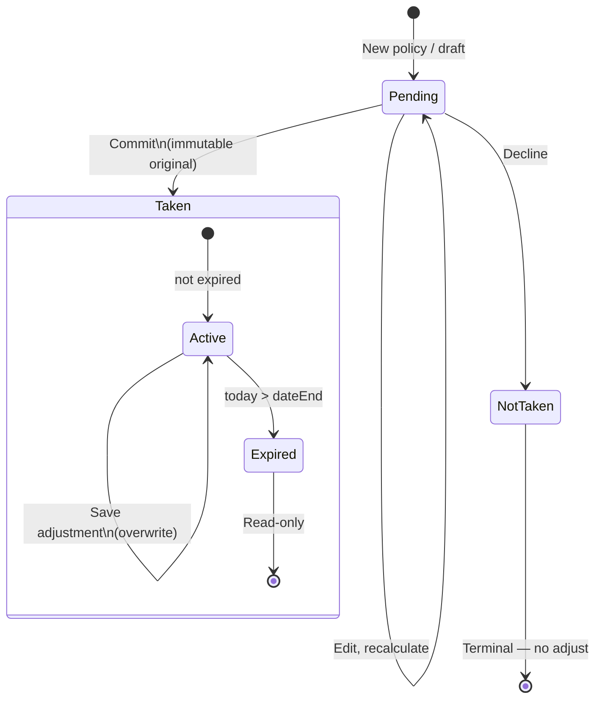
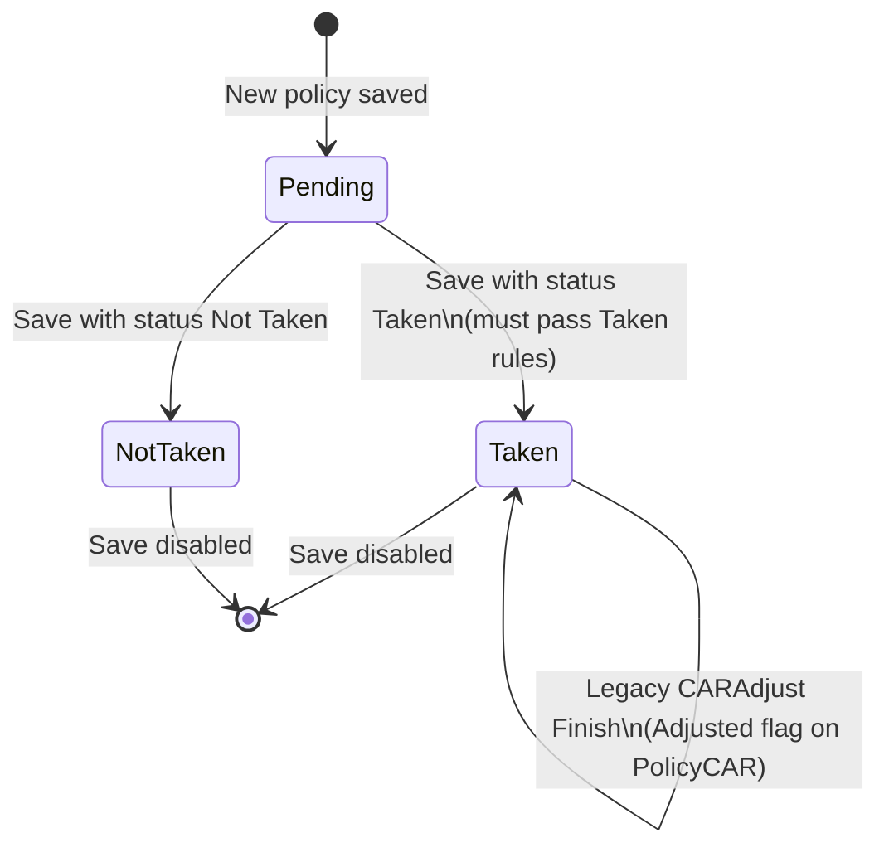

# CAR — Save Validation Rules

Source: legacy `CARNewPolicy.aspx`, `CARViewPolicy.aspx`, `CARAdjust.aspx`, and `CARPolicy.cs`.

This document covers validation that runs when a broker **saves**, **finishes**, or **changes status** — distinct from wizard **Next** navigation rules (see [CAR_FORM_VALIDATION.md](./CAR_FORM_VALIDATION.md)).

---

## Overview — save entry points

| Page | Action | Code path | Blocks save? |
|------|--------|-----------|--------------|
| `CARNewPolicy.aspx` | **Finish** (Step 2) | `wzdNewDeclare_FinishButtonClick` → `SubmitCertificate()` → `CARPolicy.Save()` | No field re-validation on Finish; BLL errors only |
| `CARViewPolicy.aspx` | **Save** | `btnSaveChanges_OnClick` → `Save()` → `CARPolicy.Amend()` | Yes — ASP.NET validators + Taken rules |
| `CARViewPolicy.aspx` | **Generate ROA / Schedule / Adjustment ROA** | Same `Save()` path | Same as Save |
| `CARAdjust.aspx` | **Finish** (adjustment wizard) | `wzdNewDeclare_FinishButtonClick` → `SubmitCertificate()` → `CARPolicy.Adjust()` | Yes — validators + 75% return premium rule |

---

## 1. New policy — Finish save (`CARNewPolicy.aspx`)

### Wizard Finish (Step 2 → persist policy)

**Trigger:** Finish button on Pricing information step.

**Validation before save:**

- **No `Page.IsValid` check** on Finish — Step 1 validators are not re-run.
- Assumes broker already passed validation when clicking **Next** on Step 1.

**On save failure:**

```
ERROR. Unable to continue, please refer to your system admin.
```

**BLL (`CARPolicy.Save()`) errors surfaced to user:**

| Condition | Message |
|-----------|---------|
| Policy number pool exhausted (`GetPolicyNumber` returns `isFull`) | `Unable to get Policy Number. Class: {class}, Underwriter: {underwriter}` |
| Any other save exception | `Unable to save. Error: {exception message}` |

**Side effects on successful first save (not validation):**

- If `IsReferred()` → referral `PolicyNote` created from `GetReferralReasons()` (informational — does **not** block save).

---

## 2. View policy — Save changes (`CARViewPolicy.aspx`)

### UI guards (before Save is even available)

| Condition | Behaviour |
|-----------|-----------|
| Status is **Taken** or **Not Taken** | `btnSaveChanges` hidden; `rdoCARStatus` disabled — **no further saves allowed** |
| Status is **Pending** | Save enabled; broker can change status and edit premiums/excesses |

### ASP.NET validators (`ValidationGroup="SaveChanges"`)

Shown in validation summary (no custom header text on `vs` — default ASP.NET message box).

**Cannot continue for the following reasons:**

- Policy Number is required
- 'Status' is required
- Named Insured Plant & Equipment excess is required
- Contract Value up to $2,000,000 minor perils excess is required
- Contract Value up to $2,000,000 major perils excess is required
- Worker to Worker (CV up to $1,000,000) excess is required

**Note:** Excess fields `1C`, `1D`, `2C`, `2D`, `2E`, `2F` have validators on the page but **without** `ValidationGroup="SaveChanges"`, so they do **not** run when clicking Save.

### Taken status rule (code-behind — blocks save)

**Trigger:** Status changing **from non-Taken → Taken** (`CARViewPolicy.aspx.cs` → `Save()`).

**Alert format:**

```
Unable to set status to taken. {reasons}
```

**Rules:**

| Condition | Message |
|-----------|---------|
| `ExistingStructures > 0` AND `ContractWorksExistingStructurePremium == 0` | Existing Structures has value however there are no premiums. |
| `PlantEquipment > 25000` AND `ContractWorksPlantPremium == 0` | Plant and equipment has value however there are no premiums. |

**Business logic (from code comments):**

1. Existing Structure cover requires a premium — no free cover when declared on the form.
2. Plant & equipment above $25,000 requires a calculated/entered plant premium.

**Field mapping:**

| Form input (Step 1 / read-only on view) | Premium line (editable on view) |
|----------------------------------------|----------------------------------|
| `ExistingStructures` | `ContractWorksExistingStructurePremium` |
| `PlantEquipment` | `ContractWorksPlantPremium` |

Pending policies may have declared existing structures with zero premium; **Taken** cannot.

### Other save-path alerts (`CARViewPolicy.aspx`)

| Action | Condition | Message |
|--------|-----------|---------|
| Generate Adjustment ROA | Policy not adjusted (`hidAdjusted == false`) | `Unable to generate adjustment document if this policy has not been adjusted!` |
| Save / Amend exception | Any unhandled error in `p.Amend()` | `Failed to save. Please contact your administrator.` |

### What gets saved on View Policy Save

- Status (Pending / Taken / Not Taken)
- Premium breakdown fields (Section 1 & 2 components, terrorism, plant, ESL, GST, SD, totals)
- Sub-limits, excluded contracts, excesses, additional wording
- Broker fees
- Invoice comment, notes (notes saved as separate `PolicyNote` if `txtNotes` not empty)

`CARPolicy.Amend()` increments `AmendmentNumber` then calls `Save()`.

---

## 3. Adjustment — Finish save (`CARAdjust.aspx`)

> **Target rebuild:** adjustments are separate **Draft / Applied** records; original Taken policy is immutable. See [CAR_INSURANCE_APP_SPEC.md §6.9](./CAR_INSURANCE_APP_SPEC.md#69-policy-state-and-lifecycle).

### Page access guard

| Condition | Message |
|-----------|---------|
| Policy status ≠ **Taken** | Redirect: `You can only adjust a policy where the status is taken.` |
| Policy expired (`today > dateEnd`) | **Target:** block adjustment (not in legacy) |
| Policy status = **Not taken** | **Target:** block adjustment |

### Wizard Next (Step 1 → Step 2)

**Cannot continue for the following reasons:**

- Adjustment Turnover is required

### Wizard Finish

**Step 1 — ASP.NET validation:**

- Same as Next: `Adjustment Turnover is required` if `Page.IsValid` fails.

**Step 2 — Return premium cap (code-behind):**

| Condition | Message |
|-----------|---------|
| Total return premium is negative AND absolute value > 75% of original combined premium | `The return premium is more than 75% of the original premium. Unable to continue.` |

Formula:

```
OriginalPrem = txtCombinedTotalPremium (original)
TheMinPrem   = OriginalPrem × 0.75
TotalPrem    = txtCombinedTotalPremium_Total (after adjustment)
Block if:    TotalPrem < 0 AND |TotalPrem| > TheMinPrem
```

**On save failure:**

```
ERROR. Unable to continue, please refer to your system admin.
```

**Legacy success path:** `CARPolicy.Adjust()` sets `Adjusted = true`, `AdjustedDate = now`, then `Save()`.

**Target success path:** create new **Applied** adjustment record; original `PolicyCAR` unchanged.

---

## 4. BLL save rules (`CARPolicy.Save()`)

Server-side logic applied on every new policy save (and underlying amend/adjust saves).

### New policy only (`PolicyId == 0`)

| Rule | Behaviour |
|------|-----------|
| **New business** | Auto-generate policy number via `GetPolicyNumber()` |
| **Renewal** with empty policy number | Look up last **Taken** annual policy number for client; if none found, downgrade to **New** and generate new number |
| **Renewal** with policy number entered | Use broker-entered number |
| Policy number pool full | Throw: `Unable to get Policy Number. Class: CAR, Underwriter: {code}` |

### All saves

| Rule | Behaviour |
|------|-----------|
| `base.Save()` fails | Returns `false` (no user message from BLL) |
| Unhandled exception | Throw: `Unable to save. Error: {message}` |

### Referral notes (first save only)

Not blocking. If `IsReferred()` on new policy:

- Creates `PolicyNoteType.Referral` with reasons from `GetReferralReasons()`:

- Display Homes has a value of {amount}
- Existing Structure has a value of {amount}
- Number of claim last 3 years is entered with value {count}
- Any claims exceeded $20,000 in value is stated as yes
- Do not hold a current Contract Works/Liability policy
- Named Insureds Construction Plant & Equipment is over 50,000 *(from calculator)*
- Unable to find Contract Works rate
- Unable to find Liability rate for {limit}
- Unable to find the SD rate
- Unable to find the ESL rate
- Unable to find terrorism rate for this combination of postcode/State

---

## 5. Status lifecycle constraints

> **Target rebuild model** is defined in [CAR_INSURANCE_APP_SPEC.md §6.9](./CAR_INSURANCE_APP_SPEC.md#69-policy-state-and-lifecycle). Summary below. Legacy behavior is noted where it differs.

### 5.1 Policy status values

| Status | Meaning | Editable? |
|--------|---------|-----------|
| **Pending** | Pending policy in progress | Yes — full edit and recalculate |
| **Taken** | Committed / bound policy | **No** — original record immutable in database |
| **Not taken** | Declined / not proceeded | No — terminal |

**Pending ≡ draft.**

### 5.2 Taken — permanent save

When status becomes **Taken**:

- Policy and `PolicyCAR` premium snapshot are **permanently saved**.
- **No further UPDATE** to the original policy record is allowed.
- Legacy `CARViewPolicy.aspx` disables Save for Taken/Not Taken — same intent.

### 5.3 Expiry

```
isExpired = today > policyEndDate
```

- **Taken** policies may be adjusted **only if not expired**.
- Expired policies are read-only (view, documents); no new adjustments.

### 5.4 Adjustments (Stage 1)

- One `PolicyCARAdjustment` row per policy (PK = `PolicyId`).
- Original policy **A** is **never modified**.
- **No Draft status** — save applies immediately; a later save **overwrites** the row.
- **Effective premium** = original policy premium **+** current adjustment delta (if row exists).
- **Not taken** policies **cannot** be adjusted.
- Stage 2 will redesign adjustments.

**Example:**

| Record | State | Contributes to effective premium? |
|--------|-------|-----------------------------------|
| Policy A | Taken (immutable) | Yes — base |
| Adjustment (1:1) | Applied on save | Yes — current delta |

### 5.5 Lifecycle diagram (Stage 1)



### 5.6 Validation matrix (Stage 1)

| From | To / action | Extra validation |
|------|-------------|------------------|
| Pending | Taken | Existing structures premium + plant premium rules |
| Pending | Not taken | None beyond save validators |
| Taken | Edit original | **Blocked** — immutable |
| Taken (not expired) | Save adjustment | Adjustment turnover required; 75% return cap; 25% base refund cap |
| Taken (expired) | Any adjustment | **Blocked** |
| Not taken | Any adjustment | **Blocked** |

### 5.7 Legacy lifecycle (reference)

Legacy uses a single adjustment that sets `PolicyCAR.Adjusted = true` while status stays Taken. Stage 1 keeps **one overwriteable adjustment** on a separate table while leaving the Taken original immutable (see spec §6.9.9).



| From | To | Extra validation |
|------|-----|------------------|
| Pending | Taken | Existing structures premium + plant premium rules |
| Pending | Not Taken | None beyond SaveChanges validators |
| Taken / Not Taken | Any | **Save button removed** — terminal states |
| Taken | Legacy adjust | Adjustment turnover required; 75% return cap on Finish |

---

## 6. New app (`web/`) — implementation status

> **Note:** Current `web/` prototype follows **legacy** in-place `adjusted` flag on policy. Stage 1 target is **immutable Taken policy + one overwriteable `PolicyCARAdjustment` row** per [CAR_INSURANCE_APP_SPEC.md §6.9](./CAR_INSURANCE_APP_SPEC.md#69-policy-state-and-lifecycle).

| Legacy / Stage 1 rule | Implemented in `web/`? |
|--------------------|------------------------|
| Wizard Step 1 validators on Next | Partial — Zod per-step on new wizard |
| Finish without re-validation | N/A — save uses full `carPolicySchema` |
| View policy SaveChanges validators | Not yet — no view-policy edit route |
| Taken status premium gate | Partial — `getTakenStatusErrors()` |
| Terminal Taken/Not Taken (no re-save) | Partial — `isTerminalStatus()` blocks edit |
| Taken policy immutable in DB | **Not yet** — Stage 1 model |
| Expiry gate on adjustment | **Not yet** — Stage 1 model |
| One `PolicyCARAdjustment` row; save overwrites | **Not yet** — Stage 1 model |
| Effective premium = original + current delta | **Not yet** — Stage 1 model |
| Legacy-style single adjustment wizard | Partial — `/policies/:policyId/adjust` |
| Adjustment 75% return cap | Partial — `validateAdjustmentFinish()` |
| `ContractWorksExistingStructurePremium` / display homes premium lines | Partial — mapped from Section 1 values |
| BLL policy number generation | Mock — auto `ATCCW####` |
| Referral notes on save | Partial — `buildReferralNotes()` on calculate/save |

---

## 7. Example — View Policy save blocked for Taken

Broker sets status to **Taken** on a policy where:

- Existing Structures (form) = `$100,000`
- Existing Structure (premium line) = `$0.00`

**Alert:**

```
Unable to set status to taken. Existing Structures has value however there are no premiums.
```

If plant is `$30,000` with `$0` plant premium, both messages are concatenated:

```
Unable to set status to taken. Existing Structures has value however there are no premiums. Plant and equipment has value however there are no premiums.
```
