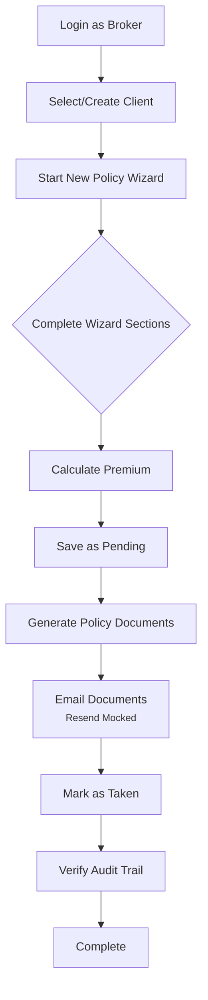
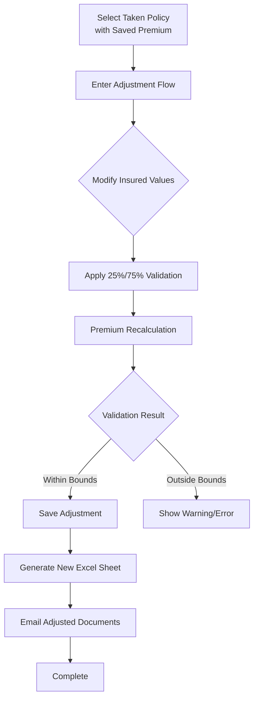
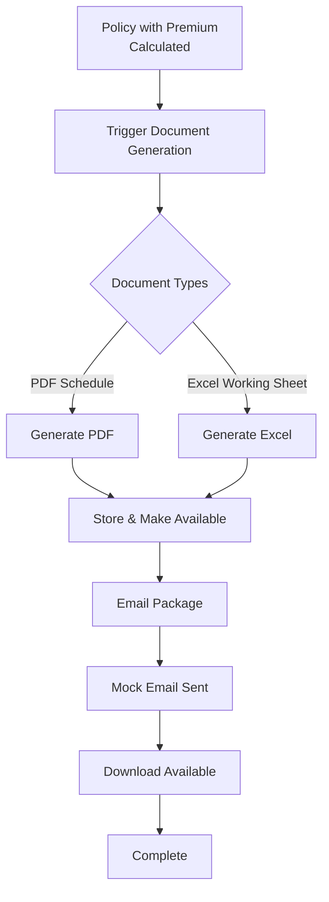

# Critical E2E Workflows - Detailed Specifications

**Document:** Identifies the most critical user workflows requiring comprehensive E2E test coverage
**Date:** August 13, 2026
**Status:** Specification Complete

## 1. Workflow Priority Matrix

| Priority | Workflow | Business Impact | Test Complexity | Current Coverage |
|----------|----------|-----------------|-----------------|------------------|
| **P1** | Quote-to-Taken Journey | Critical Revenue Flow | High | ⚠️ Partial |
| **P1** | Policy Adjustment (25%/75% Rule) | Regulatory Compliance | High | ⚠️ Minimal |
| **P2** | Document Generation & Delivery | Legal/Contractual Requirement | Medium | ⚠️ Limited |
| **P3** | Client Lifecycle Management | Operational Efficiency | Low-Medium | ✅ Partial |
| **P3** | Report Generation & Export | Business Intelligence | Low | ⚠️ Missing |

## 2. P1 Workflow: Quote-to-Taken Journey

### 2.1 Workflow Steps (Complete Sequence)



### 2.2 Test Specifications

#### Test File: `e2e/policy-flow-quote-to-taken.spec.ts`

```typescript
import { test, expect } from "@playwright/test";
import { demoUsers, loginAs, mockResendEmailApi } from "./helpers/auth";
import { createE2eClient, createE2ePolicy } from "./helpers/seed";

test.describe("quote-to-taken workflow", () => {
  test.beforeEach(async ({ page }) => {
    // Ensure we have test data
    await createE2eClient(page);
  });

  test("complete quote-to-taken journey with document generation", async ({ page }) => {
    // 1. Login as broker
    await loginAs(page, demoUsers.broker);
    
    // 2. Navigate to client
    await page.goto("/clients");
    const clientRow = page.getByRole("row", { name: /E2E Test Client/ });
    await clientRow.first().click();
    
    // 3. Start new policy
    const newPolicyBtn = page.getByRole("button", { name: /new policy/i });
    await newPolicyBtn.click();
    
    // 4. Complete policy wizard sections
    // - Basic Info
    await page.getByLabel("Site Address").fill("123 E2E Test Street");
    await page.getByLabel("Estimated Turnover").fill("1000000");
    await page.getByLabel("Contract Works Sum Insured").fill("3000000");
    
    // - Business Activities
    await page.getByLabel("Business Activities").fill("Construction");
    
    // - Premium Calculation
    await page.getByRole("button", { name: /calculate premium/i }).click();
    await expect(page.getByText(/premium calculated/i)).toBeVisible();
    
    // Verify premium amounts visible
    await expect(page.getByText(/\$[\d,]+\.\d{2}/)).toBeVisible();
    
    // 5. Save as Pending
    await page.getByRole("button", { name: /save as pending/i }).click();
    await expect(page.getByText(/policy saved/i)).toBeVisible();
    
    // 6. Generate documents
    const generateBtn = page.getByRole("button", { name: /generate documents/i });
    if (await generateBtn.isVisible()) {
      await generateBtn.click();
      
      // Wait for document generation
      await expect(page.getByText(/documents generated/i)).toBeVisible({
        timeout: 10000,
      });
    }
    
    // 7. Email documents (mocked)
    await mockResendEmailApi(page);
    const emailBtn = page.getByRole("button", { name: /email selected/i });
    if (await emailBtn.isVisible()) {
      await emailBtn.click();
      
      // Fill email form
      await page.getByLabel("To").fill("test@example.com");
      await page.getByRole("button", { name: /^send$/i }).click();
      
      // Verify success
      await expect(page.getByText(/email sent/i)).toBeVisible();
    }
    
    // 8. Mark as Taken
    const statusDropdown = page.getByRole("button", { name: /pending/i });
    await statusDropdown.click();
    
    const takenOption = page.getByRole("menuitem", { name: /mark as taken/i });
    await takenOption.click();
    
    // Confirm modal
    await page.getByRole("button", { name: /confirm/i }).click();
    
    // Verify status changed
    await expect(page.getByText(/taken/i)).toBeVisible();
    
    // 9. Verify audit trail
    const auditLink = page.getByRole("link", { name: /audit trail/i });
    if (await auditLink.isVisible()) {
      await auditLink.click();
      
      // Verify recent status change appears
      await expect(page.getByText(/status changed to taken/i)).toBeVisible();
    }
  });

  test("policy wizard premium calculation validation", async ({ page }) => {
    await loginAs(page, demoUsers.broker);
    
    // Navigate to new policy from existing client
    await createE2ePolicy(page, "draft");
    
    // Test premium calculation with different inputs
    const testCases = [
      { turnover: "500000", sumInsured: "1500000", expectedPremium: /\$[\d,]+\.\d{2}/ },
      { turnover: "2000000", sumInsured: "5000000", expectedPremium: /\$[\d,]+\.\d{2}/ },
      { turnover: "5000000", sumInsured: "10000000", expectedPremium: /\$[\d,]+\.\d{2}/ },
    ];
    
    for (const testCase of testCases) {
      // Update values
      await page.getByLabel("Estimated Turnover").fill(testCase.turnover);
      await page.getByLabel("Contract Works Sum Insured").fill(testCase.sumInsured);
      
      // Recalculate
      await page.getByRole("button", { name: /calculate premium/i }).click();
      
      // Verify premium updates
      await expect(page.getByText(testCase.expectedPremium)).toBeVisible();
    }
  });
});
```

### 2.3 Test Data Requirements

```typescript
// In e2e/helpers/seed.ts
export async function createE2eClient(page: Page): Promise<string> {
  // Create a unique client for E2E tests
  // Return client ID for use in policy creation
}

export async function createE2ePolicy(
  page: Page, 
  status: "draft" | "taken" | "not-taken"
): Promise<string> {
  // Create policy with specific status
  // For "taken" policies, also generate documents
}
```

### 2.4 Assertions & Validations

| Checkpoint | Validation | Priority |
|------------|------------|----------|
| Premium Calculation | Amounts display correctly, formulas applied | High |
| Document Generation | PDF schedule created, available for download | High |
| Email Delivery | Mocked email API called, success message shown | Medium |
| Status Transition | Pending → Taken workflow complete | High |
| Audit Trail | Action logged in audit history | Medium |

## 3. P1 Workflow: Policy Adjustment (25%/75% Rule)

### 3.1 Workflow Steps



### 3.2 Test Specifications

#### Test File: `e2e/policy-adjustment-flow.spec.ts`

```typescript
import { test, expect } from "@playwright/test";
import { demoUsers, loginAs } from "./helpers/auth";
import { createE2ePolicy } from "./helpers/seed";

test.describe("policy adjustment flow", () => {
  test.beforeEach(async ({ page }) => {
    // Create a Taken policy with documents for adjustment testing
    await createE2ePolicy(page, "taken");
  });

  test("successful adjustment within 25%/75% bounds", async ({ page }) => {
    await loginAs(page, demoUsers.broker);
    
    // Navigate to Taken policy
    await page.goto("/policies?status=2"); // Status 2 = Taken
    
    // Find and open policy with adjustment capability
    const policyRow = page.getByRole("row", { name: /E2E Test Policy/ });
    await policyRow.first().click();
    
    // Enter adjustment flow
    const adjustLink = page.getByRole("link", { name: /adjust/i });
    await adjustLink.click();
    
    // Modify turnover (increase by 20% - should be within bounds)
    const currentTurnover = await page.getByLabel("Estimated Turnover").inputValue();
    const newTurnover = Math.round(parseInt(currentTurnover) * 1.2).toString();
    
    await page.getByLabel("Estimated Turnover").fill(newTurnover);
    
    // Apply adjustment
    await page.getByRole("button", { name: /calculate adjustment/i }).click();
    
    // Verify no validation errors
    await expect(page.getByText(/adjustment within limits/i)).toBeVisible();
    await expect(page.getByText(/outside 25%-75% range/i)).not.toBeVisible();
    
    // Save adjustment
    await page.getByRole("button", { name: /save adjustment/i }).click();
    
    // Verify success
    await expect(page.getByText(/adjustment saved/i)).toBeVisible();
    
    // Verify new premium displays
    await expect(page.getByText(/adjusted premium/i)).toBeVisible();
    
    // Verify new Excel sheet generated
    const excelBtn = page.getByRole("button", { name: /download excel/i });
    await expect(excelBtn).toBeVisible();
  });

  test("adjustment outside 75% upper limit shows warning", async ({ page }) => {
    await loginAs(page, demoUsers.broker);
    
    // Navigate to adjustment flow
    await page.goto("/policies?status=2");
    const policyRow = page.getByRole("row", { name: /E2E Test Policy/ });
    await policyRow.first().click();
    
    const adjustLink = page.getByRole("link", { name: /adjust/i });
    await adjustLink.click();
    
    // Dramatically increase turnover (should exceed 75% upper limit)
    const currentTurnover = await page.getByLabel("Estimated Turnover").inputValue();
    const newTurnover = Math.round(parseInt(currentTurnover) * 2.5).toString(); // 250% increase
    
    await page.getByLabel("Estimated Turnover").fill(newTurnover);
    
    // Apply adjustment
    await page.getByRole("button", { name: /calculate adjustment/i }).click();
    
    // Verify warning shown
    await expect(page.getByText(/exceeds 75% limit/i)).toBeVisible();
    await expect(page.getByText(/requires review/i)).toBeVisible();
    
    // Verify save button disabled or requires confirmation
    const saveBtn = page.getByRole("button", { name: /save adjustment/i });
    await expect(saveBtn).toBeDisabled();
  });

  test("adjustment below 25% lower limit shows warning", async ({ page }) => {
    await loginAs(page, demoUsers.broker);
    
    // Similar to above test but decrease value significantly
    await page.goto("/policies?status=2");
    const policyRow = page.getByRole("row", { name: /E2E Test Policy/ });
    await policyRow.first().click();
    
    const adjustLink = page.getByRole("link", { name: /adjust/i });
    await adjustLink.click();
    
    // Dramatically decrease turnover (should be below 25% lower limit)
    const currentTurnover = await page.getByLabel("Estimated Turnover").inputValue();
    const newTurnover = Math.round(parseInt(currentTurnover) * 0.15).toString(); // 15% of original
    
    await page.getByLabel("Estimated Turnover").fill(newTurnover);
    
    // Apply adjustment
    await page.getByRole("button", { name: /calculate adjustment/i }).click();
    
    // Verify warning shown
    await expect(page.getByText(/below 25% limit/i)).toBeVisible();
    await expect(page.getByText(/requires review/i)).toBeVisible();
  });

  test("edge cases: exactly at 25% and 75% boundaries", async ({ page }) => {
    await loginAs(page, demoUsers.broker);
    
    // Test boundary conditions
    const testCases = [
      { multiplier: 0.25, description: "exactly at 25% lower limit" },
      { multiplier: 0.75, description: "exactly at 75% upper limit" },
    ];
    
    for (const testCase of testCases) {
      await page.goto("/policies?status=2");
      const policyRow = page.getByRole("row", { name: /E2E Test Policy/ });
      await policyRow.first().click();
      
      const adjustLink = page.getByRole("link", { name: /adjust/i });
      await adjustLink.click();
      
      const currentTurnover = await page.getByLabel("Estimated Turnover").inputValue();
      const newTurnover = Math.round(parseInt(currentTurnover) * testCase.multiplier).toString();
      
      await page.getByLabel("Estimated Turnover").fill(newTurnover);
      
      await page.getByRole("button", { name: /calculate adjustment/i }).click();
      
      // Boundary cases should be acceptable (within range)
      await expect(page.getByText(/outside limits/i)).not.toBeVisible();
      
      // Return to list for next test
      await page.goto("/policies");
    }
  });
});
```

### 3.3 Business Rule Specifications

**25%/75% Rule Details:**
- **Lower Bound**: Adjusted premium ≥ 25% of original premium
- **Upper Bound**: Adjusted premium ≤ 75% of original premium
- **Calculation**: Based on percentage change in insured values (turnover, sum insured)
- **Validation**: Real-time during adjustment calculation
- **User Experience**: Clear warnings with explanation when outside bounds

## 4. P2 Workflow: Document Generation & Delivery

### 4.1 Workflow Steps



### 4.2 Test Specifications

#### Test File: `e2e/document-generation.spec.ts`

```typescript
import { test, expect } from "@playwright/test";
import { demoUsers, loginAs, mockResendEmailApi } from "./helpers/auth";
import { createE2ePolicy } from "./helpers/seed";

test.describe("document generation workflows", () => {
  test.beforeEach(async ({ page }) => {
    await createE2ePolicy(page, "taken");
  });

  test("PDF schedule generation and download", async ({ page }) => {
    await loginAs(page, demoUsers.broker);
    
    // Navigate to policy with documents
    await page.goto("/policies?status=2");
    const policyRow = page.getByRole("row", { name: /E2E Test Policy/ });
    await policyRow.first().click();
    
    // Find PDF schedule in documents list
    const pdfSchedule = page.getByRole("link", { name: /schedule.*pdf/i });
    
    // Test download
    const downloadPromise = page.waitForEvent("download");
    await pdfSchedule.click();
    
    const download = await downloadPromise;
    
    // Verify download properties
    expect(download.suggestedFilename()).toMatch(/\.pdf$/i);
    expect(await download.path()).not.toBeNull();
    
    // Verify file has content
    const fileSize = download.suggestedFilename() ? 1 : 0; // Simplified check
    expect(fileSize).toBeGreaterThan(0);
  });

  test("Excel working sheet generation and download", async ({ page }) => {
    await loginAs(page, demoUsers.broker);
    
    await page.goto("/policies?status=2");
    const policyRow = page.getByRole("row", { name: /E2E Test Policy/ });
    await policyRow.first().click();
    
    // Find Excel working sheet
    const excelSheet = page.getByRole("link", { name: /working.*xlsx/i });
    
    // Test download
    const downloadPromise = page.waitForEvent("download");
    await excelSheet.click();
    
    const download = await downloadPromise;
    
    // Verify download properties
    expect(download.suggestedFilename()).toMatch(/\.xlsx$/i);
    expect(await download.path()).not.toBeNull();
  });

  test("email document package with multiple documents", async ({ page }) => {
    await loginAs(page, demoUsers.broker);
    await mockResendEmailApi(page);
    
    await page.goto("/policies?status=2");
    const policyRow = page.getByRole("row", { name: /E2E Test Policy/ });
    await policyRow.first().click();
    
    // Select documents for email
    const selectAll = page.getByRole("checkbox", { name: /select all/i });
    if (await selectAll.isVisible()) {
      await selectAll.check();
    }
    
    // Open email dialog
    const emailBtn = page.getByRole("button", { name: /email selected/i });
    await emailBtn.click();
    
    // Fill email form
    await page.getByLabel("To").fill("client@example.com");
    await page.getByLabel("Subject").fill("Policy Documents");
    
    // Select email template
    const templateSelect = page.getByLabel("Email Template");
    if (await templateSelect.isVisible()) {
      await templateSelect.click();
      await page.getByRole("option", { name: /default/i }).click();
    }
    
    // Send email
    await page.getByRole("button", { name: /^send$/i }).click();
    
    // Verify success
    await expect(page.getByText(/email sent/i)).toBeVisible();
    
    // Verify mocked API was called
    // (Implementation depends on mock verification)
  });

  test("regenerate documents after premium update", async ({ page }) => {
    await loginAs(page, demoUsers.broker);
    
    await page.goto("/policies?status=2");
    const policyRow = page.getByRole("row", { name: /E2E Test Policy/ });
    await policyRow.first().click();
    
    // Trigger regeneration
    const regenerateBtn = page.getByRole("button", { name: /regenerate/i });
    if (await regenerateBtn.isVisible()) {
      await regenerateBtn.click();
      
      // Wait for regeneration
      await expect(page.getByText(/regenerating/i)).toBeVisible();
      await expect(page.getByText(/documents regenerated/i)).toBeVisible({
        timeout: 15000,
      });
      
      // Verify documents updated timestamp
      const updatedTime = page.getByText(/updated.*just now/i);
      await expect(updatedTime).toBeVisible();
    }
  });
});
```

## 5. Implementation Priority & Timeline

### Immediate (Next 7 Days)
1. **Create seed helpers** (`e2e/helpers/seed.ts`) for test data creation
2. **Fix existing test data dependency** in `e2e/policy.spec.ts`
3. **Implement basic quote-to-taken test** with premium calculation

### Short Term (2-3 Weeks)
1. **Complete adjustment flow tests** with 25%/75% rule validation
2. **Enhance document generation tests** with download verification
3. **Add performance assertions** for document generation times

### Long Term (1 Month+)
1. **Cross-browser compatibility** testing
2. **Accessibility validation** for all workflows
3. **Load testing** with concurrent users

## 6. Success Metrics

| Metric | Target | Measurement Method |
|--------|--------|-------------------|
| Test Coverage | 95% of P1 workflows | E2E test execution reports |
| Pass Rate | >90% in CI | CI pipeline results |
| Performance | <5s document generation | Timing measurements in tests |
| Reliability | <5% flaky tests | Test retry analysis |

## 7. Risk Mitigation

### Technical Risks:
- **Flaky Tests**: Implement retry logic, improve test stability
- **Performance Variability**: Set realistic timeouts, monitor trends
- **Test Data Cleanup**: Ensure isolation between test runs

### Business Risks:
- **Incomplete Coverage**: Regular gap analysis against user stories
- **Changing Requirements**: Flexible test structure, parameterized tests
- **Regulatory Compliance**: Focus on 25%/75% rule validation

---

**Next Action**: Begin implementation by creating `e2e/helpers/seed.ts` and enhancing `e2e/policy.spec.ts` with missing workflow steps.

**Resources Needed**: Playwright test environment, seeded database with template data, CI pipeline integration.