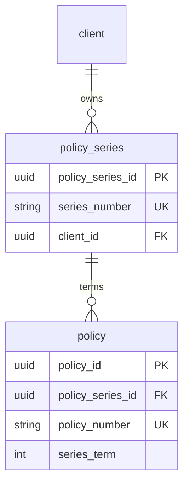

# Policy series and policy numbers

How client-facing **series numbers** relate to per-term **policy numbers** in Postgres, the UI, and allocation.

## Tables and relationship

```text
client
  └── policy_series (one row per client-facing "policy number" chain)
        └── policy (one row per term: new business, renewal, clone, etc.)
```

| Table           | Role                                                                                               |
| --------------- | -------------------------------------------------------------------------------------------------- |
| `policy_series` | Stable **client-facing** identifier (`series_number`, e.g. `ATCCWI1039`) shared across renewals    |
| `policy`        | One **term** of cover: dates, status, CAR data, and an internal **`policy_number`** unique per row |

**Foreign key:** `policy.policy_series_id` → `policy_series.policy_series_id` (many policies per series).

There is **no** foreign key between `policy_number` and `series_number`. They are separate `varchar` columns with **separate** unique indexes:

| Index                       | Column                               |
| --------------------------- | ------------------------------------ |
| `policy_series_number_uidx` | `lower(policy_series.series_number)` |
| `policy_policy_number_uidx` | `lower(policy.policy_number)`        |

Drizzle definitions: [`app/lib/db/schema.ts`](../../app/lib/db/schema.ts).  
Migration introducing series: [`supabase/migrations/20260924120000_policy_series.sql`](../../supabase/migrations/20260924120000_policy_series.sql).



### Column cheat sheet

**`policy_series`**

| Column             | Notes                                  |
| ------------------ | -------------------------------------- |
| `policy_series_id` | UUID primary key                       |
| `series_number`    | Broker-visible number; globally unique |
| `client_id`        | Owning client                          |

**`policy`**

| Column             | Notes                                                                       |
| ------------------ | --------------------------------------------------------------------------- |
| `policy_id`        | UUID primary key; used in URLs                                              |
| `policy_series_id` | Links all terms in a renewal chain                                          |
| `series_term`      | `0` = first term; `1`, `2`, … = renewals (UI badge `#1`, `#2`, …)           |
| `policy_number`    | Internal unique term reference (`ATCCWI####`); not the primary broker label |

Legacy imports may have had duplicate MSSQL policy numbers on renewals; Postgres deduped those into suffixed `policy_number` values while backfilling `policy_series`. See [legacy-db-migration/README.md § Duplicate policy numbers](../legacy-db-migration/README.md#duplicate-policy-numbers-renewals).

## What brokers see

| Concern                        | Source                                                                                                             |
| ------------------------------ | ------------------------------------------------------------------------------------------------------------------ |
| Main label                     | `series_number` ([`policyDisplayNumber`](../../app/lib/policies/policy-display.ts))                                |
| Title / audit / search         | `series_number` + optional `#term` ([`formatPolicySeriesReference`](../../app/lib/policies/policy-series-term.ts)) |
| Internal / uniqueness per term | `policy_number`                                                                                                    |

Search accepts forms like `ATCCWI1039#1` ([`parsePolicySeriesSearch`](../../app/lib/policies/policy-series-term.ts)).

## New business (term 0)

1. Create `policy_series` with `series_number` (e.g. `ATCCWI1039`).
2. Create `policy` with the same `policy_series_id`, `series_term = 0`, and usually the same numeric suffix for `policy_number` on the first term.

The app sets `series_number = policy_number` when starting a **new** series ([`createPolicyDraft`](../../app/lib/services/policy/data.service.ts)).

## Renewal example

**Year 1 — original policy (taken)**

`policy_series`:

| policy_series_id | series_number | client_id    |
| ---------------- | ------------- | ------------ |
| `aaa-…`          | ATCCWI1039    | Acme Pty Ltd |

`policy`:

| policy_id | policy_series_id | series_term | policy_number | category |
| --------- | ---------------- | ----------- | ------------- | -------- |
| `p1-…`    | `aaa-…`          | 0           | ATCCWI1039    | New      |

Display: **ATCCWI1039** (no term badge on term 0).

**Year 2 — renew** ([`renewPolicy`](../../app/lib/services/policy/orchestration.service.ts))

- Reuse **`policy_series_id`** and **`series_number`** (`ATCCWI1039`).
- New **`policy_id`**.
- New **`policy_number`** (allocated among existing `policy` rows only), e.g. `ATCCWI1042`.
- **`series_term`** = previous max + 1 → `1`.
- Category Renewal; `copied_from_policy_id` points at the prior term.

`policy` after renewal draft:

| policy_id | policy_series_id | series_term | policy_number |
| --------- | ---------------- | ----------- | ------------- |
| `p1-…`    | `aaa-…`          | 0           | ATCCWI1039    |
| `p2-…`    | `aaa-…`          | 1           | ATCCWI1042    |

Display: **ATCCWI1039** in the wizard; reference text **ATCCWI1039#1**.

Renewals keep the series number read-only in the form ([`resolveSeriesNumberFromForm`](../../app/lib/policies/policy-series.ts)).

## Why two numbers?

|                 | `series_number`              | `policy_number`                    |
| --------------- | ---------------------------- | ---------------------------------- |
| Scope           | One per chain                | One per **policy row** (each term) |
| On renewal      | Unchanged                    | New value each term                |
| Shown to broker | Yes (primary)                | Usually hidden                     |
| Enforced by     | `policy_series` unique index | `policy` unique index              |

The chain is joined by **`policy_series_id`**, not by matching strings.

## Auto-allocation (gap-fill)

Canonical shape: `ATCCWI` + 4-digit suffix (**1000–9999**). Helpers live in [`app/lib/policies/policy-number.ts`](../../app/lib/policies/policy-number.ts); SQL in [`app/lib/policies/policy-number-sql.ts`](../../app/lib/policies/policy-number-sql.ts).

| Scenario                  | Free suffix must be absent on                                |
| ------------------------- | ------------------------------------------------------------ |
| New policy (new series)   | `policy.policy_number` **and** `policy_series.series_number` |
| Renewal / existing series | `policy.policy_number` only                                  |

Allocation picks the **smallest** free suffix in range (gap-fill), not only `max + 1`. `policy_number_seq` is still synced to `MAX(used)` for ops/scripts ([`scripts/db/lib/policy-number-seq.mts`](../../scripts/db/lib/policy-number-seq.mts)); draft create does not rely on `nextval` for the primary path.

Orphan `policy_series` rows (series without a policy) still reserve that suffix for **new** business—otherwise insert hits `policy_series_number_uidx`.

## Related code

| Area                        | Location                                                                                                     |
| --------------------------- | ------------------------------------------------------------------------------------------------------------ |
| Draft create + allocate     | [`app/lib/services/policy/data.service.ts`](../../app/lib/services/policy/data.service.ts)                   |
| Renew / clone orchestration | [`app/lib/services/policy/orchestration.service.ts`](../../app/lib/services/policy/orchestration.service.ts) |
| Unit tests (gap-fill logic) | [`tests/unit/policy-number-allocate.test.ts`](../../tests/unit/policy-number-allocate.test.ts)               |
