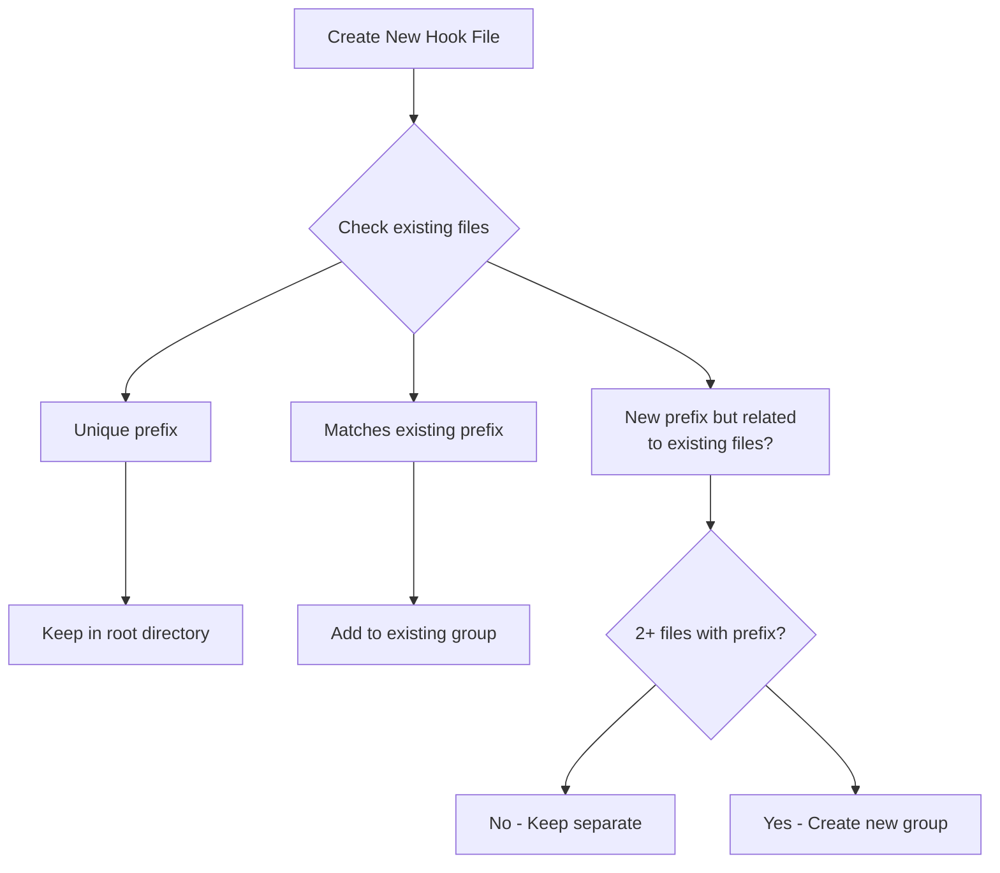

# Hook File Creation Monitoring System

**Effective:** August 16, 2026  
**Purpose:** Proactively maintain hook file organization standards as codebase grows

## Overview

This monitoring system ensures that new hook files follow established organization patterns (`prefix/use-feature.ts` for 2+ files with same prefix) from the moment they're created, preventing organizational debt.

## Core Monitoring Principles

### 1. **Proactive Detection**

- Monitor new hook file creation in real-time
- Flag organizational opportunities before they become debt
- Guide developers toward best practices

### 2. **Automated Validation**

- Use scripts/tools to validate file organization
- Integrate with development workflows
- Provide immediate feedback

### 3. **Developer Education**

- Clear guidelines for when to apply grouping
- Examples of proper vs improper organization
- Step-by-step refactoring guidance

## Trigger Points for Monitoring

### 🎯 Code Review Stage

**Checklist Item:** "Verify hook file organization follows patterns"

```markdown
### Hook File Organization

- [ ] Single hook with unique prefix → Keep in root
- [ ] 2+ hooks with same prefix → Group in `prefix/` directory
- [ ] New hook matching existing prefix → Add to existing group
```

### 🎯 Pre-commit Hook (Optional)

Run `scripts/check-hook-grouping.sh` to detect organization issues:

```bash
# Add to pre-commit hook
./scripts/check-hook-grouping.sh || echo "Hook organization issues found"
```

### 🎯 CI/CD Pipeline

Add script to CI pipeline:

```yaml
# In CI config
- name: Check hook file organization
  run: ./scripts/check-hook-grouping.sh
```

### 🎯 Weekly Team Review

```bash
# Run during team sync
./scripts/check-hook-grouping.sh --report
```

## Monitoring Scripts

### Primary Script: `scripts/check-hook-grouping.sh`

```bash
# Basic usage
./scripts/check-hook-grouping.sh

# Check specific directory
./scripts/check-hook-grouping.sh --dir app/components/specific/hooks

# Show verbose output
./scripts/check-hook-grouping.sh --verbose

# Fix mode (suggests commands to fix)
./scripts/check-hook-grouping.sh --fix
```

### What the Script Detects:

1. **Ungrouped prefixes** with 2+ files
2. **Missing index.ts** files in grouped directories
3. **Inconsistent naming** within groups
4. **Opportunities for grouping** across directories

## Decision Flow for New Hook Files



## Implementation Examples

### Scenario 1: Adding First Hook

```typescript
// Adding: use-email-notifications.ts (new prefix)
// Current: No existing email-* hooks
// Decision: Keep in root → app/hooks/use-email-notifications.ts
```

### Scenario 2: Adding Second Hook

```typescript
// Current: app/hooks/use-email-notifications.ts
// Adding: use-email-preview.ts (same email prefix)
// Decision: Create group → app/hooks/email/use-notifications.ts, use-preview.ts
```

### Scenario 3: Adding to Existing Group

```typescript
// Current: app/hooks/document-template-editor/use-controller.ts
// Current: app/hooks/document-template-editor/use-fetcher.ts
// Adding: use-document-template-editor-validator.ts
// Decision: Add to group → app/hooks/document-template-editor/use-validator.ts
```

## Refactoring Commands Checklist

When script detects issues, follow these steps:

### Step 1: Create Directory

```bash
# For prefix "notification"
mkdir -p app/hooks/notification
```

### Step 2: Move and Rename Files

```bash
# From: app/hooks/use-notification-alerts.ts
# From: app/hooks/use-notification-settings.ts
# To: notification/use-alerts.ts, notification/use-settings.ts

mv app/hooks/use-notification-alerts.ts app/hooks/notification/use-alerts.ts
mv app/hooks/use-notification-settings.ts app/hooks/notification/use-settings.ts
```

### Step 3: Create Index File

```typescript
// app/hooks/notification/index.ts
export { useNotificationAlerts } from "./use-alerts";
export { useNotificationSettings } from "./use-settings";
export type { NotificationAlertsType } from "./use-alerts";
export type { NotificationSettingsType } from "./use-settings";
```

### Step 4: Update Imports

```bash
# Find and update imports
grep -r "use-notification-alerts" --include="*.ts" --include="*.tsx" -l .
# Update each file to use new import path
```

### Step 5: Verify

```bash
npm run typecheck
./scripts/check-hook-grouping.sh
```

## Integration with Development Workflows

### Option A: Git Hooks (Recommended for Teams)

```bash
# .husky/pre-commit
#!/bin/sh
echo "Checking hook file organization..."
./scripts/check-hook-grouping.sh || {
  echo "Hook organization issues detected."
  echo "See docs/guidelines/file-organization-standards.md for guidance."
  exit 1
}
```

### Option B: IDE Integration (Cursor/VS Code)

```json
// .cursor/rules/hook-monitoring.mdc
# Hook File Organization Monitor
Whenever a new hook file is created:
1. Check if prefix matches existing files
2. If 2+ files with same prefix, suggest grouping
3. Provide refactoring commands
```

### Option C: Code Review Template

```markdown
## File Organization Review

- [ ] New hook files follow naming conventions
- [ ] Related hooks (2+ with same prefix) are grouped
- [ ] Groups have index.ts files
- [ ] Imports use directory paths
```

## Success Metrics

### Quantitative Metrics

- **Detection Rate:** % of new hooks correctly organized
- **Refactoring Time:** Time to fix organization issues
- **Compliance Rate:** % of hooks following patterns

### Qualitative Metrics

- **Developer Feedback:** Ease of following patterns
- **Code Discovery:** Time to find related hooks
- **Maintenance:** Ease of adding/modifying hook groups

## Troubleshooting

### Common Issues and Solutions

**Issue:** Script flags files that shouldn't be grouped

```bash
# Files share prefix but aren't functionally related
# Solution: Adjust prefix extraction logic or manually exclude
```

**Issue:** False positives for component-specific hooks

```bash
# Component hooks in app/components/*/hooks/
# Solution: Script handles these separately
```

**Issue:** Import updates missed

```bash
# Verify with TypeScript
npm run typecheck -- --noEmit
# Use refactoring tools or search/replace
```

**Issue:** Performance concerns with frequent checks

```bash
# Only check changed files in pre-commit
git diff --name-only --cached | grep -E "hooks/.*\.ts$"
```

## Maintenance Schedule

### Daily

- Developers run script when creating new hooks
- Pre-commit hook validates changes

### Weekly

- Team sync reviews organization status
- Update documentation as needed

### Monthly

- Full codebase scan with script
- Identify opportunities for further organization
- Update patterns based on usage

### Quarterly

- Review monitoring effectiveness
- Adjust thresholds/patterns as needed
- Team training/retraining

## Related Documentation

1. **[File Organization Standards](../guidelines/file-organization-standards.md)** - Detailed patterns and examples
2. **[Coding Standards](../guidelines/coding-standards.md)** - General coding guidelines
3. **[Code Review Checklist](../guidelines/code-review.md)** - Review criteria including organization

## Getting Help

If you encounter issues with hook file organization:

1. **Check Examples:** Review existing grouped hooks in `app/hooks/`
2. **Run Script:** `./scripts/check-hook-grouping.sh --verbose`
3. **Consult Standards:** Read `docs/guidelines/file-organization-standards.md`
4. **Ask Team:** Post in #code-organization channel

## Changelog

- **2026-08-16:** Initial monitoring system created
- **Pattern:** `prefix/use-feature.ts` for 2+ files with same prefix
- **Tooling:** `check-hook-grouping.sh` script for detection
- **Integration:** Git hooks, CI pipelines, code review templates

---

**Maintainer:** Engineering Team  
**Review Frequency:** Quarterly or as patterns evolve  
**Next Review:** November 2026
