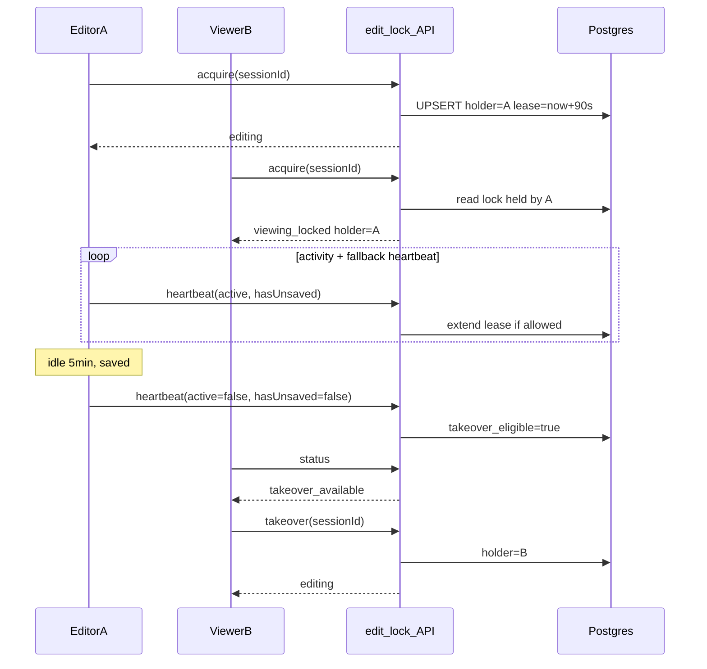

# Edit lock for Policy + Client forms

**Status:** Planned (Phase 1)  
**Scope:** Policy wizard + Client edit forms (blur-save). AR/User dialogs later.

## Problem today

Policy and client blur-save are **last-write-wins** with no concurrency control (`app/components/policies/wizard/hooks/use-draft-save.ts`, `app/components/clients/use-client-form-draft.ts`). Two users on the same policy/client silently overwrite each other.

## Design: lease + heartbeat (not permanent row lock)

Use a small **`edit_lock`** table keyed by resource — not columns on `policy`/`client` — so one mechanism can later cover AR/users without schema churn.



### Takeover rules

| Holder state                | Others see                       | Can Take over?                |
| --------------------------- | -------------------------------- | ----------------------------- |
| Active (recent input)       | Read-only + “Edited by …”        | No                            |
| Idle + **unsaved**          | Read-only                        | No (protect in-progress work) |
| Idle + **saved**            | Read-only + **Take over** button | Yes (manual)                  |
| No heartbeat past lease TTL | Normal edit                      | Yes (acquire on load)         |

### Idle detection (client) — event-driven, not polling

**Idle is not detected by polling the DOM.** We listen for activity events (`keydown`, `pointerdown`, `input`, `focusin` on the form) and update a `lastActivityAt` timestamp. On each lease sync we compare `Date.now() - lastActivityAt` to `IDLE_MS` (5 min) → `active: false`. Same pattern as `app/hooks/use-network-status.ts` (events + derived state, no timer loop checking idle).

### Lease renewal — timed client→server traffic (not idle polling)

The heartbeat is **not** checking whether the user is idle. It is a **lease renewal**: a small POST so the server extends `lease_expires_at`.

| Mechanism                     | What it does                        | Polling?                          |
| ----------------------------- | ----------------------------------- | --------------------------------- |
| Activity listeners            | Detect idle vs active               | No — event-driven                 |
| Heartbeat (hybrid, see below) | Renew lease while tab open          | Yes — fallback timer when quiet   |
| Lease TTL (90s)               | Server-side expiry if renewals stop | No — evaluated on next API call   |
| `pagehide` + `sendBeacon`     | Release on tab close                | Event-driven                      |
| Viewer status                 | Page load / Take over click         | No background polling for viewers |

**Why not purely event-driven renewal?** If the user types once and leaves the tab open without further input, we still renew until idle+saved (then takeover eligible). Crash/force-close may not fire `pagehide` — **lease TTL** is the backstop.

### Hybrid renewal (recommended — fewer requests)

1. **On activity** (debounced ~10s): heartbeat if lease is within ~60s of expiry, or `hasUnsaved` changed.
2. **Fallback interval** (60s): renewal if the tab is open but quiet (user reading the form).
3. **`visibilitychange`**: pause fallback when `document.hidden`; heartbeat on `visible` again.
4. **On successful draft save**: heartbeat with `hasUnsaved: false` (takeover-eligible path when also idle).

Constants (`app/lib/edit-lock/constants.ts`):

- `LEASE_TTL_MS = 90_000` — server rejects holder after this without renewal
- `IDLE_MS = 5 * 60_000` — no input → `active: false`
- `HEARTBEAT_FALLBACK_MS = 60_000` — quiet-tab safety net
- `ACTIVITY_HEARTBEAT_DEBOUNCE_MS = 10_000` — cap renewals during rapid edits

**Unsaved:** reuse existing flags — policy `hasUnsavedChanges` in draft hook; client equivalent in `use-client-form-draft.ts`.

When `active: false` and `hasUnsaved: false`, server sets **`takeover_eligible = true`** (holder still has lease until takeover or expiry; others may use **Take over**).

When tab closes: `navigator.sendBeacon` **release** + clear timers (`pagehide`).

### Page close vs TTL — two layers

**Yes, the table has a TTL:** `lease_expires_at` on each `edit_lock` row. Every accepted heartbeat sets it to `now() + LEASE_TTL` (90s). Any API that checks the lock treats the row as **free** when `lease_expires_at < now()` — no background cron required.

| Scenario                                    | What happens                                       | Lock free when                                          |
| ------------------------------------------- | -------------------------------------------------- | ------------------------------------------------------- |
| User navigates away / closes tab (normal)   | `pagehide` → `sendBeacon` **release** (delete row) | **Immediately** (if beacon succeeds)                    |
| User closes tab / kills browser (no beacon) | Heartbeats stop                                    | **~90s** after last renewal (`lease_expires_at` passes) |
| User stays on page                          | Hybrid heartbeats extend `lease_expires_at`        | Not until release, takeover, or expiry                  |

**Release is best-effort, TTL is the guarantee.** `sendBeacon` on `pagehide` is fast but not 100% reliable (crash, hard kill). The TTL backstop is why we renew while the tab is open.

**Acquire / takeover / draft save** all evaluate expiry at request time:

```sql
-- lock is held only if row exists AND lease not expired
WHERE lease_expires_at > now()
```

Optional later: scheduled job deleting expired rows for cleanliness; **not required** for correctness.

### Session identity

Each tab generates a **`sessionId`** (crypto random, stored in `sessionStorage`) so the same user in two tabs is treated as two holders; second tab is locked out until first releases.

---

## Database

New migration + Drizzle model:

```sql
create table public.edit_lock (
  resource_type text not null,          -- 'policy' | 'client'
  resource_id uuid not null,
  holder_user_id uuid not null references app_user(user_id),
  holder_session_id text not null,
  lease_expires_at timestamptz not null,
  last_heartbeat_at timestamptz not null,
  last_saved_at timestamptz,
  holder_active boolean not null default true,
  holder_has_unsaved boolean not null default false,
  takeover_eligible boolean not null default false,
  acquired_at timestamptz not null default now(),
  primary key (resource_type, resource_id)
);
```

Index on `lease_expires_at` for optional cleanup job later (not required for Phase 1).

---

## Server API

**Route:** `app/routes/api/edit-locks.tsx` (register in `app/routes.ts`)

**Auth:** `requireAuth` (`app/lib/auth/session.server.ts`) on every call.

**Body (Zod):** `resourceType`, `resourceId`, `sessionId`, `intent`: `acquire` | `heartbeat` | `release` | `takeover`.

**Service:** `app/lib/services/edit-lock/service.ts`

| Intent      | Behavior                                                                                                                                            |
| ----------- | --------------------------------------------------------------------------------------------------------------------------------------------------- |
| `acquire`   | If no row or lease expired → claim. If held by same `sessionId` → renew. Else return lock status (holder display name from `app_user`).             |
| `heartbeat` | Only if `holder_session_id` matches; update `active`, `has_unsaved`, `takeover_eligible`, extend `lease_expires_at` when `active \|\| has_unsaved`. |
| `takeover`  | Only if `takeover_eligible` OR lease expired; reassign to caller.                                                                                   |
| `release`   | Delete row if `sessionId` matches.                                                                                                                  |

**Draft enforcement** (409 `LOCKED`):

- `app/routes/api/policies.$policyId.draft.tsx` — PUT/DELETE require valid lock for `sessionId` (header `X-Edit-Session` or JSON field).
- `app/routes/api/clients.$clientId.draft.tsx` — same.
- On successful draft save: update `last_saved_at` and clear `holder_has_unsaved` on the lock row.

Policy full submit in `app/routes/_app/policies/$policyId.tsx` should require lock (or release lock on successful submit).

---

## Client hook + UI

**Hook:** `app/hooks/use-edit-lock.ts`

- Inputs: `resourceType`, `resourceId`, `hasUnsavedChanges`, `enabled` (false when policy `fieldsLocked` / terminal status).
- Outputs: `mode` (`editing` | `viewing_locked` | `takeover_available`), `holderName`, `takeOver()`, `isLockLoading`.
- Wires activity listeners (idle), hybrid lease renewal, acquire on mount, release on unmount/`pagehide`.

**Banner:** `app/components/forms/edit-lock-banner.tsx`

- Viewing locked: “{name} is editing this record.”
- Takeover available: same + **Take over** button.
- Editing: optional subtle cue (or omit to reduce noise).

**Integrate:**

- `app/components/policies/wizard/car-policy-wizard-inner.tsx` — banner; read-only when `mode !== 'editing'`; `sessionId` on draft client.
- `app/components/clients/client-form-inner.tsx` — same via client draft client.

Reuse existing read-only fieldset pattern (Taken/view mode).

**Loader prefetch (optional):** policy/client loaders call `getEditLockStatus` to avoid a brief editable flash before acquire returns.

---

## Testing

`tests/unit/edit-lock.service.test.ts`:

- acquire when free / expired
- blocked acquire when active holder
- heartbeat extends lease; idle+saved sets `takeover_eligible`
- takeover only when eligible
- release only for matching session
- draft save rejected without lock

---

## Out of scope (Phase 1)

- AR broker / User dialogs
- Optimistic locking on `updated_when` (stale-write detection after takeover)
- Durable Objects (Postgres lease is enough on Workers + Hyperdrive)
- Admin “break lock” override

## Implementation checklist

- [ ] `edit_lock` migration + Drizzle schema
- [ ] Edit-lock service + `/api/edit-locks` route with Zod
- [ ] Enforce lock on policy/client draft APIs + `last_saved_at` on save
- [ ] `useEditLock` hook (activity, hybrid heartbeat, acquire/release/takeover)
- [ ] `EditLockBanner` + wire policy wizard and client form
- [ ] Unit tests for lock service and takeover rules
- [ ] Short section in `docs/architecture.md` (edit leases, heartbeat, takeover)
