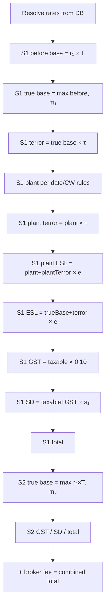

# CAR Policy Pricing Calculation Formulas

Canonical legacy formulas for BrokerSure CAR premium. **Rates come from the database** (Postgres `price_*` tables, migrated from MSSQL `CAR_*`). Only the small constants table below is hardcoded — never invent terrorism / CW / ESL / stamp-duty rates in code.

| Rebuild implementation                            | Role                                                 |
| ------------------------------------------------- | ---------------------------------------------------- |
| `app/server/pricing/car-calculator.ts`            | Server new-policy calc (matches `CARCalculator`)     |
| `app/server/pricing/rate-resolver.ts`             | Published schedule lookup by date / postcode / state |
| `app/lib/premium-workings.ts`                     | UI “how was this calculated?” mirror of server math  |
| `app/server/pricing/car-adjustment-calculator.ts` | End-of-term adjustment deltas                        |

| Legacy source            | Primary files                                                       |
| ------------------------ | ------------------------------------------------------------------- |
| Server calculator        | `InsuranceDemo.BLL/Calculators/CARCalculator2.cs` (`CARCalculator`) |
| Rate lookups             | `InsurnanceDemo.SqlDataProvider/CARPolicyData.cs`                   |
| New policy (server + JS) | `WebSite/CAR/CARNewPolicy.aspx.cs`, `CARNewPolicy.aspx`             |
| View/edit policy (JS)    | `WebSite/CAR/CARViewPolicy.aspx`                                    |
| End-of-term adjustment   | `WebSite/CAR/CARAdjust.aspx.cs`, `CARAdjust.aspx`                   |

Historical copy (same content origin): `_archive/specs/CAR_PRICING_FORMULAS.md`.

> **Scope:** Annual CAR broker product only. Owner Builder / Licenced Builder calculators are separate.

### What is hardcoded vs DB-driven

| Kind                       | Examples                                                                                                                               | Source                                                                            |
| -------------------------- | -------------------------------------------------------------------------------------------------------------------------------------- | --------------------------------------------------------------------------------- |
| Hardcoded constants        | GST `0.10`, terror start `2021-01-01`, plant v2.1 date `2023-01-01`, plant CW band `$2.5M`, referral plant `>$50k`, adjustment 25%/75% | Match legacy `CARCalculator`                                                      |
| **Never hardcoded**        | CW / liability rates & mins, stamp duty, ESL, plant rate, terrorism τ / tier                                                           | Latest published `price_*` row for certificate date (+ postcode/state for terror) |
| Manual premium lines       | Display Homes, Existing Structure                                                                                                      | Broker-entered; server leaves `0` (not SI → premium)                              |
| Missing terrorism postcode | —                                                                                                                                      | Return **no rate** + referral (do **not** invent e.g. `0.01`)                     |

### Taken status premium gate

Before status can move to **Taken**, legacy requires:

| Declared (Limits)             | Required premium line            |
| ----------------------------- | -------------------------------- |
| Existing Structures `> 0`     | Existing Structure premium `> 0` |
| Plant & equipment `> $25,000` | Plant premium `> 0`              |

Rebuild: `app/lib/policy-taken-status.ts` (`getTakenStatusErrors`). Enter the premium on **Premium → click the $0 cell**, then set Taken.

---

## 1. Constants

| Symbol                          | Value        | Notes                                             |
| ------------------------------- | ------------ | ------------------------------------------------- |
| `GSTRate`                       | `0.10` (10%) | `CARCalculator2.cs` L76; `Policy.cs` L56          |
| `TerrorStartDate`               | `2021-01-01` | Terrorism levy applies from this certificate date |
| `Version21StartDate`            | `2023-01-01` | Simplified plant formula from this date           |
| `PlantCertificateTurnoverLimit` | `2,500,000`  | Used in pre-v2.1 plant banding                    |
| Plant referral threshold        | `50,000`     | Triggers referral, not a formula cap              |
| Adjustment 25% cap              | `0.25`       | Max base refund per section on adjustment         |
| Adjustment 75% floor            | `0.75`       | Min retained premium on adjustment finish         |

Plant min/max dollar thresholds (`PlantValueMin`, `PlantValueMax`) come from DB (`price_plant` / legacy `CAR_PlantRate_Get`), typically ~$25k free band / $50k cap.

**Terrorism example (not a hardcode):** postcode `2033` NSW → tier **B** → τ = `0.053` from `price_terrorism_rate`.  
`Terrorism Levy = True Base Premium × τ` (e.g. `$6,700 × 0.053 = $355.10`).

---

## 2. Rate Resolution (inputs → rates)

Resolved once per calculation from certificate date, state, postcode, cover type, and turnover.

```
CAR_Price_Get(CoverType, Turnover, Date)
  → ContractWorksRate, ContractWorksMinPremium
  → Liability10mRate, Liability10mMinPremium
  → Liability20mRate, Liability20mMinPremium

CAR_StampDuty_Get(State, Date)     → SDRate
CAR_ESL_Get(State, Date)           → ESLRate (construction), PlantEslRate (loaded but see §10)
CAR_TerrorismRate_Get(Postcode, State, Date)  [if Date ≥ 2021-01-01]
  → TerrorismRate, TerrorismTier
CAR_PlantRate_Get(Date)            → PlantPremiumRate, PlantValueMin, PlantValueMax
```

### Section 2 liability rate (`GetLiabilityRate`)

| `LiabilityLimitBand` | Rate               | Min premium              |
| -------------------- | ------------------ | ------------------------ |
| `1` (`m10`) — $10M   | `Liability10mRate` | `Liability10mMinPremium` |
| `2` (`m20`) — $20M   | `Liability20mRate` | `Liability20mMinPremium` |
| `3` (`NotInsured`)   | `0`                | `0`                      |

Persisted as `PolicyCAR.LiabilityLimitBand` **int** with check `IN (1, 2, 3)`.

---

## 3. Section 1 — Contract Works (server: `CARCalculator`)

Let:

- `T` = `CertificateTurnover` (estimated turnover)
- `r₁` = `ContractWorksRate`
- `m₁` = `ContractWorksMinPremium`
- `τ` = `TerrorismRate`
- `e` = `ESLRate`
- `g` = `GSTRate` (= 0.10)
- `s₁` = `SDRate` (section 1 stamp duty rate, decimal)

### 3.1 Base premium

```
ContractWorksCalculatedBasePremium = r₁ × T
ContractWorksBasePremium   = max(ContractWorksCalculatedBasePremium, m₁)
```

### 3.2 Terrorism (contract works base only)

```
ContractWorksTerrorismPremium = ContractWorksBasePremium × τ
```

### 3.3 Plant & equipment (`GetContractWorksPlantPremium`)

Let `P` = plant equipment value, `pr` = `PlantPremiumRate`, `pMin` = `PlantValueMin`, `pMax` = `PlantValueMax`, `CW` = `Section1ContractWorksValue`.

**If certificate date ≥ 2023-01-01:**

```
ContractWorksPlantPremium = pr × P
```

**Else if date < 2021-01-01 OR CW ≤ 2,500,000** (banded — first $25k free):

```
if P > pMin:
  if P > pMax:  ContractWorksPlantPremium = pr × (pMax − pMin)
  else:         ContractWorksPlantPremium = pr × (P − pMin)
else:
  ContractWorksPlantPremium = 0
```

**Else** (post-terror, CW > 2.5M):

```
if P ≤ 0:       ContractWorksPlantPremium = 0
elif P > pMax:  ContractWorksPlantPremium = pr × pMax
else:           ContractWorksPlantPremium = pr × P
```

### 3.4 Plant terrorism & ESL

```
ContractWorksPlantTerrorismPremium = (ContractWorksPlantPremium > 0) ? ContractWorksPlantPremium × τ : 0
ContractWorksPlantESL              = (ContractWorksPlantPremium > 0) ? (ContractWorksPlantPremium + ContractWorksPlantTerrorismPremium) × e : 0
ContractWorksESL                   = (ContractWorksBasePremium + ContractWorksTerrorismPremium) × e
```

### 3.5 GST

```
ContractWorksGST = (ContractWorksBasePremium
            + ContractWorksTerrorismPremium
            + ContractWorksPlantPremium
            + ContractWorksPlantTerrorismPremium
            + ContractWorksPlantESL
            + ContractWorksESL) × g
```

### 3.6 Stamp duty

```
ContractWorksStampDuty = (ContractWorksBasePremium
           + ContractWorksTerrorismPremium
           + ContractWorksPlantPremium
           + ContractWorksPlantTerrorismPremium
           + ContractWorksPlantESL
           + ContractWorksESL
           + ContractWorksGST) × s₁
```

### 3.7 Section 1 total

```
ContractWorksTotalPremium = ContractWorksBasePremium
                     + ContractWorksTerrorismPremium
                     + ContractWorksPlantPremium
                     + ContractWorksPlantTerrorismPremium
                     + ContractWorksPlantESL
                     + ContractWorksESL
                     + ContractWorksGST
                     + ContractWorksStampDuty
```

**Not calculated server-side:** `ContractWorksDisplayHomesPremium`, `ContractWorksExistingStructurePremium` — manual premium lines only (client JS).

---

## 4. Section 2 — Legal Liability (server: `CARCalculator`)

Let `r₂` = liability rate, `m₂` = liability min premium, `s₂` = `SDRate`.

```
LiabilityCalculatedBasePremium = r₂ × T
LiabilityBasePremium   = max(LiabilityCalculatedBasePremium, m₂)
LiabilityESL               = 0
LiabilityGST               = (LiabilityBasePremium + LiabilityESL) × g
LiabilityStampDuty                = (LiabilityBasePremium + LiabilityESL + LiabilityGST) × s₂
LiabilityTotalPremium      = LiabilityBasePremium + LiabilityESL + LiabilityGST + LiabilityStampDuty
```

Section 2 has **no terrorism levy** in any code path.

---

## 5. Combined Total (new policy)

```
OriginalCombinedBrokerFee = BrokerFeeTotal + BrokerFeeGstTotal
OriginalTotalPremium      = ContractWorksTotalPremium + LiabilityTotalPremium + OriginalCombinedBrokerFee
```

### Combined True Base Premium (display column)

Legacy `CalculateTotal` / client `CalculatePremium` (not CW+Liability alone):

```
CombinedTrueBasePremium =
    ContractWorksBasePremium
  + ContractWorksTerrorismPremium   // includes ES/DH terror when client recalc folded them in
  + LiabilityBasePremium
  + ContractWorksPlantPremium
  + ContractWorksPlantTerrorismPremium
  + ContractWorksExistingStructurePremium
  + ContractWorksDisplayHomesPremium
```

(`CARNewPolicy.aspx.cs` `CalculateTotal` adds broker fee to combined display total.)

Rebuild: combined fee is **derived** from `PolicyFee` lines (`sum(Fee) + sum(FeeGst)`); there is no `OriginalCombinedFee` column. Bind-time total is only `PolicyCAR.OriginalTotalPremium` (not duplicated on `Policy`).

---

## 6. Client-Side `CalculatePremium` (new policy & view policy)

Used when broker manually edits premium fields on the pricing step. Logic in `CARNewPolicy.aspx` L1094–1354 and `CARViewPolicy.aspx` L1060–1299.

### Additional Section 1 variables

```
ES          = ContractWorksExistingStructurePremium      (manual premium input)
DH          = ContractWorksDisplayHomesPremium         (manual premium input)
ES_τ        = τ × ES
DH_τ        = τ × DH
```

`Section1Terror` in JS = terrorism on **contract works base only**. The displayed terrorism field combines all three:

```
txtContractWorksTerrorismPremium = Section1Terror + ES_τ + DH_τ
```

### ESL (recalculated unless `ManualTaxOverride` is true)

```
ContractWorksESL = (Section1Base + Section1Terror + ES_τ + ES + DH + DH_τ) × ESLRate
LiabilityESL = 0
```

### GST (always recalculated)

```
ContractWorksGST = (Section1Base + Section1Terror + ES_τ + ES + DH + DH_τ
             + Section1Plant + Section1PlantTerror + ContractWorksESLPlant + ContractWorksESL) × GSTRate

LiabilityGST = (Section2Base + LiabilityESL) × GSTRate
```

### Stamp duty (recalculated unless `ManualTaxOverride`)

```
ContractWorksStampDuty = (all Section1 taxable components + ContractWorksGST) × ContractWorksStampDutyRate
LiabilityStampDuty = (Section2Base + LiabilityESL + LiabilityGST) × LiabilityStampDutyRate
```

### Section totals

```
Section1Total = Section1Base + Section1Terror + ES_τ + ES + DH + DH_τ
              + Section1Plant + Section1PlantTerror + ContractWorksESLPlant
              + ContractWorksESL + ContractWorksGST + ContractWorksStampDuty

Section2Total = Section2Base + LiabilityESL + LiabilityGST + LiabilityStampDuty

CombinedTotal = Section1Total + Section2Total + BrokerFee
```

### Manual override rules

- Editing base on blur: floor to `hidContractWorksMinPremium` / `hidLiabilityMinPremium`.
- Editing ESL/SD/GST directly sets `ManualTaxOverride = true` permanently for the session — ESL/SD stop auto-recalculating.
- `hidContractWorksAppliedRate = Section1Base / EstimatedTurnover` back-derived on manual base edit.

---

## 7. End-of-Term Adjustment (`CARAdjust.aspx`)

> **Stage 1 rebuild model:** One `PolicyCARAdjustment` row per policy (save overwrites; no Draft status), linked to an **immutable Taken** policy. Original policy premium is never overwritten; effective premium = original + current adjustment delta. See [CAR_INSURANCE_APP_SPEC.md §6.9](./CAR_INSURANCE_APP_SPEC.md#69-policy-state-and-lifecycle). Formulas below describe **legacy** `CARAdjust.aspx` calculation logic (still used for delta math). Stage 2 may redesign adjustments.

**Legacy simplified model** — excludes plant, display homes, existing structures, and broker fees. Uses **frozen rates** stored on the policy from original policy.

Inputs:

- `T_adj` = adjustment turnover
- `T_orig` = original estimated turnover
- `r₁, r₂, m₁, m₂, τ, e, g, s₁, s₂` = stored rates
- `SDExempt` = stamp duty exempt (Yes → Section 2 SD = 0)

### 7.1 Original row (reconstructed)

From stored `ContractWorksBasePremium`, `LiabilityBasePremium`, `ContractWorksTerrorismPremium`:

```
S1_ESL = (S1_Base + S1_Terror) × e
S2_ESL = 0
S1_GST = (S1_Base + S1_Terror + S1_ESL) × g
S2_GST = (S2_Base + S2_ESL) × g
S1_SD  = (S1_Base + S1_Terror + S1_ESL + S1_GST) × s₁
S2_SD  = SDExempt ? 0 : (S2_Base + S2_ESL + S2_GST) × s₂
S1_Gross = S1_Base + S1_Terror + S1_ESL + S1_GST + S1_SD
S2_Gross = S2_Base + S2_ESL + S2_GST + S2_SD
OriginalCombined = S1_Gross + S2_Gross
```

### 7.2 Adjustment row (from `T_adj`)

```
AdS1_Base   = max(T_adj × r₁, m₁)
AdS2_Base   = max(T_adj × r₂, m₂)
AdS1_Terror = AdS1_Base × τ
AdS2_Terror = 0
AdS1_ESL    = (AdS1_Base + AdS1_Terror) × e
AdS2_ESL    = 0
AdS1_GST    = (AdS1_Base + AdS1_Terror + AdS1_ESL) × g
AdS2_GST    = (AdS2_Base + AdS2_Terror + AdS2_ESL) × g
AdS1_SD     = (AdS1_Base + AdS1_Terror + AdS1_ESL + AdS1_GST) × s₁
AdS2_SD     = SDExempt ? 0 : (AdS2_Base + AdS2_Terror + AdS2_ESL + AdS2_GST) × s₂
AdCombined  = AdS1_Gross + AdS2_Gross
```

### 7.3 Total adjustment premium (delta) — with 25% base refund cap

Per section, base delta:

```
if Ad_Base < Orig_Base AND (Orig_Base − Ad_Base) / Orig_Base > 0.25:
  Δ_Base = Orig_Base × 0.25 × (−1)     // max 25% refund of original base
else:
  Δ_Base = Ad_Base − Orig_Base
```

Then taxes recalculated on the capped delta:

```
Δ_Terror = Δ_Base × τ          (Section 1 only; Section 2 terror = 0)
Δ_ESL    = (Δ_Base + Δ_Terror) × e    (Section 1 only; Section 2 ESL = 0)
Δ_GST    = (Δ_Base + Δ_Terror + Δ_ESL) × g
Δ_SD     = (Δ_Base + Δ_Terror + Δ_ESL + Δ_GST) × s     (S2 SD = 0 if SDExempt)
Δ_Gross  = Δ_Base + Δ_Terror + Δ_ESL + Δ_GST + Δ_SD
TotalAdjustmentPremium = ΔS1_Gross + ΔS2_Gross
```

### 7.4 Finish validation — 75% minimum retained premium

```
if TotalAdjustmentPremium < 0
   AND |TotalAdjustmentPremium| > OriginalCombined × 0.75:
  REJECT — "The return premium is more than 75% of the original premium"
```

Policy must retain at least **25%** of original section gross premium.

On success (legacy): `Adjusted = true`, `AdjustedDate = now`, status remains **Taken**.

**Target rebuild:** adjustment is saved as a new **Applied** child record; original `PolicyCAR` unchanged; effective premium composes original + this adjustment's delta.

---

## 8. Calculation Order (full new policy)



---

## 9. Stored Rate Back-Calculation (on save)

When a policy is saved, effective rates are derived from final premium amounts and stored for future adjustments:

```
ContractWorksAppliedRate  = TrueBase₁ / Turnover
LiabilityAppliedRate  = TrueBase₂ / Turnover
TerrorismRate = ContractWorksTerrorismPremium / ContractWorksBasePremium
PlantRate     = ContractWorksPlantPremium / PlantValue
ESLRate       = ContractWorksESL / (TrueBase₁ + TerrorismPremium)
PlantEslRate  = ContractWorksPlantESL / (Plant + PlantTerrorism)
ContractWorksStampDutyRate = ContractWorksStampDuty / (all S1 taxable + GST)
LiabilityStampDutyRate = LiabilityStampDuty / (S2Base + ESL + GST)
```

---

## 10. Three Calculation Paths Compared

| Component                          | New policy (server) | View/edit (JS)            | Adjustment                         |
| ---------------------------------- | ------------------- | ------------------------- | ---------------------------------- |
| Rate source                        | DB lookup           | Hidden fields from policy | Frozen stored rates                |
| Plant & equipment                  | Yes                 | Yes (JS)                  | **No**                             |
| Display homes / existing structure | No (JS only)        | Yes (JS)                  | **No**                             |
| Terrorism on S2                    | No                  | No                        | No                                 |
| S2 ESL                             | Always 0            | Always 0                  | Always 0                           |
| Broker fee in total                | Yes                 | Yes                       | **No**                             |
| 75% return rule                    | UI text only        | UI text only              | **Enforced**                       |
| 25% base refund cap                | N/A                 | N/A                       | **Enforced**                       |
| S2 stamp duty exempt               | N/A                 | N/A                       | Optional (`StampDutyExempt = Yes`) |

---

## 11. Referral Triggers (`CARCalculator.GetReferralReasons`)

- Plant equipment > $50,000
- `ContractWorksRate` missing or zero
- Liability selected but rate = 0
- Stamp duty rate not found (`CAR_StampDutyId == 0`)
- ESL rate not found (`CAR_ESLId == 0`)
- Terrorism rate not found when `DateCertificate ≥ 2021-01-01`

---

## 12. Implementation Notes

1. **`PlantEslRate`** is loaded from DB but plant ESL uses **`ESLRate`** (construction rate `e`) in `CARCalculator2.cs` L291 — rebuild matches this in `car-calculator.ts` / `premium-workings.ts`.
2. **`PlantValueMax` assignment bug** at L341 in legacy: `PlantValueMin` is assigned twice from `PlantValueMax` column — may affect plant banding. Rebuild maps min/max columns correctly from Postgres.
3. **Terrorism field semantics:** server stores terror on CW base only; legacy JS merges ES/DH terror into the displayed terrorism field after manual edits.
4. **Adjustment original row** may not equal the policy's true original premium when plant / ES / DH premiums exist on the certificate.
5. **75% minimum premium** text appears on new policy and view screens but is **not enforced** outside the adjustment wizard.
6. **Rebuild fidelity:** missing terrorism postcode/state returns `null` (referral), never a hardcoded fallback rate.

---

## 13. Variable Glossary

| Variable                         | Meaning                                                 |
| -------------------------------- | ------------------------------------------------------- |
| `T` / `Turnover`                 | Estimated annual turnover                               |
| `r₁` / `ContractWorksRate`       | Contract works rate (per dollar of turnover)            |
| `m₁` / `ContractWorksMinPremium` | Contract works minimum premium                          |
| `r₂`                             | Section 2 liability rate                                |
| `m₂`                             | Section 2 minimum premium                               |
| `τ` / `TerrorismRate`            | Terrorism levy rate                                     |
| `e` / `ESLRate`                  | Emergency Services Levy (construction) rate             |
| `g` / `GSTRate`                  | GST rate (0.10)                                         |
| `s₁`, `s₂`                       | Stamp duty rates (section 1 and 2)                      |
| `P`                              | Plant & equipment declared value                        |
| `ES`, `DH`                       | Existing structure / display homes manual premium lines |
